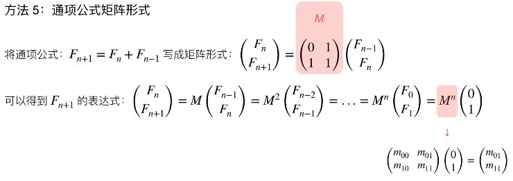

# 题目总结如下：

## [1. 移动零](https://leetcode-cn.com/problems/move-zeroes/)（简单）

* 思路一： 重建数组的思想

  设立一个新指针j指向新数组的末尾(初始的时候是原数组的开头)，然后用另一个指针i开始遍历原数组，如果当前元素不等于0， 那么就加入到新数组中， 然后比较两个指针是否指向同一个位置，如果不是， i位置的元素置零。 然后j往后移动一位。代码如下：

  ```python
  class Solution:
      def moveZeroes(self, nums: List[int]) -> None:
          """
          Do not return anything, modify nums in-place instead.
          """
          new_array_j = 0
          for i in range(len(nums)):
              if nums[i] != 0:
                  nums[new_array_j] = nums[i]
                  if i != new_array_j:
                      nums[i] = 0
                  new_array_j += 1
  ```

  这个还可以写一种交换的写法， 这个更适合一般的题目， 比如把负数移到后面而不破坏相对顺序。

  ```python
  class Solution:
      def moveZeroes(self, nums: List[int]) -> None:
          """
          Do not return anything, modify nums in-place instead.
          """
          nonzeors_loc = 0
          for i in range(len(nums)):
              if nums[i] != 0:
                  nums[nonzeors_loc], nums[i] = nums[i], nums[nonzeors_loc]
                  nonzeors_loc += 1
  ```

  时间复杂度O(n)， 空间复杂度O(1)， 表示没有再开辟新的空间

* 思路二：时间复杂度O(n), 空间复杂度O(n)

  新开辟一块空间， 当然不符合这个题目的要求了哈， 但是开阔一下思路， 就是复制原数组， 然后遍历原数组， 如果不是0， 往前加， 否则往后加。

  ```python
  class Solution:
      def moveZeroes(self, nums: List[int]) -> None:
          """
          Do not return anything, modify nums in-place instead.
          """
          new_array = nums.copy()
          head, tail = 0, len(new_array)-1
          for num in new_array:
              if num == 0:
                 nums[tail] = num
                 tail -= 1
              else:
                  nums[head] = num
                  head += 1
  ```

  时间复杂度O(n), 空间复杂度O(n)

注意： **在原数组上新建数组的思想很重要， 非常适合哪种顺序表中删除不符合条件的元素的题目， 比如删除重复元素并且保证位置不变， 删除负数， 删除0元素**

参考：

* [国际站题解](https://leetcode.com/problems/move-zeroes/discuss/?currentPage=1&orderBy=most_votes&query=)
* [中国站题解](https://leetcode-cn.com/problems/move-zeroes/solution/)

## 2. [盛最多水的容器](https://leetcode-cn.com/problems/container-with-most-water/)（中等）

这个题是经典的面试题之一

* 思路一： 暴力破解

  这个题最先容易想到的就是暴力破解，  定义一个最大面积0， 两层循环， 对于外层的每一个柱子， 遍历它后面的所有柱子， 对于每个柱子， 计算它俩围成的容器的面积， 如果比最大的大，则更新最大值。

  ```python
  class Solution:
      def maxArea(self, height: List[int]) -> int:
          max_area = 0
          for i in range(len(height)):
              for j in range(i+1, len(height)):
                  if min(height[i], height[j])*(j-i) > max_area:
                      max_area = min(height[i], height[j])*(j-i)
          
          return max_area
  ```

  暴力破解的方式不要使用， 在这里面会超时， 并且没有什么技术含量。 时间复杂度O(n^2)

* 思路二： 双指针法

  再说这个事情， 我们先可以分析一下暴力破解存在的问题就是因为搜索次数太多了， 有很多无用的遍历， 所以如果想改进， 就是在次数上进行改进。 双指针法是解决这个题目非常好的方式， 只需要O(n)的复杂度， 也就是遍历数组一遍就可以搞定， **它使用了一种缩减搜索空间的思想**。

  i, j两个指针指向数组的首尾， 记录此时围成的面积，然后如果nums[i] < nums[j], 就说明此时的面积高度是nums[i]决定的，此时与j围成的面积已经达到了极限，所以i向右移动。 如果nums[i] > nums[j]， 那么同理， j向左移动。 此时记录围成的面积， 如果比先前的大， 进行更新。 然后再按照前面的移动规则进行移动。

  ```python
  class Solution:
      def maxArea(self, height: List[int]) -> int:
          if len(height) < 2:
              return
  
          max_area = 0
          i, j = 0, len(height)-1
          while i < j:
              temp_area = min(height[i], height[j]) * (j-i)   # 记录当前围成的面积
              if temp_area > max_area:
                  max_area = temp_area
              
              # 更新两端
              if height[i] < height[j]:
                  i += 1
              else:
                  j -= 1
          
          return max_area
  
  # 相似的写法， 但是下面这个运行更快
  class Solution:
      def maxArea(self, height: List[int]) -> int:
            if len(height) < 2:
              return	
            max_area = 0
            i, j = 0, len(height)-1
            while i < j:
                if height[i] < height[j]:
                    temp_area = height[i] * (j-i)
                    max_area = temp_area  if temp_area > max_area else max_area
                    i += 1
                else:
                    temp_area = height[j] * (j-i)
                    max_area = temp_area if temp_area > max_area else max_area
                    j -= 1
        
       	  return max_area
  ```

理解这个思路的核心就是它的移动规则， **当前高度最短的在相应方向上进行移动**，为啥这样就能找到最优解呢？ 拿题目中的图解释一下：

  我们暴力的时候， 是固定了左边， 比如第一块， 然后分别从第二块-第八块进行面积计算， 而双指针法的时候， 我们可以看到i指向第一块， 然后j指向最后一块， 会发现height[1]比较短， 所以最终的面积是S = (j-i) * height[1]。 这时候， 如果我们固定height[1]不动， j往前进行遍历的时候， 面积那个等式其实是长度不变或者减小， 宽度在减小的过程， S显然会减小， 所以此时遍历第二块-第七块显然没有作用， 不如i++， 即短的向右移动一个位置， 此时还有希望超过原来的S。 从这一次来看， 搜索空间一下就从O(n)降到了O(1)。 后面都是同样的思路， 直到两者相遇， 这样就可以把O(n^2)的复杂度降到O(1)了。  

  **左右边界i, j, 向中间收敛， 这是一种左右夹逼的方法， 一定要记住， 是后面解决很多问题的关键**

  参考：

  * [比较好的一个题解](https://leetcode-cn.com/problems/container-with-most-water/solution/on-shuang-zhi-zhen-jie-fa-li-jie-zheng-que-xing-tu/)
  * [国际站题解](https://leetcode.com/problems/container-with-most-water/discuss/?currentPage=1&orderBy=most_votes&query=)

## 3. [爬楼梯](https://leetcode-cn.com/problems/climbing-stairs/)（中等）

这个题也是经典的面试题之一， 斐波那契数列的变形。 下面一点点的进行优化加分析

* 思路一： 递归

  这个题拿到手很自然的会想到递归的方式， 因为我第n阶楼梯的爬楼方法其实就可以考虑成， 假设我已经爬到了第n-1阶， 那么我就爬1步， 如果我已经爬到了第n-2阶， 那就迈两步。 那这时候面临的问题就是第n-1层有多少种， 第n-2层有多少种， 这时候又可以进行分解。 所以这里的通项公式就是： f(n) = f(n-1) + f(n-2)。 如果这个通项公式， 递归就非常好写了：

  ```python
  class Solution:
      def climbStairs(self, n: int) -> int:
          if n == 1:
              return 1
          if n == 2:
              return 2
          
          return self.climbStairs(n-1) + self.climbStairs(n-2)
  ```

  这个思路非常好理解， But， 过不去， 会超时， 因为递归里面我们有太多的重复计算了， 比如f(4)的时候， 等于f(3)+f(2), f(3)的时候就需要计算f(2), 这时候如果分析时间复杂度的话会是O($2^n$), 这个是指数级时间复杂度。空间复杂度O(n), 那么这个不行， 怎么改进呢？   其实递归耗时的地方就在于重复计算， 那么我事先存好数， 不用计算直接找不就行了， 所以， 这就是动态规划的思路， 其实就是用数组的方式实现上面的思路。

* 思路二： 动态规划

  ```python
  class Solution:
      def climbStairs(self, n: int) -> int:
          if n == 1:
              return 1
          res = [i+1 for i in range(n)]
          for i in range(2, n):
              res[i] = res[i-1] + res[i-2]
          
          return res[n-1]
  ```

  这个的时间复杂度是O(n), 空间复杂度O(n)， 下面还可以优化空间复杂度， 因为每一次递推其实只用了两个数。

  ```python
  class Solution:
      def climbStairs(self, n: int) -> int:
          res = 1 if n == 1 else 2 
  
          a = 1
          b = 2
      
          for i in range(2, n):
              res = a + b
              a, b = b, res
          
          return res
   
  # 附简洁代码
  class Solution:
      def climbStairs(self, n: int) -> int:
          a = b = 1
          for _ in range(n):
              a, b = b, a+b
          
          return a
  ```

  这时候空间复杂度变成了O(1)

* 思路三： 数学推导式

  这个是用了矩阵分解的一种思路， 可以将时间复杂度进一步优化， 根据题目， 可以写成下面的推导式：

  

  这时候就可以通过这个矩阵乘法来解决， 当然， 这个可以进一步优化， 就是把M进行对角化分解， 分解完了之后就是$M=T\Lambda T^{-1}$的方式来表示， 这时候更好计算n次幂， 下面是这种实现方式， 可以看到Python代码的优势：

  ```python
  import numpy as np
  class Solution:
      def climbStairs(self, n: int) -> int:
          if n== 1:
              return 1
          
          f0 = np.array([[0], [1]])
          m = np.array([[0, 1], [1, 1]])
          fea_val, fea_vec = np.linalg.eig(m)
          fea_val_eye = np.array([[fea_val[0], 0], [0, fea_val[1]]])
          n = np.dot(fea_vec, fea_val_eye**n)
          n = np.dot(n, np.linalg.inv(fea_vec))
          res = np.dot(n, f0)
          return int(res[1])
  ```

参考：

* [国际题解](https://leetcode.com/problems/climbing-stairs/discuss/?currentPage=1&orderBy=most_votes&query=)
*  [中文题解](https://leetcode-cn.com/problems/climbing-stairs/solution/)

这里再传达一种思路： 

​	解题懵逼的时候想一下能不能暴力？ 如果不能暴力， 就从最基本的情况想？ 想完了基本情况再考虑能不能泛化， **找最近重复子问题**

## 4. [两数之和](https://leetcode-cn.com/problems/two-sum/)（简单）

* 思路一： 暴力求解

  这个思路比较简单，直接两层for循环， 如果是两者相加之和为target， 那么返回两者的下标即可。时间复杂度O(n^2)

  ```python
  class Solution:
      def twoSum(self, nums: List[int], target: int) -> List[int]:
          res = []
  
          for i in range(len(nums)-1):
              for j in range(i+1, len(nums)):
                  if nums[i] + nums[j] == target:
                      return [i, j]
  ```

* 思路二： 哈希存储

  使用python字典把每个值存储下来， 那么这时候遍历每个元素的时候， 只需要去查找字典里面是不是有target-当前元素即可， 时间复杂度可以降一些， 因为这些查找都是经过了一定的优化。  使用哈希查找的话时间复杂度是O(n)， 因为哈希查找元素时间复杂度是O(1), 这时候只需要遍历外层循环即可。

  ```python
  class Solution:
      def twoSum(self, nums: List[int], target: int) -> List[int]:
          hash_dict = {}
          for i in range(len(nums)):
              if hash_dict.get(target-nums[i]) is not None :
                  return [hash_dict.get(target-nums[i]), i]
              hash_dict[nums[i]] = i
  ```

参考题解：

* [中文题解](https://leetcode-cn.com/problems/two-sum/solution/)
* [国际站](https://leetcode.com/problems/two-sum/discuss/?currentPage=1&orderBy=most_votes&query=)

这个题如果变一下， 万一不止有一种组合呢？  如何解？   可以参考三数之和的思路。

## 5. [三数之和](https://leetcode-cn.com/problems/3sum/)（中等）

这又是一个高频老题了。解决这个之前， 先简单回忆上面两数之和的题目， 上面那个相当于只要知道两个数相加等于target即可， 而这个题相当于找两个数等于里面的第三个数的相反数， 即a+b=-c, 而两数之和那边c固定， 而这里c不固定。 而这个题里面还有一个难点就是不能重复， 所以这个题还是比较不错的一个题目。  

* 思路一： 暴力法

  当拿到一个题来之后直接懵逼的时候， 第一个思路就是看能不能进行暴力， 然后在这个基础上进行优化， 显然， 这个题暴力依然是可以解决， 三个数相加等于0，三层for循环即可搞定， But， 会超时。 因为时间复杂度是O(n^3)， 这种根本就不适合解这种问题。当然暴力的模板我们要会：

  ```python
  class Solution:
      def threeSum(self, nums: [int]) -> [[int]]:
          res = []
          for i in range(len(nums)-2):
              for j in range(i+1, len(nums)-1):
                  for k in range(j+1, len(nums)):
                      if nums[i] + nums[j] + nums[k] = 0:
                          res.append([i, j, k])
          return res
  ```

* 思路二： 双指针法

  这个又学习到了， 原来前后指针还能解这样的题目。 步骤是这样： 首先先把数组从小到大进行排序， 然后设置指针k开始从头遍历元素， 对于每一次遍历， 分别设置i, j指针指向**k后面**剩下元素的首尾， 然后进行判断， 如果三个指针指向的元素等于0， 保存结果。 否则， 如果三者之和小于0， 那么i往后移动。 因为i指向的元素小了导致的总体之和小， 如果三者之和大于0， j往左移， 因为是j指向的元素过大导致的总体之和大。 这样当i， j相遇， 当前k的所有组合已经遍历完毕， 往后移动k， 重复上面的步骤。   **但是这个过程里面要注意的就是避免重复元素**。所以具体流程应该如下：

  1. 异常检查， 如果元素个数小于3直接返回

  2. 数组从小到大

  3. 遍历k

     * 如果nums[k] > 0, 直接停掉程序。 因为此时说明所有数都大于0， nums[j] > nums[i] > nums[k] > 0， 肯定没有加和等于0的
     * 如果k>0并且nums[k]=nums[k-1], 跳过当前这次查找， 因为这样找就出现了重复了， 之前的nums[k-1]肯定把结果找出来了
     * 排除掉上面两种情况， 就设置两个指针i, j分别指向后面元素的首尾， 再次进入循环i < j
       * 判断三者之和是不是等于0， 如果是， 则存放结果， 然后i往右移动， 但要跳过相同的数去， j往左移动， 也要跳过相同的数去
       * 如果不是0， 如果两者之和大于0， 说明j太大了， j往左移动
       * 如果两者之和小于0， 说明i太小了， i往右移动

     上代码：

  ```python
  class Solution:
      def threeSum(self, nums: List[int]) -> List[List[int]]:
         res = []
         # 异常判断
         if len(nums) < 3: return res
  
         # 排序
         nums.sort()
  
         # 遍历k
         for k in range(len(nums)-2):
             if nums[k] > 0: break         # 说明所有元素都大于0
             if k > 0 and nums[k] == nums[k-1]: continue      # nums[k-1]已经找了结果了，跳过
  
             i, j = k + 1, len(nums) - 1           # 前后双指针
             while i < j:
                 s = nums[i] + nums[j] + nums[k]
                 if s == 0:
                     res.append([nums[k], nums[i], nums[j]])
                     i += 1
                     while i < j and nums[i] == nums[i-1]: i += 1        # 避免重复
                     j -= 1
                     while i < j and nums[j] == nums[j+1]: j -= 1
                 elif s < 0:         # 说明i的元素小了， 右移动
                     i += 1
                 else:                        # 说明当前j大了，左移动
                     j -= 1
         return res
  ```

  参考：

  * [中文题解](https://leetcode-cn.com/problems/3sum/solution/)
  * [国际题解](https://leetcode.com/problems/3sum/discuss/?currentPage=1&orderBy=most_votes&query=)

## 6. [删除排序数组中的重复项](https://leetcode-cn.com/problems/remove-duplicates-from-sorted-array/)（简单）

这个题比较简单， 这里先给出第一种思路， 因为是有序数组， 所以只需要一个new_len指向新数组的末尾， 而一个i遍历， 如果发现当前i和他前一个元素一样， 那么说明存在重复， 跳过， 否则， 直接在新数组中插入， 这个时间比较快：

```python
class Solution:
    def removeDuplicates(self, nums: List[int]) -> int:
        
        # 空数组的情况
        if len(nums) == 0:
            return 
        
        new_len = 0
        for i in range(1, len(nums)):
            if nums[new_len] != nums[i]:
                new_len += 1
                nums[new_len] = nums[i]
        
        return new_len+1
  

# 下面这个方式比较快
class Solution:
    def removeDuplicates(self, nums: List[int]) -> int:
        
        # 空数组的情况
        if len(nums) == 0:
            return 
        
        new_len = 1
        for i in range(1, len(nums)):
            if nums[i] == nums[i-1]:
                continue
            
            else:
                nums[new_len] = nums[i]
                new_len += 1
        
        return new_len
```

参考：

* [中文站](https://leetcode-cn.com/problems/remove-duplicates-from-sorted-array/solution/)
* [国际站](https://leetcode.com/problems/remove-duplicates-from-sorted-array/discuss/?currentPage=1&orderBy=most_votes&query=)

## 7. [合并两个有序数组](https://leetcode-cn.com/problems/merge-sorted-array/)（简单）

* 思路一： 两个指针向后遍历

  这个和合并两个有序链表的思路一样， 先申请一个临时数组存放nums1， 然后把nums1置为空， 之后， 就是分别用两个下标遍历临时数组和nums2， 如果哪个元素小， 就加入到nums1里面去， 遍历完其中一个， 如果哪个还有剩余， 直接加入进去， 所以这是我的第一款代码。

  ```python
  class Solution:
      def merge(self, nums1: List[int], m: int, nums2: List[int], n: int) -> None:
          """
          Do not return anything, modify nums1 in-place instead.
          """
          if n == 0:    return
          temp_nums1 = nums1.copy()
          nums1[:] = []
          i = j = 0
          while i < m and j < n:
              if temp_nums1[i] < nums2[j]:
                  nums1.append(temp_nums1[i])
                  i += 1
              else:
                  nums1.append(nums2[j])
                  j += 1
          if i < m:
              nums1.extend(temp_nums1[i:m])
          if j < n:
              nums1.extend(nums2[j:n])
  ```

  这个的时间复杂度O(n+m), 空间复杂度O(m)， 会浪费一些空间。 那么能不能进行优化呢？

* 思路二： 两个指针向前遍历

  这里又get到了一个思想， 由于nums1的空间是无限大的， 那我们完全可以从后往前遍历， 这是数组和链表的不同之处， 链表不知道最后的尾部， 但是数组知道， 从后往前， 如果哪个数大， 就放入到最后面， 这时候， 如果nums2有剩余， 直接插入到nums1的最前面， 如果没有剩余， 就说明已经完全插入到nums1了。这个思想还是很不错的， 时间复杂度不变， 空间复杂度O(1)

  ```python
  class Solution:
      def merge(self, nums1: List[int], m: int, nums2: List[int], n: int) -> None:
          """
          Do not return anything, modify nums1 in-place instead.
          """
          if n == 0:    return
          p = m - 1
          q = n - 1
          k = m + n - 1
          while p >= 0 and q >= 0:
              if nums1[p] > nums2[q]:
                  nums1[k] = nums1[p]
                  p -= 1
              else:
                  nums1[k] = nums2[q]
                  q -= 1
              k -= 1
          
          if q >= 0:
              nums1[:q+1] = nums2[:q+1]
  
  # 更简洁的一款代码
  class Solution:
      def merge(self, nums1: List[int], m: int, nums2: List[int], n: int) -> None:
          """
          Do not return anything, modify nums1 in-place instead.
          """
          while m > 0 and n > 0:
              if nums1[m-1] > nums2[n-1]:
                  nums1[m+n-1] = nums1[m-1]
                  m -= 1
              else:
                  nums1[m+n-1] = nums2[n-1]
                  n -= 1
          
          nums1[:n] = nums2[:n]
  ```

参考：

* [中文题解](https://leetcode-cn.com/problems/merge-sorted-array/solution/he-bing-liang-ge-you-xu-shu-zu-by-leetcode/)
* [国际站](https://leetcode.com/problems/merge-sorted-array/discuss/?currentPage=1&orderBy=most_votes&query=)

## 8. [加一](https://leetcode-cn.com/problems/plus-one/) (简单)

这个题是一个数学加法题， 需要注意的一点就是有可能会有进位， 所以这种情况要避免掉。所以我第一款的代码就是直接最后位加一， 然后发现有进位就进上去， 如果发现进位是0， 就停掉循环。 如果进位不是0， 从0位置插入1。

```python
class Solution:
    def plusOne(self, digits: List[int]) -> List[int]:

        jinwei = 1

        for i in range(len(digits)-1, -1, -1):
            temp = digits[i]
            digits[i] = (digits[i] + jinwei) % 10
            jinwei = (temp + 1) // 10
            if jinwei == 0:
                break
        
        if jinwei != 0:
            digits.insert(0, jinwei)
        
        return digits
```

这个代码， 就是普通的加法， 不过发现了一个更好的思路。 

先逆序， 然后在末尾填个0， 然后第一个位置加1， 遍历这个数组， 如果当前数大于1， 除10取余， 然后后一位加1， 这个比较简单， 但涉及到了逆序， 复杂度会高一点。

```python
class Solution:
    def plusOne(self, digits: List[int]) -> List[int]:

       digits.reverse()
       digits.append(0)
       digits[0] += 1
       for i in range(len(digits)-1):
           if digits[i] == 10:
               digits[i] = digits[i] % 10
               digits[i+1] += 1
       
       digits.reverse()
       return digits if digits[0] != 0 else digits[1:]
```

还有一种思路， 先变成数字， 然后加一， 之后再返回列表推导式

```python
class Solution:
    def plusOne(self, digits: List[int]) -> List[int]:

       nums = 0
       for i in range(len(digits)):
           nums = nums * 10 + digits[i]
        
       return [int(i) for i in str(nums+1)]
```

参考：

* [中文题解](https://leetcode-cn.com/problems/plus-one/solution/)
* [国际站](https://leetcode.com/problems/plus-one/discuss/?currentPage=1&orderBy=most_votes&query=)

## 9.[旋转数组](https://leetcode-cn.com/problems/rotate-array/)（简单）

这个题目比较巧妙的一个解法就是三次逆序的方式， 首先把数组全部逆序， 然后逆序0-k-1, 然后逆序k-len(nums)-1,  但是这个题有个坑就是**k有可能比len(nums)大**， 也就是说需要取余。

```python
class Solution:
    def rotate(self, nums: List[int], k: int) -> None:
        """
        Do not return anything, modify nums in-place instead.
        """
        def reverse(l, start, end):
            i, j = start, end-1
            while i<=j:
                l[i], l[j] = l[j], l[i]
                i += 1
                j -= 1
        
        reverse(nums, 0, len(nums))
        reverse(nums, 0, k%len(nums))
        reverse(nums, k%len(nums), len(nums))
```

这个的空间复杂度和时间复杂度都是O(1)， 如果可以浪费点空间的话， 还可以这样做：直接把从0到len(nums)-k的元素扔到最后面。

```python
class Solution:
    def rotate(self, nums: List[int], k: int) -> None:
        """
        Do not return anything, modify nums in-place instead.
        """
        temp = nums.copy()
        nums[:] = []
    
        k  = k % len(temp)
        for i in range(len(temp)-k, len(temp)):
            nums.append(temp[i])

        for i in range(len(temp)-k):
            nums.append(temp[i])
 
# 这个代码的简洁版
def rotate(self, nums, k):
        n = len(nums)
        k = k % n
        nums[:] = nums[n-k:] + nums[:n-k]
    
# 注意这个地方的nums[:]不能写成nums, 前者是真正的改变列表本身， 而后者只是一个引用
```

参考：

* [中文题解](https://leetcode-cn.com/problems/rotate-array/solution/)
* [国际题解](https://leetcode.com/problems/rotate-array/discuss/?currentPage=1&orderBy=most_votes&query=)