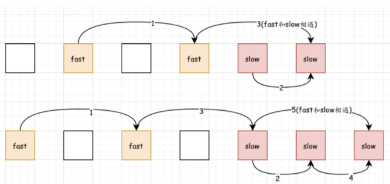
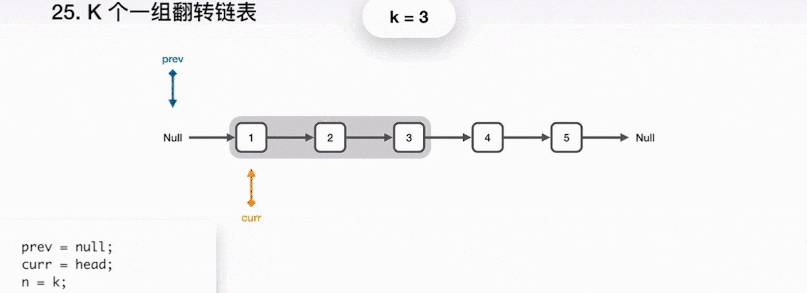

# 题目总结如下：

## [1. 反转链表](https://leetcode-cn.com/problems/reverse-linked-list/)（简单）

* 思路一： 头插法的思想进行逆序

  这个思想很重要， 我们知道链表的头插法可以把链表进行逆序， 所以可以使用这个方式， 为了更加清晰， 我习惯加一个头结点。    

  ```python
  class Solution:
      def reverseList(self, head):
          # 声明一个头结点
          pre_head = ListNode(-1)
  
          # 头插法逆序
          while head:
              q = head.next
              head.next = pre_head.next
              pre_head.next = head
              head = q
          return pre_head.next
    
  # python还可以有更简洁的代码
  class Solution:
      def reverseList(self, head):
          headnode = ListNode(-1)
          while head:
              head.next, headnode.next, head = headnode.next, head, head.next
          
          return headnode.next
  ```

  时间复杂度O(n), 空间复杂度O(1)

* 思路二：递归

  递归的思想是这样， 当前的节点是head, 假设我们已经把head.next的这个链表逆序完了， 比如1->2->3->4->5, 当前head指向1， 如果我已经通过调用自身这个函数拿到了5->4->3->2的时候， 只需要通过head.next.next = head就指向了1。 也就完成了逆序， 这里的核心代码， 也是比较难理解的就是上面这句代码。  因为下一步是2->1， 而此时head指向的是1， head.next指向的2， 我们想要的是2->1， 所以就是head.next.next = head。

  
  
  那么递归体定了， 结束条件呢？ 很显然， 就是当一个节点的时候， 就返回他本身， 而这个一个节点的意思是如果它本身是空， 或者.next是空， 就返回本身。
  
  ```python
  class Solution:
      def reverseList(self, head):
          
          # 结束条件
          if not head or not head.next:
              return head
          
          # 先去逆序head.next
          res = self.reverseList(head.next)  # 逆序完了之后
          head.next.next = head
          head.next = None

          return res
  ```
  
  时间复杂度O(n), 空间复杂度O(1)， 这个想法很巧妙， 也是尾递归常用的思路。
  
* 思路三： 双指针法

  这个思路就是遍历的同时进行逆序。 

  ```python
  class Solution:
      def reverseList(self, head):
          
          cur = head
          pre = None
          
          while cur:
              cur.next, pre, cur = pre, cur, cur.next
          return pre
  ```

  时间复杂度O(n), 空间复杂度O(1)

  还有思路就是开辟一个数组， 然后利用数组的逆序思想给链表重新赋值即可。 这个其实费时间， 也费空间， 不是好思路。 

参考：

* [国际站题解](https://leetcode.com/problems/reverse-linked-list/discuss/?currentPage=1&orderBy=most_votes&query=)
* [中国站题解](https://leetcode-cn.com/problems/reverse-linked-list/solution/)

## 2. [两两交换链表中的节点](https://leetcode-cn.com/problems/swap-nodes-in-pairs/)（中等）

* 思路一： 三指针遍历

  这个思路非常重要， 首先，先判断head，如果只有一个节点或者一个都没有，那么就直接返回，无需交换。
  如果上面不成立，则先建立一个头结点，然后一个尾指针始终指向交换之后的尾部。 然后建立三个指针： pre,p,q。pre在最前面，p中间，q是后面。 如果p不是空的时候， q指向p后面的节点，防止丢掉。 然后把前面的两个交换，交换完毕之后，把指针归位。

  ```python
  class Solution:
      def swapPairs(self, head: ListNode) -> ListNode:
          
          # 如果只有一个节点, 直接返回
          if not head or not head.next:
              return head
          
          headNode = ListNode(-1)
          headNode.next = head
          
          rear, pre, p = headNode, head, head.next
          
          while p:
              q = p.next
              
              p.next, pre.next = pre, p.next
              
              rear.next = p
              rear = pre
              pre = q
              p = pre.next if pre else None
          
          return headNode.next
  ```

  时间复杂度O(N), 空间复杂度O(1)

* 思路二： 递归

  递归的关键是要找到重复的步骤， 递归很重要的三个条件， 终止条件， 返回值， 单次的过程。在该题中， 终止条件就是head本身为空或者head.next为空， 这时候说明head只有一个节点， 返回。如果满足返回条件， 我们可以这么想： 当前节点是head， 下一个节点是head.next, 如果假设你给我把head.next.next的后边都逆序了， 那么我只需要把前面的head和head.next换一下位置， 然后head.next指向后面逆序的一长串。基于这个思想， 写过递归：

  ```python
class Solution:
      def swapPairs(self, head: ListNode) -> ListNode:
          
          # 如果只有一个节点, 直接返回
          if not head or not head.next:
              return head
          
          q = head.next     # 先保存head.next
          head.next = self.swapPairs(head.next.next)  # head与后面的逆序的接上来
          q.next = head     # 相当于前面两个逆序
          
          return q
  
      
  # 下面还有更简洁的代码 python元组解包+递归。 直接这样想核心代码， 当前是head, 先给我逆序head.next.next, 
  # 然后head.next.next指向逆序完的， head与head.next互换， 注意： 元组解包不考虑顺序
  class Solution:
      def swapPairs(self, head: ListNode) -> ListNode:
          
          if not head or not head.next:
              return head
          
          else:
          	head, head.next, head.next.next = head.next, head, self.swapPairs(head.next.next)
          return head
  
  #上面的原形是下面的这个
  class Solution(object):
      def swapPairs(self, head):
          if not head or not head.next: 
              return head
          
          new_start = head.next.next
          head, head.next = head.next, head
          head.next.next = self.swapPairs(new_start)
          return head
  ```
  
  时间复杂度O(N)， 空间复杂度O(1)
  
* 思路三： 两指针遍历

  这个题目中说了不单单交换数值，如果没限制的话，可以通过交换内部节点的值解决这个题，那样会更加简单，这里只是提供另一种思路：

  > 指定p和q两个指针遍历， 如果p和q都不为空，那么就交换两个的值，然后都往后走。

  

  ```python
  class Solution:
      def swapPairs(self, head: ListNode) -> ListNode:
          if not head or not head.next:
              return head
          
          pre, p = head, head.next
          
          while p:
              pre.val, p.val = p.val, pre.val
              pre = p.next
              p = pre.next if pre else None
          
          return head
  ```

参考：

  * [中国站题解](https://leetcode-cn.com/problems/swap-nodes-in-pairs/solution/)
  * [国际站题解](https://leetcode.com/problems/container-with-most-water/discuss/?currentPage=1&orderBy=most_votes&query=)

## 3. [环形链表](https://leetcode-cn.com/problems/linked-list-cycle/)（简单）

* 思路一： 哈希表的方式

  这个思路的话非常简单， 定义一个集合， 然后开始遍历链表里面的每个元素， 对于每一次遍历， 首先判断一下当前节点是否已经在集合里面， 如果在里面， 就说明有环， 返回。 没有的话就把当前节点加入到集合里面去， 当遍历结束， 说明没有遇到环。

  ```python
  class Solution:
      def hasCycle(self, head: ListNode) -> bool:
          
          if not head or not head.next:
              return False
          
          s = set()
          p = head
          while p:
              if p in s:
                  return True
              s.add(p)
              p = p.next
          
          return False
  ```

  时间复杂度O(N), 空间复杂度O(N)， 由于使用了集合， 而题目中尝试用O(1)的复杂度， 那么只能在链表上进行操作了。

* 思路二： 快慢指针法

  

  这里又是一种思维， 定义两个指针同时在起点出发， 快指针一次走一步， 慢指针一次走两步。如果有闭环，那么快慢指针一定会相遇；如果没有闭环，那么快指针一定会先走到头，直接return false就好了。

  ```python
  class Solution:
      def hasCycle(self, head: ListNode) -> bool:
          
          if not head or not head.next:
              return False
          
          p = q = head
          
          while q and q.next:
              p = p.next
              q = q.next.next 
              if p == q:
                  return True
          
          return False
  
  ```

  这个的时间复杂度是O(n), 空间复杂度O(1)


参考：

* [国际题解](https://leetcode.com/problems/linked-list-cycle/discuss/?currentPage=1&orderBy=most_votes&query=)
*  [中文题解](https://leetcode-cn.com/problems/linked-list-cycle/solution/)
*  这里有一个不错的链表题目算法总结：[https://leetcode-cn.com/problems/linked-list-cycle/solution/yi-wen-gao-ding-chang-jian-de-lian-biao-wen-ti-h-2/](https://leetcode-cn.com/problems/linked-list-cycle/solution/yi-wen-gao-ding-chang-jian-de-lian-biao-wen-ti-h-2/)

## 4. [环形链表II](https://leetcode-cn.com/problems/two-sum/)（中等）

* 思路一： 哈希表的方式

  **升维+空间换时间**是一种非常重要的思想，如果使用哈希表， 这个题目就会变得相对来说很简洁， 与上面那个相比， 只需要改一行代码， 定义一个集合， 然后开始遍历每一个节点， 对于每一次遍历， 判断是否在集合里面出现过， 如果出现过了， 直接返回这个节点即可， 这个节点即为相遇的节点。  等遍历结束， 返回None即可。

  ```python
  class Solution:
      def detectCycle(self, head: ListNode) -> ListNode:
          
          if not head or not head.next:
              return None
          
          s = set()
          p = head
          while p:
              if p in s:
                  return p
              s.add(p)
              p = p.next
          
          return None
  ```

* 思路二： 快慢指针

  这个快慢指针法其实在考察一个数学上的问题，有环的情况下先上结论：

  > - 如果快指针和慢指针都从head节点出发，快指针一次走两步，慢指针一次走一步，经历若干圈之后，两者一定会从某个节点相遇， 且快指针走过的路程是慢指针走过的路程的两倍。
  > - 不仅会相遇，如果这时候快指针回到起始位置，慢指针在相遇位置， 然后，快指针一次走一步，慢指针一次走一步，若干步之后，两者还会相遇，且相遇位置就是入环节点处。
  
  这里使用快慢指针的思路，其实利用了上面的这两个结论。
  首先，先解释一下子为什么是这样，结论一不解释， 会相遇这个如果不明白可以想象围着操场追赶，数学证明看LeetCode官方题解。 这里重点解释结论二， 看下面画的草图(A和C是一点，便于区分环)：
  
  
  
  就假设第一次相遇， 那么fast走的路程是 OA + AB + BC + CB, slow走的路程是OA + AB。 根据结论一， fast的走的路程应该是slow走的路程的两倍。即 OA + AB + BC + CB = OA + AB + OA + AB , A点和C点是同一点，即AB和CB其实是同一回事。 这样上面就成了 OA = BC。
  所以，如果在B点fast和slow相遇的话，fast回到原点，slow不动，那么slow和fast以1步的步伐走的时候，到再相遇，slow走的正是BC，fast走的正是OA。 而A正是入环点。
  
  ```python
  class Solution:
      def detectCycle(self, head: ListNode) -> ListNode:
          
          if not head or not head.next:
              return None
          
          fast = slow = head
          while fast and fast.next:
              slow = slow.next
              fast = fast.next.next
              if slow is fast:
                  fast = head
                  while fast != slow:
                      slow = slow.next
                      fast = fast.next
                  return fast
          
          return None
  ```

参考题解：

* [中文题解](https://leetcode-cn.com/problems/linked-list-cycle-ii/solution/)
* [国际站](https://leetcode.com/problems/linked-list-cycle-ii/discuss/?currentPage=1&orderBy=most_votes&query=)

## 5. [K个一组翻转链表(困难)](https://leetcode-cn.com/problems/reverse-nodes-in-k-group/)

* 思路一： 头插法

  这个题我开始用的链表头插+尾插的方式， 主要分为下面的三步：

  1. 先遍历一遍链表， 得到总结点数， 然后除以K， 得到逆序的组数
  2. 再开始遍历链表
     1. 如果当前组大于0 
        1. 定义一个变量进行计数， 如果变量小于k, 那么就采用头插的方式把元素插入到链表， 相当于逆序
        2. 否则， 说明k个元素已经逆序完毕， 这时候把新链表的尾指针移到最末尾
        3. 组数减一， 进行上面的操作
     2. 如果组为0， 说明后面的不够一组了， 直接插入到末尾即可

  ```python
  class Solution:
      def reverseKGroup(self, head: ListNode, k: int) -> ListNode:
  
          if not head or not head.next:
              return head
          
          pre_node = ListNode(-1)
          r = pre_node
          pre_node.next = None
          p = head
          node_cou = 0
          while p:
              node_cou += 1
              p = p.next
          # node_cou获得了节点总个数， 下面求组数
          group_cou = node_cou // k
  
          p = head
          # 下面遍历链表， 如果group_cou>0, 如果当前个数小于k， 那么头插到链表里， 否则尾插
          while p:
              while group_cou > 0:
                  temp_cou = k
                  while temp_cou > 0:
                      p.next, r.next, p = r.next, p, p.next 
                      temp_cou -= 1
                  # r移动到末尾
                  while r.next:
                      r = r.next
                  group_cou -= 1
              
              r.next = p
              break
          
          return pre_node.next
  
  ```

  这个的时间复杂度O(n)， 不过先前遍历了一遍， 可能会花一些时间， 空间复杂度O(1)， 有没有不事先遍历一遍的解法呢？  下面的这种方式。

* 思路二： 三指针法

  首先，用一个指针p负责遍历一遍链表，指针rear负责指向需要翻转的第一个节点，指针new_rear负责新链表里面，指向翻转组的最后一个节点。

  

  在遍历的时候，会用一个cou当做计数器数节点，如果小于k，p就往后走，如果等于k的时候，p正好指向需要反转的节点的后一个(看下面图中的第一次）。也就是p前面的节点需要逆序，rear指向翻转节点组的第一个节点。也就是rear指向的节点一直到p的前一个节点，都需要逆置到，即用头插法插入到新的链表中即可。插完之后， 要注意翻转完了一组，new_rear要移动最末尾。cou置零

  

  然后p继续往后走，还是按照上面的思路循环。但是当p走到空的时候，此时有两种情况：
  
  - 第一种是cou<k， 也就是说后面的不够一组逆置了，那就不改变顺序，直接把new_rear.next = rear。 连起来即可
  - 第二种是cou=k, 正好够一组逆置，这其实是k=元素个数的情况，此时，直接相当于把链表元素逆序。
  
  下面看图比较好理解：模拟了一遍k=2时的操作：（**重点看看我上面说的那几个指针的指向位置**）

  

  ```python
  class Solution:
      def reverseKGroup(self, head: ListNode, k: int) -> ListNode:
          
          if not head or not head.next:
              return head
          
          # 空链表头结点
          new_prehead = ListNode(-1)
          new_prehead.next = None
          new_rear = new_prehead
          
          p = head
          rear = head
          cou = 0
          
          while p:
              while p and cou < k:
                  p = p.next
                  cou = cou + 1
              
              if p:
                  while rear != p:
                      rear.next, new_rear.next, rear = new_rear.next, rear, rear.next
                  while new_rear.next:
                      new_rear = new_rear.next
                  cou = 0
                  
              elif cou < k:           # p为空的第一种情况直接连上
                  new_rear.next = rear
            
              else:                  # p为空的第二种情况直接逆置
                while rear:
                      rear.next, new_rear.next, rear = new_rear.next, rear, rear.next
          return new_prehead.next
  
  ```
  
  这个时间复杂度O(n), 但是要比上面那个要快， 空间复杂度O(1)
  
  
  
  思路三： 递归解法
  
  这个题依然可以使用递归， 递归的性质就是如果子问题和原问题的结构完全相同， 就可以用。分析一下这个题目，原问题就是我遍历整个链表， 如果够了k个我逆序， 不够k个我不动。 如果我设法已经把前面的k个链表翻转了， 后面的那些节点怎么处理呢？ 貌似依然是上面的解决方式，并且新的链要比原来的少，  这就是子问题。
  
  
  
    那么递归分为两个步骤：
  
  1. 先翻转以head开头的k个元素
  
  2. 将k+1个元素作为head递归调用函数
  
  3. 将上面的两个结果连起来
  
     注意， 这个题有个base case， 就是如果元素不足k个， 保持不变
  
     ```python
     class Solution:
          def reverseKGroup(self, head: ListNode, k: int) -> ListNode: 
             def reverse(a, b):           # 翻转从a到b的节点
                 pre, cur, nex = None, a, a
                 while cur != b:
                     cur.next, pre, cur = pre, cur, cur.next
                 return pre
     
             if not head or not head.next:
                 return head
             a = b = head
             # b 往前走k步
             for i in range(k):
                 if not b: return head            # 不足k步， 说明翻转完成， 直接返回head
                 b = b.next
             
             new_head = reverse(a, b)         # 翻转前k个， 此时末尾元素是a
             a.next = self.reverseKGroup(b, k)
             return new_head
     
     ```
  
  参考：
  
  * [中文题解](https://leetcode-cn.com/problems/reverse-nodes-in-k-group/solution/di-gui-si-wei-ru-he-tiao-chu-xi-jie-by-labuladong/)
  * [国际题解](https://leetcode.com/problems/reverse-nodes-in-k-group/discuss/?currentPage=1&orderBy=hot&query=)

## 6. 合并两个有序链表（简单）

* 思路一：迭代法

  这个题最容易想到的就是迭代了， 建立一个只有头结点的空链表， 然后两个指针分别指向这两个链表，然后开始比大小，如果p->valval， 那么把p插入空链表（尾插法）， 否则q插入空链表（尾插）。最后看看那个还剩下了，剩下的直接放入新链表的末尾，返回。

  ```python
  class Solution:
      def mergeTwoLists(self, l1: ListNode, l2: ListNode) -> ListNode:
          # 异常判断
          if not l1:
              return l2
          if not l2:
              return l1
          
          p, q = l1, l2
          pre_node = ListNode(-1)
          pre_node.next = None
          r = pre_node
  
          while p and q:
              if p.val > q.val:
                  r.next, q = q, q.next
              else:
                  r.next, p = p, p.next
              r = r.next
          
          if p:
              r.next = p
          if q:
              r.next = q
          
          return pre_node.next
  
  # 人家的简洁代码
  def mergeTwoLists1(self, l1, l2):
      dummy = cur = ListNode(0)
      while l1 and l2:
          if l1.val < l2.val:
              cur.next = l1
              l1 = l1.next
          else:
              cur.next = l2
              l2 = l2.next
          cur = cur.next
      cur.next = l1 or l2
      return dummy.next
  ```

* 思路二： 递归法

  这个题也可以用递归法， 总是感觉递归法一看就懂， 自己写不太容易相当， 还是得多练。 这个题考虑递归， 还是那三个要素：

  1. 终止条件： 如果某个链表为空， 就返回另一个链表
  2. 递归体： 如果当前某个链表的元素小， 就让它的next指向它之后的所有元素和另一个链表的排序结果
  3. 返回值： 返回其中的一个链表

```python
class Solution:
    def mergeTwoLists(self, l1: ListNode, l2: ListNode) -> ListNode:
        
        # 终止条件
        if not l1: return l2
        if not l2: return l1

        if l1.val < l2.val:
            l1.next = self.mergeTwoLists(l1.next, l2)
            return l1
        else:
            l2.next = self.mergeTwoLists(l1, l2.next)
            return l2

# 简洁代码
# recursively    
def mergeTwoLists2(self, l1, l2):
    if not l1 or not l2:
        return l1 or l2
    if l1.val < l2.val:
        l1.next = self.mergeTwoLists(l1.next, l2)
        return l1
    else:
        l2.next = self.mergeTwoLists(l1, l2.next)
        return l2
```

参考：

* [国际站](https://leetcode.com/problems/merge-two-sorted-lists/discuss/?currentPage=1&orderBy=most_votes&query=)
* [中文站](https://leetcode-cn.com/problems/merge-two-sorted-lists/solution/)

现在发现写代码，比较啰嗦， 不简洁