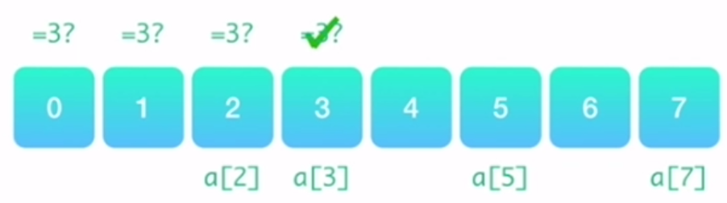
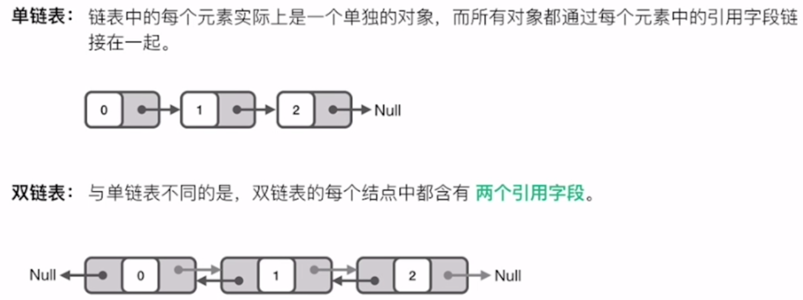

# 基础知识

## Array数组

关于Array， 我们需要知道的知识点：

1. Array常见的操作： 元素的增， 删， 改， 查和移动

2. Array访问数组时间复杂度O(1), 插入和删除时间复杂度O(n)， 内存连续
3. 比较经典的题目一般就是考察元素的合并， 交换， 添加， 删除等， 数组的遍历
4. 这里涉及到的一些思想：
   * 两指针一前一后往中间遍历， 这个可以进行数组逆序
   * 两指针从前面往后遍历， 可以进行符合特定条件元素的筛选
   * 重建数组思想
   * 空间换时间
   * 哈希存储等

5. **数组的优缺点**(要掌握一种数据结构，就必须要懂得分析它的优点和缺点)
   * 数组的优点在于：构建非常简单, 能在 O(1) 的时间里根据数组的下标（index）查询某个元素

- *  数组的缺点在于： 构建时必须分配一段连续的空间、查询某个元素是否存在时需要遍历整个数组，耗费 O(n) 的时间（其中，n 是元素的个数）、删除和添加某个元素时，同样需要耗费 O(n) 的时间

    所以，当你在考虑是否应当采用数组去辅助你的算法时，请务必考虑它的优缺点，看看它的缺点是否会阻碍你的算法复杂度以及空间复杂度。

## 链表

关于链表， 我们需要知道的知识点：

1. 常见操作： 元素的增， 删， 改， 查， 比较复杂的就是各种指针
2. Linklist访问数组的时间复杂度O(n), 插入和删除时间复杂度O(1), 内存不连续
3. 比较经典的一些题目考察的是链表的前插， 后插， 逆序， 翻转， 合并和移动等。
4. 这里涉及到的一些思想：
   * 头结点思想， 声明一个头结点可以方便很多事，一般用在要返回新的链表的题目中，比如，给定两个排好序的链表，要求将它们整合在一起		
   
       并排好序。又比如，将一个链表中的奇数和偶数按照原定的顺序分开后重新组合成一个新的
   
       链表，链表的头一半是奇数，后一半是偶数。
   
   * 头插法逆序思想
   
   * 三指针遍历， 可以做很多事情， 比如两两交换，逆序, 翻转等
   
   * 快慢指针的思想， 一般可以用到环里面
   
   * 递归， 链表这个地方的题目很容易递归起来

5. 优缺点：
   1. 优点：链表能灵活地分配内存空间； 能在 O(1) 时间内删除或者添加元素，前提是该元素的前一个元素已知，当然也取决于是单链表还是双链表，在双链表中，如果已知该元素的后一个元素，同样可以在 O(1) 时间内删除或者添加该元素。
   2. 缺点：不像数组能通过下标迅速读取元素，每次都要从链表头开始一个一个读取；查询第 k 个元素需要 O(k) 时间。

6. 应用场景：  如果要解决的问题里面需要很多快速查询，链表可能并不适合；如果遇到的问题中，数据的元素个数不确定，而且需要经常进行数据的添加和删除，那么链表会比较合适。而如果数据元素大小确定，删除插入的操作并不多，那么数组可能更适合。
7. 建议：在解决链表的题目时，可以在纸上或者白板上画出节点之间的相互关系，然后画出修改的方法，既可以帮助你分析问题，又可以在面试的时候，帮助面试官清楚地看到你的思路。

## 跳表

关于跳表， 我们需要大体了解：

1. 跳表的主要应用： Redis中进行应用
2. 跳表可以解决链表的访问元素O(n)复杂度的缺陷
3. 对链表进行加速的一个中心思想就是： 空间换时间， 所以跳表通过添加索引的方式优化了链表的查询， 把O(n)的时间复杂度降到O(logn)
4. 如何提高链表线性查找效率？   添加索引， 

5. 跳表的空间复杂度虽然也是O(n), 但是比普通链表要非空间很多， 因为要存很多索引。 
6. **空间换时间**
7. 关于跳表， 考察的不多， 感兴趣的可以看下面的链接：
   * [https://www.jianshu.com/p/b1ab4a170c3c](https://www.jianshu.com/p/b1ab4a170c3c)
   * [https://leetcode-cn.com/problems/lru-cache](https://leetcode-cn.com/problems/lru-cache)
   * [https://redisbook.readthedocs.io/en/latest/internal-datastruct/skiplist.html](https://redisbook.readthedocs.io/en/latest/internal-datastruct/skiplist.html)
   * [https://www.zhihu.com/question/20202931](https://www.zhihu.com/question/20202931)
