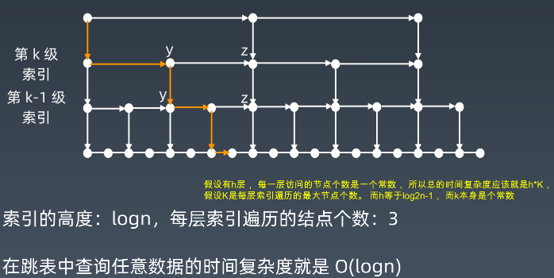

# 基础知识

关于Array， 我们需要知道的知识点：

1. Array常见的操作： 元素的增， 删， 改， 查和移动

2. Array访问数组时间复杂度O(1), 插入和删除时间复杂度O(n)， 内存连续
3. 比较经典的题目一般就是考察元素的合并， 交换， 添加， 删除等， 数组的遍历
4. 这里涉及到的一些思想：
   * 两指针一前一后往中间遍历， 这个可以进行数组逆序
   * 两指针从前面往后遍历， 可以进行符合特定条件元素的筛选
   * 重建数组思想
   * 空间换时间
   * 哈希存储等

关于链表， 我们需要知道的知识点：

1. 常见操作： 元素的增， 删， 改， 查， 比较复杂的就是各种指针
2. Linklist访问数组的时间复杂度O(n), 插入和删除时间复杂度O(1), 内存不连续
3. 比较经典的一些题目考察的是链表的前插， 后插， 逆序， 翻转， 合并和移动等。
4. 这里涉及到的一些思想：
   * 头结点思想， 声明一个头结点可以方便很多事
   * 头插法逆序思想
   * 三指针遍历， 可以做很多事情， 比如两两交换，逆序等
   * 快慢指针的思想， 一般可以用到环里面
   * 递归， 链表这个地方的题目很容易递归起来

关于跳表， 我们需要大体了解：

1. 跳表的主要应用： Redis中进行应用
2. 跳表可以解决链表的访问元素O(n)复杂度的缺陷
3. 对链表进行加速的一个中心思想就是： 空间换时间， 所以跳表通过添加索引的方式优化了链表的查询， 把O(n)的时间复杂度降到O(logn)
4. 如何提高链表线性查找效率？   添加索引， 

5. 跳表的空间复杂度虽然也是O(n), 但是比普通链表要非空间很多， 因为要存很多索引。 
6. **空间换时间**
7. 关于跳表， 考察的不多， 感兴趣的可以看下面的链接：
   * [https://www.jianshu.com/p/b1ab4a170c3c](https://www.jianshu.com/p/b1ab4a170c3c)
   * [https://leetcode-cn.com/problems/lru-cache](https://leetcode-cn.com/problems/lru-cache)
   * [https://redisbook.readthedocs.io/en/latest/internal-datastruct/skiplist.html](https://redisbook.readthedocs.io/en/latest/internal-datastruct/skiplist.html)
   * [https://www.zhihu.com/question/20202931](https://www.zhihu.com/question/20202931)
