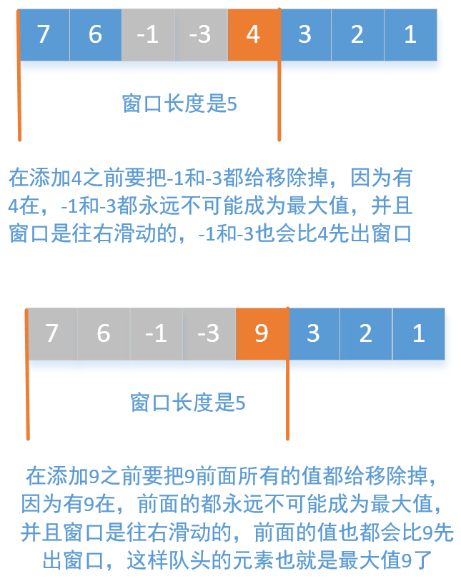
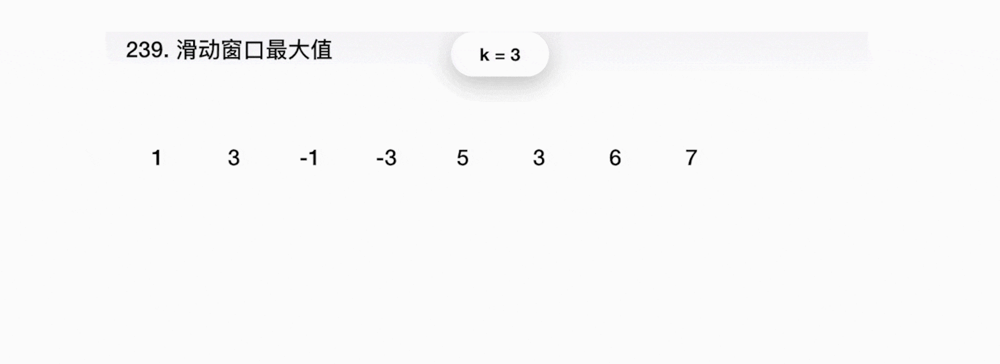

# 题目总结如下：

如果一个东西， 如果有所谓的**最近相关性**， 就可以考虑用栈来解决问题。 如果有所谓的**先来后到**， 就可以考虑用队列来解决。 算法都是来源于生活， 都可以现实生活中看到他们的身影。

如果是只用栈来实现队列， 那么需要两个栈， 如果是只用队列来实现栈， 那么就需要两个队列。

## 1. [滑动窗口最大值](https://leetcode-cn.com/problems/sliding-window-maximum/)(困难)

* 思路一： 暴力解法

  这个思路很容易想到， 就是遍历一遍， 每一次找到那个窗口， 获取到最大值即可。 但是这个时间复杂度是$O(n*k)$, python来说会超时

  ```python
  class Solution:
      def maxSlidingWindow(self, nums: List[int], k: int) -> List[int]:
  
          res = []
  
          for i in range(len(nums)-k):
              windows = nums[i:i+k]
              res.append(max(windows))
          
          res.append(max(nums[len(nums)-k:]))
  
          return res
  ```

  所以这种方式不行

* 思路二：双端队列

  上面暴力解法的超时就是在于每个窗口内查找最大元素的时候花费时间， 其实我们的窗口从前往后滑动， 那么对于第一个窗口， 假如我们已经找到了最大值， 那么窗口往后移动的时候， 相比较于前面的这个窗口， 新窗口内的元素无非就是原来窗口的第一个元素出去了， 又加了一个新元素。 所以再次重新遍历窗口找最大值根本就没有必要。  有两个方法可以节省时间：

  第一个方法就是先找到前k个元素里面的最大值， 然后循环n-k次， 在每次循环中， 如果发现窗口新加入的元素比前面窗口中的最大值大， 加入结果即可， 且更新一下窗口最大值， 如果发现新加入的元素和前面窗口的最大值相等， 那么就需要重新找新窗口里面的最大值。 代码如下：
  
  ```python
  class Solution:
      def maxSlidingWindow(self, nums: List[int], k: int) -> List[int]:
          res = []
  
          win_max = max(nums[:k])   # 先保存第一个滑动窗口的最大值
  
          # 下面循环n-k次， 对于每次循环， 要比较新加入的元素是否大于前面窗口的最大元素， 如果大于直接加入结果， 且更新最大值
          # 如果不大于的话， 看前面窗口的首元素是否是最大元素， 如果不是， 那说明最大值在后面的窗口中， 已经加入到了结果
          # 如果是， 说明前一窗口的最大值就是首元素， 由于滑动窗口后移已经出去了， 新窗口里面需要重新找最大值
          for i in range(len(nums)-k):
              res.append(win_max)
  
              if nums[i+k] > win_max:             # 新窗口的最后一个元素大于win_max， 更新最大值
                  win_max = nums[i+k]
              elif nums[i] == win_max:        # 前一个窗口首元素为前一窗口最大值， 这时候需要重新在新窗口找最大
                  win_max = max(nums[i+1:i+k+1])
          
          # 这个是最后那个窗口不够k的
          res.append(max(nums[len(nums)-k:]))
          return res
  ```
  
  这个竟然达到了最快速度， 68ms, 击败了99.15%。
  
  
  
  第二个方法就是双端队列， 我们完全可以在遍历前面那个窗口的时候， 就把窗口内元素按照递减顺序放到一个双端队列里面， 这时候， 队头元素就是最大值， 当窗口后移， 后面一个元素加入的时候， 需要在添加之前， 把队列里面把它小的移除掉， 因为有新元素的加入后， 比他小的不可能再成为最大值， 且窗口是往右滑动的， 我们必须始终保证**对头元素是队列中最大的值， 而保证的方式就是在添加一个值之前，比他小的都要被移除掉，然后再添加这个值。** 看下面这个图：
  
  
  
  所以我们使用一个双端队列就可以在线性的时间内完成这个问题, 代码思路如下：
  
  1. 首先声明一个双端队列， 一个结果列表
  2. 开始遍历数组，如果队列非空， 且当前元素大于队尾元素， 则队尾元素出队， 然后把当前元素加入
  3. 如果发现队头元素不在当前窗口中了， 队头元素出队， 否则， 当满足窗口大小的时候， 加入结果
  
  ```python
  class Solution:
      def maxSlidingWindow(self, nums: List[int], k: int) -> List[int]:
          from collections import deque
  
          d = deque([])
          res = []
      
          for i in range(len(nums)):
  
              # 如果队列非空， 且当前元素大于等于队尾元素， 队尾元素出队
              while d and nums[i] >= nums[d[-1]]:
                  d.pop()
              
              d.append(i)
  
              # 如果队头元素不在新窗口内， 出队
              if d[0] == i-k:
                  d.popleft()
  
              if i >= k-1:
                  res.append(nums[d[0]])
                
          return res
  ```
  
  这个线性时间复杂度， 128ms， 不如上面那个快。看个动画吧：
  
  

参考：

* [中文题解](https://leetcode-cn.com/problems/sliding-window-maximum/solution/)
* [国际站](https://leetcode.com/problems/sliding-window-maximum/discuss/65901/9-lines-Ruby-11-lines-Python-O(n))

## 6. [设计循环双端队列](https://leetcode-cn.com/problems/design-circular-deque/)(中等)

这个没有啥技术含量， 直接列表操作即可：

```python
class MyCircularDeque:

    def __init__(self, k: int):
        """
        Initialize your data structure here. Set the size of the deque to be k.
        """
        self.q = []
        self.init_size = k
        

    def insertFront(self, value: int) -> bool:
        """
        Adds an item at the front of Deque. Return true if the operation is successful.
        """
        if len(self.q) == self.init_size:
            return False
        self.q.insert(0, value)
        return True

    def insertLast(self, value: int) -> bool:
        """
        Adds an item at the rear of Deque. Return true if the operation is successful.
        """
        if len(self.q) == self.init_size:
            return False
        self.q.append(value)
        return True

    def deleteFront(self) -> bool:
        """
        Deletes an item from the front of Deque. Return true if the operation is successful.
        """
        if len(self.q) == 0:
            return False
        
        self.q.pop(0)

        return True

    def deleteLast(self) -> bool:
        """
        Deletes an item from the rear of Deque. Return true if the operation is successful.
        """
        if len(self.q) == 0:
            return False
        
        self.q.pop()
        return True

        

    def getFront(self) -> int:
        """
        Get the front item from the deque.
        """
        if len(self.q) == 0:
            return -1
        return self.q[0]
        

    def getRear(self) -> int:
        """
        Get the last item from the deque.
        """
        if len(self.q) == 0:
            return -1
        return self.q[-1]

    def isEmpty(self) -> bool:
        """
        Checks whether the circular deque is empty or not.
        """
        if len(self.q) == 0:
            return True
        

    def isFull(self) -> bool:
        """
        Checks whether the circular deque is full or not.
        """
        if len(self.q) == self.init_size:
            return True
```

