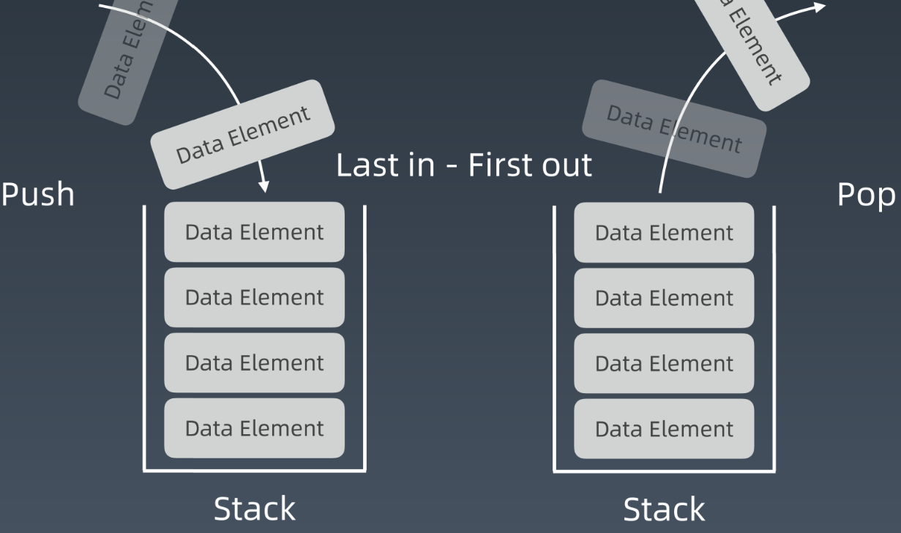

# 栈和队列的基础知识

## 栈(stack)

**特点**： 栈的最大特点就是后进先出（LIFO）。对于栈中的数据来说，所有操作都是在栈的顶部完成的，只可以查看栈顶部的元素，只能够向栈的顶部压⼊数据，也只能从栈的顶部弹出数据。

**实现**：利用一个单链表来实现栈的数据结构。而且，因为我们都只针对栈顶元素进行操作，所以借用单链表的头就能让所有栈的操作在 O(1) 的时间内完成。 如果打算用一个数组外加一个指针来实现相似的效果，那么，一旦数组的长度发生了改变，哪怕只是在最后添加一个新的元素，时间复杂度都不再是 O(1)，而且，空间复杂度也得不到优化。

**复杂度**： 添加、删除元素皆为O(1), 查询的话时间复杂度O(N), python中可以通过一个列表进行实现， append操作和pop操作就是入栈和出栈操作。



**应用场景**：在解决某个问题的时候，只要求关心最近一次的操作，并且在操作完成了之后，需要向前查找到更前一次的操作。

**注意**：栈是许多 LeetCode 中等难度偏上的题目里面经常需要用到的数据结构，掌握好它是十分必要的。

## 队列(Queue)

**特点**：和栈不同，队列的最大特点是先进先出（FIFO），就好像按顺序排队一样。对于队列的数据来说，我们只允许在队尾查看和添加数据，在队头查看和删除数据。

**复杂度**： 添加删除元素皆为O(1), 查询的话O(N)， python里面的话好像是可以import queue， 用queue.Queue建立一个队列。


**应用场景**：直观来看，当我们需要按照一定的顺序来处理数据，而该数据的数据量在不断地变化的时候，则需要队列来帮助解题。在算法面试题当中，广度优先搜索（Breadth-First Search）是运用队列最多的地方。

**双端队列(Deque)**: 可以理解成Stack和Queue的组合， 两端都可以进出的Queue， 插入和删除是O(1)的操作， 查询依然是O(N)， 这个python里面可以使用collections里面的[deque实现](https://docs.python.org/zh-cn/3.8/library/collections.html#collections.deque)， 这个比较好用。


**实现**：可以借助双链表来实现队列。和普通队列不同的就是在队列的首尾都可以在O(1)的时间内进行数据的查看、添加和删除。

**应用场景**：**：**双端队列最常用的地方就是实现一个长度动态变化的窗口或者连续区间，而动态窗口这种数据结构在很多题目里都有运用。

 python里面实现双端队列可以使用collections模块里面的deque类，deque 是双边队列（double-ended queue），具有队列和栈的性质，在 list 的基础上增加了移动、旋转和增删等。常用方法：

```python 
d = collections.deque([])
d.append('a') # 在最右边添加一个元素，此时 d=deque('a')
d.appendleft('b') # 在最左边添加一个元素，此时 d=deque(['b', 'a'])
d.extend(['c','d']) # 在最右边添加所有元素，此时 d=deque(['b', 'a', 'c', 'd'])
d.extendleft(['e','f']) # 在最左边添加所有元素，此时 d=deque(['f', 'e', 'b', 'a', 'c', 'd'])
d.pop() # 将最右边的元素取出，返回 'd'，此时 d=deque(['f', 'e', 'b', 'a', 'c'])
d.popleft() # 将最左边的元素取出，返回 'f'，此时 d=deque(['e', 'b', 'a', 'c'])
d.rotate(-2) # 向左旋转两个位置（正数则向右旋转），此时 d=deque(['a', 'c', 'e', 'b'])
d.count('a') # 队列中'a'的个数，返回 1
d.remove('c') # 从队列中将'c'删除，此时 d=deque(['a', 'e', 'b'])
d.reverse() # 将队列倒序，此时 d=deque(['b', 'e', 'a'])
```

**优先队列(Priority Queue)**: 插入操作O(1), 取出操作O(logN) - 按照元素的优先级取出元素， 可以理解成VIP， 即可以根据元素的重要性取出元素， queue里面也有这个东西。

优先队列(Priority Queue): 插入操作O(1), 取出操作O(logN) - 按照元素的优先级取出元素， 可以理解成VIP， 即可以根据元素的重要性取出元素， queue里面也有这个东西。

上面这些数据结构的python实现， 可以参考[官方文档](https://docs.python.org/zh-cn/3.8/library/)

# 做过的题目

栈部分：

* 有效的括号(简单)
* 最小栈(简单)
* 柱状图中的最大矩形(困难)
* 接雨水(困难)

队列部分：

* 滑动窗口最大值(中等)
* 设计队列(中等)