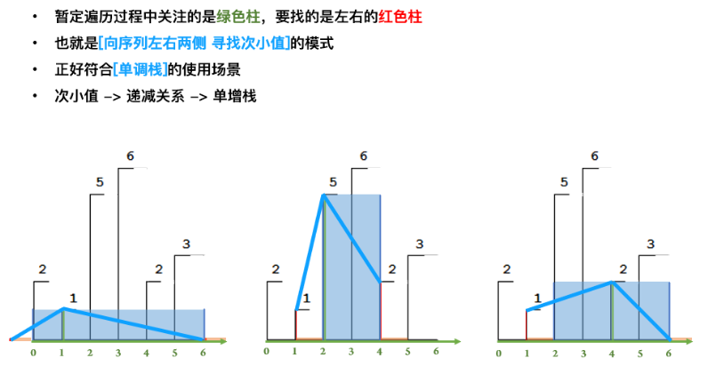

题目总结如下：

如果一个东西， 如果有所谓的**最近相关性**， 就可以考虑用栈来解决问题。 如果有所谓的**先来后到**， 就可以考虑用队列来解决。 算法都是来源于生活， 都可以现实生活中看到他们的身影。

如果是只用栈来实现队列， 那么需要两个栈， 如果是只用队列来实现栈， 那么就需要两个队列。

## 1. [有效的括号](https://leetcode-cn.com/problems/valid-parentheses/description/)（简单）

* 思路一：暴力解法

  这个题目也可以用暴力解法， 思路就是直接找"()", "[]", "{}"， 如果发现， 就替换为空字符， 如果最后字符串为空了， 返回True， 这个时间复杂度O(n^2)

  ```python
  class Solution:
      def isValid(self, s: str) -> bool:
  
          if len(s) % 2 != 0:
              return False
          
          while "()" in s or "[]" in s or "{}" in s:
              s = s.replace("()", "").replace("[]", "").replace("{}", "")
          return len(s) == 0
  
  ```

  这个时间复杂度较高， 所以并不好， 只是在这里拓展一下思路， 因为暴力法当时也没有想到。空间复杂度O(1)

* 思路二： 栈的方式

  这个是本题最优和最常规的加法， 也是本题想考察的知识点， 因为这个题有**最近相关性**， 即如果遇到某一个右括号， 必须找左边最近的左括号进行匹配。所以正好利用栈里面的**后进先出**的原理， 思路是这样：

  先建立左右括号的映射关系， 然后遍历一遍字符串， 如果是左括号， 则入栈， 如果是右括号， 如果当前的栈为空， 返回False， 否则出栈一个元素看是否能和右括号匹配， 不匹配返回False。 遍历结束后， 如果栈非空， False， 否则返回True。 

  Python实现栈： 一个列表就可以， 栈的出栈使用pop(), 进栈使用append(), 栈顶元素使用[-1]

  

  下面是我写的第一款代码， 虽然可以A， 但是不够简洁：
  
  ```python
  class Solution:
      def isValid(self, s: str) -> bool:
  
          if len(s) == 0:
              return True
  
          stack = [] 
          # 建立一个字典， 进行匹配用
          pair = {'(': ')', '[':']', '{': '}'}
  
          # 下面遍历字符串
          for i in s:
              
              if i in pair:
                  stack.append(i)
              
              if i in [')', ']', '}']:
                  # 如果此时栈为空， 直接返回false
                  if len(stack) == 0:
                      return False
  
                  # 出栈一个元素
                  left = stack.pop()
                  if pair[left] != i:
                      return False
          
          if len(stack) != 0:
              return False
          else:
            return True
  ```

  下面看人家的简洁代码， 简直写起来太帅， 没有废话：
  
  ```python
  class Solution:
      def isValid(self, s: str) -> bool:
          if len(s) % 2 != 0:
              return False
          
          dic = {'{': '}',  '[': ']', '(': ')', '?': '?'}
          stack = ['?']
          for c in s:
              if c in dic: stack.append(c)
              elif dic[stack.pop()] != c: return False 
          return len(stack) == 1
  
  # 这里一个很巧妙的东西就是？， 这个不用判断是否栈是否为空
  
  class Solution:
      def isValid(self, s: str) -> bool:
  	  
          mapp = {')': '(', ']':'[', '}': '{'}
          stack = []
          for ch in s:
              if stack and ch in mapp:
                  if stack.pop() != mapp[ch]:
                      return False
              else:
                  stack.append(ch)
          
        return len(stack) == 0
  ```
  
  这个的时间复杂度是O(n)， 空间复杂度O(n), 因为用到了栈。

参考：

* [中文解](https://leetcode-cn.com/problems/valid-parentheses/solution/)
* [国际站](https://leetcode.com/problems/valid-parentheses/discuss/?currentPage=1&orderBy=most_votes&query=)

## 2. [最小栈](https://leetcode-cn.com/problems/min-stack/)(简单)

这个题是要设计一个栈了。由于python的列表可以模拟一个栈， 所以栈的push， pop和栈顶元素比较简单， 比较复杂的就是常数时间内检索到最小元素， 这个问题就需要借助另一个辅助的栈。 每次元素入栈的时候， 辅助栈里面都会存当前的最小元素， 如果元素出栈， 辅助栈里面当前的最小元素也出栈即可。 这样辅助栈的栈顶元素始终是当前栈状态下元素的最小值。

```python
class MinStack:

    def __init__(self):
        """
        initialize your data structure here.
        """
        self.stack = list()
        self.min_stack = [math.inf]


    def push(self, x: int) -> None:
        self.stack.append(x)
        self.min_stack.append(min(x, self.min_stack[-1]))
        

    def pop(self) -> None:
        self.stack.pop()
        self.min_stack.pop()


    def top(self) -> int:
        return self.stack[-1]


    def getMin(self) -> int:
        return self.min_stack[-1]
```

## 3. [柱状图中的最大矩形](https://leetcode-cn.com/problems/largest-rectangle-in-histogram/)（困难）

遇到这种题目先不要懵， 做题很重要的一个思路就是把复杂的问题化简单， 或者要从整体到局部， 先拿其中一个来看， 会有什么操作， 由于是往两边绘制图形， 所以最重要的就是**从一个柱子出发， 往左右找边界去， 即我到哪里就不能再画下去了**， 会发现， 往两边走， 碰到比他矮的柱子， 就无法再画图了。 所以才有了下面的三种方式， 而单调栈的这种思路我们需要记住。

* 思路一： 暴力法

  这个题如果一上来没有思路， 就先想到暴力法， 也就是用两个指针i, j， 从头进行循环， 即：

  for i -> 0, n-1:

  ​	for j -> i, n-1:

  ​		find 当前高度， 当前宽度， 求出当前面积， 进行更新

  ```python 
  class Solution:
      def largestRectangleArea(self, heights: List[int]) -> int:
  
          max_area = 0
  
          if len(heights) < 1:
              return max_area
          n = len(heights)
          for i in range(n):
              for j in range(i, n):
                  # 求最大面积
                  curr_height = min(heights[i:j+1])
                  curr_width = j - i + 1
                  curr_area = curr_height * curr_width
                  if curr_area > max_area:
                      max_area = curr_area
          
          return max_area
  ```

  当然这个方法A不掉， 会超出时间限制。  时间复杂度为O(n^3)

* 思路二： 暴力法2

  这个思路可以用O(n^2)的时间复杂度， 也就是我们只需要遍历每根柱子， 当前柱子为高， 然后往柱子左边和右边遍历， 去找比他低的第一个柱子， 这就是该柱子的左右边界， 根据这个求出当前柱子可以围成的最大面积。 更新即可。

  ```python
  class Solution:
      def largestRectangleArea(self, heights: List[int]) -> int:
  
          max_area, n =  0, len(heights)
  
          if len(heights) < 1:
              return max_area
          
          for i in range(n):  # 遍历每根柱子
              # 以当前柱子的高度为高， 宽度初为1
              h, w = heights[i], 1
              # 左右遍历指针
              l, r = i-1, i+1
              while l >= 0 and heights[l] >= h:
                  l -= 1
                  w += 1
              while r < n and heights[r] >= h:
                  r += 1
                  w += 1
              max_area = max(max_area, h*w)
          
          return max_area
  ```

  这个python里面依然会超时， python下下面这种方法是最好的。

* 思路三： 单调栈（这个题目只需要看这个题解）

  这是一个非常典型的利用单调栈来解决顺序和大小综合问题的题目， **单调栈特别适合解决两头大小决定中间值大小的题目**。

  

  首先， 这个题目为什么想到用到单调栈？   考虑上面的暴力解法2， 当我们确定了中间的柱子之后， 我们需要去找他的左右边界， 这时候， 用的是遍历， 即又嵌套了一个O(n)的复杂度在里面， 那么有没有把这个寻找的过程变成O(1)呢？  其实是可以的， 因为我们是从左到右遍历的柱子， 如果我们遍历每个柱子的时候， 用一个单调栈来记录左边的柱子高度， **即遍历的时候， 只要不遇到比栈顶柱子高度高的， 就一直往栈里面加**， 这时候， 其实这个栈就记录了每个柱子的左边边界。 就拿栈顶柱子来说， 它下一个柱子就是它的左边界。 那么右边界怎么找呢？   **这个就是遍历的时候发现的比栈顶元素小的柱子**， 遍历的时候， 如果发现了当前柱子高度， 比栈顶元素小， 说明了**对于当前的栈顶元素来说， 它的右边界就是当前遍历的柱子， 左边界就是单调栈里面它压着的柱子， 这时候， 就可以出栈栈顶元素， 并计算栈顶元素的往左往右能绘制的矩形的最大面积了**。 怎么计算呢？  面积的高度是当前栈顶元素的高度， 面积的宽度是右边界的下标 - (左边界的下标+1)， 因为左边界的高度是比当前栈顶元素小， 画不到那个位置去。

  这个方式相比较于上面的暴力来说， 只需要遍历一遍柱子就可以， 把时间复杂度降到了O(n)，下面是一些细节：

  1. 对于当前柱子， 如何看待左右边界？    

     1. 数组本身的边界
     2. 遇到比当前柱子矮的柱子

     这里有个技巧**如果在数组的两侧添加高度为0的柱子， 那么这个问题只剩下第二条**， 当然添加高度为0的柱子还有一个好处就是具体遍历的时候， 可以把所有柱子一起对待， 如果不加0的柱子， 对于第一个柱子， 栈此时为空， 没有左边界， 对于最后一个柱子， 没法找到当前遍历的元素了， 也就可能无法找到右边界。

  2. 如何计算宽度？ 我们这里需要的是右边界和左边界的下标位置， 右边界的位置 - （左边界的位置+1）， 所以我们这里需要保存**下标**。

  3. 遍历的当前柱其实是**右边界**， 栈顶元素才是我们上面暴力法2里面的当前柱， 也就是将被弹出的高柱， 弹出后的栈顶才是左侧的边界。

  下面开始梳理代码思路：

  1. 首先， 定义一个变量存储最后的结果。
  
   	2. 把原数组的首尾加0柱子， 让后面的操作处理一致
   	3. 定义一个栈
 	4. 开始遍历每一个柱子， 如果栈此时不为空， 并且当前柱子的高度比栈顶柱子的高度小， 此时执行出栈操作， 更新面积， 否则， 遍历的柱子进栈

  ```python
  class Solution:
      def largestRectangleArea(self, heights: List[int]) -> int:
  
          max_area = 0
          heights = [0] + heights + [0]
          stack = []
  
          # 开始遍历所有柱子
          for i in range(len(heights)):
              # 当栈不为空， 并且当前柱子比栈顶柱子要小， 出栈更新面积
              while stack and heights[i] < heights[stack[-1]]:     # 这个地方， 如果不设置右边的哨兵0的话， 就需要单独判断柱子递增的情况， 即如果柱子一直单调递增的话， 这个循环就不会执行了， 找不到右边界了， 而如果不设置左边哨兵0的话， 如果栈顶元素一直小于当前柱子， 一直出栈， 到最后一个元素出栈之后， stack[-1]就会越界。
                  h = heights[stack.pop()]   # 当前栈顶元素出栈, 此时栈顶元素为它左边界
                  w = i - (stack[-1]+1)
                  max_area = max(max_area, h * w)
              
              # 否则， 直接进栈
              stack.append(i)
          
          return max_area
  ```

  这两个哨兵设置的非常巧妙。  单调栈这个知识点也要学习一下

参考：

* [中文题解](https://leetcode-cn.com/problems/largest-rectangle-in-histogram/solution/4ye-pptjie-shi-wei-he-ji-ru-he-jiang-dan-diao-zhan/)
* [国际站](https://leetcode.com/problems/largest-rectangle-in-histogram/discuss/?currentPage=1&orderBy=most_votes&query=)

## 4. [接雨水](https://leetcode-cn.com/problems/trapping-rain-water/)（困难）

这个题一开始又没有思路， 即使暴力求解的方式也没写出来， 只是隐约的知道对于每个柱子， 要找比他大的边界， 所以看了题解之后， 才发现思路是如此的收到限制。  下面思路里面比较好的就是单调栈和动态规划， 主要看这两个。

* 思路一： 暴力法

  这个题可以按列求解， 也就是遍历每一个柱子， 对于每个柱子， 分别向两边去找最高的柱子， 找到之后， 根据木桶效应原理， 两个边界里面的最小的才是决定要存多少水， 这样就得到了两个边界里面的最小值，  那么如何判断这个地方能不能存水呢？   就是比较一下两个边界的最小值和当前柱子的高度， 如果最小值比高度高， 才可能存水， 并且存水的单位就是最小值减去当前高度。     遍历所有柱子， 就可以得到存水的总单位。代码如下：

  ```python
  class Solution:
      
      def trap(self, height: List[int]) -> int:
  
          # 定义一个结果
          res = 0
  
          for i in range(1, len(height)-1):  # 首尾柱子不可能存水
  
              left_h, right_h = 0, 0
              # 找左边最高的
              for j in range(i, -1, -1):
                  if height[j] > left_h:
                      left_h = height[j]
              
              # 右边最高的
              for k in range(i+1, len(height)):
                  if height[k] > right_h:
                      right_h = height[k]
              
              min_h = min(left_h, right_h)
  
              # 如果这个最小值大于当前的柱子高度， 才可能存水
              if (min_h > height[i]):
                  res += (min_h-height[i])
          
          return res
  ```

  这个的时间复杂度O(n^2), 空间复杂度O(1)， 这个时间依然是花费在了内层循环里面， 所以依然可以考虑是否通过单调栈来解决这个问题。  如果是单调栈的话， 应该是一个递减栈。

* 思路二： 单调递减栈

  这个题目与上面的柱形图中的最大矩形异曲同工， 虽然知道用单调栈， 但是具体操作的时候不知道应该怎么操作了？  这个题其实应该是这样考虑， 我们要维护一个单调递减栈， 这个就类似于与上面的找左右边界的最大值一样， 左边界的最大值就是在栈里面进行保存， 而右边界的最大值当前遍历元素， 如果遍历的当前元素大于栈顶元素， 说明栈顶元素处可以形成积水，  因为栈是单调递减的， 左边的元素都比栈顶元素大。这时候， 就可以计算当前积水的数量， 计算方式就是：宽度*高度。 宽度就是当前遍历元素下标 - 出栈栈顶元素之后的栈顶元素下标 - 1,  这个类比上面那个题。 高度是栈顶元素左右边界的高度最小值减去它本身。 这样就得到了积水的面积， 直到遍历结束。  这个题这样描述有些抽象， 下面这个例子感觉比较好：

  

  1. 首先将height[0]入栈， 然后current指向的高度大于栈顶高度， 所以把栈顶height[0]出栈， 然后栈空， 说明没有左边界， 把height[1]入栈， current后移。

     

  2. 然后current指向的高度小于栈顶高度， height[2]入栈， current后移

     

  3. current指向3的位置， 这个时候，发现当前位置高度大于栈顶元素的高度， 说明可以形成积水了， 则栈顶元素弹出， 计算height[3]与新的栈顶元素之间的积水， 方法就是宽度(3-1-1) * 高度(1*(1-0)) = 1， 计算完之后继续判断current与新的栈顶关系

     

  4. 发现当前元素依然大于栈顶元素， 继续弹出， 发现此时栈空了， height[3]入栈， current继续往后。

     

  5. 然后current指向元素小于栈顶元素， 继续入栈， current后移

     

  6. 直到height[6]的时候， 发现了这个比栈顶元素大， 弹出height[5]， 计算面积， 然后height[6]不大于新的栈顶height[4]， 所以height[6]入栈

     

  7. current指向height[7], 发现此时大于栈顶元素， 栈顶元素出栈计算面积， 发现栈顶元素是height[4]， 这个高度与height[6]相等并没有积攒雨水， 于是height[4]出栈， 栈顶元素是height[3]， 也就是说6这个地方的雨水是height[3]与height[6]造成的， 于是这时候可以计算出雨水， 此时的宽度是7-3-1=3, 高度是min(3, 7) - height[6] = 1, 所以此时的积水面积是3， 也就是第二层。 

  8. 然后height[3]小于current, 出栈， 此时栈空， height[7]进来， 之后， height[8], height[9]进来， height[9]出去计算面积， height[10]进来， height[11]进来， current已经出界， 此时遍历结束。

  上面就是单调栈解决这个问题的详细步骤了， 下面就是把上面的描述写成代码。

  1. 首先， 我们要有一个栈， 一个记录最终结果的， 一个current指针
  2. 然后， current指针开始遍历每个柱子
     1. 对于每个柱子， 我们要判断栈顶元素与当前柱子高度的关系， 如果小于当前的柱子， 就要进行出栈操作，如果此时栈空了， 停掉， 然后计算积水面积， 再去判断栈顶元素与当前柱子的关系， 重复上面的操作， 直到栈顶元素的柱子高度大于当前柱子高度停下。 
     2. 出去上面的循环之后， 说明了栈空或者是当前柱子的高度小于栈顶元素， 这时候把当前柱子进栈即可。
     3. 指针后移

  代码如下：

  ```python
  class Solution:
      
      def trap(self, height: List[int]) -> int:
  
          # 一个栈， 一个res， 一个current
          stack, res, current = [], 0, 0
  
          # 下面开始循环
          while current < len(height):
  
              # 开始进行判断， 如果栈非空并且栈顶元素小于当前元素的话， 出栈计算积水
              while stack and height[stack[-1]] < height[current]:
  
                  # 栈顶元素出栈
                  top_h = height[stack.pop()]
  
                  # 如果栈空了， 停下
                  if not stack:
                      break
              
                  # 计算积水面积
                  w = current - stack[-1] - 1
                  h = min(height[current], height[stack[-1]]) - top_h
                  res += w * h
  
                  
              # 如果栈空或者是栈顶元素大于当前元素， 入栈
              stack.append(current)
  
              # 指针后移
              current += 1
          
          return res
  ```

  这个的时间复杂度O(n),  空间复杂度O(n)。

* 思路三： 动态规划

  这个题目可以使用动态规划算， 上面的保留发现， 对于当前的每个柱子， 我们都得去遍历它的左边和右边最高的， 如果我们能够首先遍历出来，然后保存起来就好了， 这就是动态规划的思想， 首先先弄两个数组max_left和max_right， 遍历一遍所有柱子， 得到它左边最高的和右边最高的柱子放到这俩数组里来， 具体判断是这样的：

  * max_left[i] = max(max_left[i-1], height[i-1]):  它前边的墙的左边的最高高度和它前边的墙的高度选一个较大的，就是当前列左边最高的墙了。
  * max_right[i] = max(max_right[i-1], height[i+1]): 它后边的墙的右边的最高高度和它后边的墙的高度选一个较大的，就是当前列右边最高的墙了

  然后再使用思路一的解法即可。 但**空间换时间**， 这时候的时间复杂度就是O(n)了， 空间复杂度也是O(n)。

  ```python
  class Solution:
      
      def trap(self, height: List[int]) -> int:
  
          res = 0
  
          # 两个数组
          max_left = [0*i for i in range(len(height))]
          max_right = [0*i for i in range(len(height))]
  
          # 遍历一遍数组， 找左边最大
          for i in range(1, len(height)):
              max_left[i] = max(max_left[i-1], height[i-1])
          
          for j in range(len(height)-2, -1, -1):
              max_right[j] = max(max_right[j+1], height[j+1])
  
  
          # 下面开始遍历柱子
          for i in range(1, len(height)-1):
              min_h = min(max_left[i], max_right[i])
              if min_h > height[i]:
                  res += (min_h-height[i])
          
          return res
  ```

  这个动态规划的思路真的是太厉害了， 竟然找最大最小还可以这样。

* 思路四：动态规划的优化 --- 双指针

  动态规划里面， 往往可以对空间复杂度进行进一步的优化， 上面这道题里面的max_left[i]和max_right[i]数组中的元素其实我们只用了一次， 然后就再也不会用到了， 那么完全可以不用数组， 只用一个元素。  这个目前没大看明白， 后期补上。

* 思路五： 数学解法

  这个不是常规的解法了， 只能针对于这个题目，  但是思路确实很奇妙， 韦恩图的方式， P(AB) = P(A) + P(B) - P(A并B)， 如下图：

  

  从左往右遍历，不管是雨水还是柱子，都计算在有效面积内，并且每次累加的值根据遇到的最高的柱子逐步上升。面积记为S1。 从左往右遍历得S1, 每步S1+=max且max1逐步增大， 同样的， 从右往左遍历可得S2

  

  从右往左遍历得S2，每步S2+=max2且max2逐步增大

  于是我们有如下发现，S1 + S2会覆盖整个矩形，并且：重复面积(S1交S2) = 柱子面积 + 积水面积 = S1+S2 - S1并S2(矩形面积)

  

  

  最后得积水面积 = S1 + S2 - 矩形面积 - 柱子面积

  ```python
  class Solution:
      
      def trap(self, height: List[int]) -> int:
  
          n = len(height)
  
          # 同时左右计算有效面积
          s1, s2, max1, max2 = 0, 0, 0, 0
  
          for i in range(n):
              if height[i] > max1:
                  max1 = height[i]
              if height[n-i-1] > max2:
                  max2 = height[n-i-1]
              
              s1 += max1
              s2 += max2
          
          res = s1 + s2 - max1 * len(height) - sum(height)
          return res
  ```

  时间复杂度O(n), 空间复杂度O(1)，  达到了最优感觉， 但是一般不会想到， 并且有局限性。

参考：

* [中文题解这个不错](https://leetcode-cn.com/problems/trapping-rain-water/solution/xiang-xi-tong-su-de-si-lu-fen-xi-duo-jie-fa-by-w-8/)
* [国际站](https://leetcode.com/problems/trapping-rain-water/discuss/?currentPage=1&orderBy=most_votes&query=)


## 堆栈的其他题目： 二刷的时候再来探索

LeetCode 739, 224, 227, 772, 770