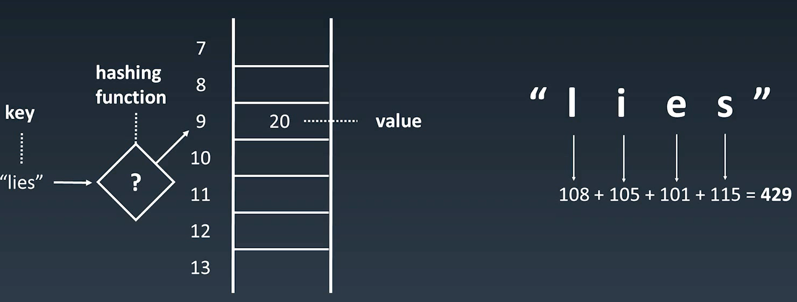
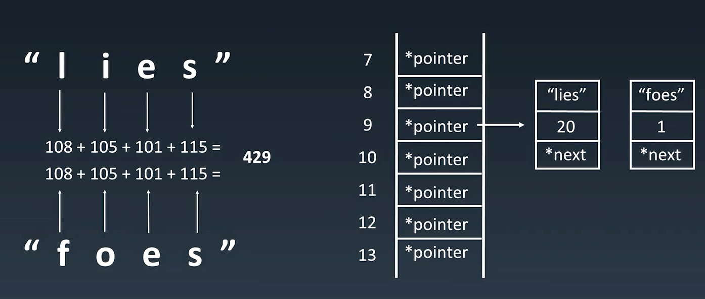
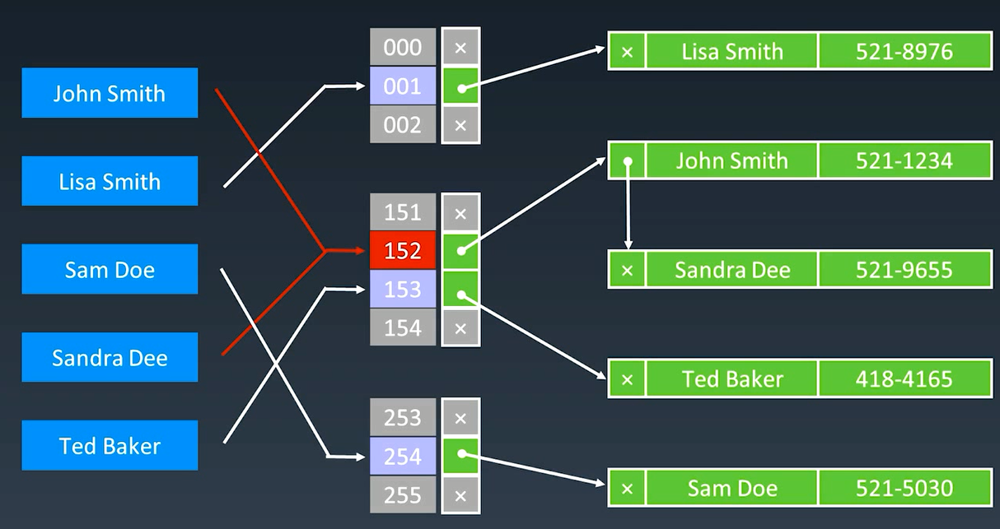

[TOC]

# 基础知识点

哈希表(Hash table), 也叫散列表， 根据关键码值而直接进行访问的数据结构。

它通过把关键码值映射到表中一个位置来访问记录， 以加快查找的速度。

这个映射函数叫做散列函数， 存放记录的数组叫做哈希表。

工程实践： 电话号码簿， 用户信息表， 缓存， 键值对存储



哈希碰撞



解决碰撞：



O(1)的时间复杂度查询， 添加和删除也是。

# 题目总结如下：

## 1. [有效的字母异位词](https://leetcode-cn.com/problems/valid-anagram/description/)（简单）

所谓字母异位词， 就是字符串长度相等， 且字母都一样的字符串， 如果字符串长度不等， 肯定不是， 所以主要是字母都一样的判断。

* 思路一： 直接排序看是否相等

  字母都一样， 那么比较容易想到的一个方式就是排序， 看是否两个字符串相等， **但注意， python中字符串是不可变对象， 所以需要转成数组**。这个代码写起来简短一些， 但是时间复杂度和空间复杂度会高一些， 因为涉及到了排序， 至少$O(nlogn)$级别的。

  ```python
  class Solution:
      def isAnagram(self, s: str, t: str) -> bool:
          
          if len(s) != len(t):
              return False
          
          return sorted(list(s)) == sorted(list(t))
  ```

* 思路二： map计数

  弄两个字典， 遍历一遍字符串， 对里面的字母个数进行统计， 最后看看是否相等， 如果不相等， 就不是字母异位词。但是这里的一个统计的思路就是相互抵消。

  ```python
  class Solution:
      def isAnagram(self, s: str, t: str) -> bool:
          
          if len(s) != len(t):
              return False
          
          mapp = {}
          
          # 统计一遍s
          for i in range(len(s)):
              mapp[s[i]] = mapp.get(s[i], 0) + 1
          # 遍历t， 然后看是否个数一致， 这里一个好的思路就是抵消
          for i in range(len(t)):
              mapp[t[i]] = mapp.get(t[i], 0) - 1
              if mapp[t[i]] < 0:
                  return False
          
          return True
      
   
  from collections import defaultdict
  
  def is_permutation(str1, str2):
      if str1 is None or str2 is None:
          return False
      if len(str1) != len(str2):
          return False
      unq_s1 = defaultdict(int)
      unq_s2 = defaultdict(int)
      for c1 in str1:
          unq_s1[c1] += 1
      for c2 in str2:
          unq_s2[c2] += 1
      
      #print(unq_s1, unq_s2)
      return unq_s1 == unq_s2
  ```

  上面是第一款代码，时间复杂度是O(n)的， 上面这个其实可以把26个字母用一个26大小的列表来统计出现的个数， 遍历一遍s统计个数， 遍历一遍t，进行字母个数抵消判断。

  

  但是感觉太繁琐了， 所以整理了两个人家的简洁代码， 但是感觉下面这两个复杂度不是O(n)了吧， 统计个数？

  ```python
  class Solution:
      def isAnagram(self, s: str, t: str) -> bool:
          
          if len(s) != len(t):
              return False
          se = set(s)
          for ch in se:
              if s.count(ch) != t.count(ch):
                  return False
          
          return True
   
  # python的collections里面的Counter
  from collections import Counter
  class Solution:
      def isAnagram(self, s: str, t: str) -> bool:
          
          if len(s) != len(t):
              return False
          
          return Counter(s) == Counter(t)。
  ```

  参考：

  * [中文题解](https://leetcode-cn.com/problems/valid-anagram/solution/)
  * [国际站](https://leetcode.com/problems/valid-anagram/discuss/?currentPage=1&orderBy=most_votes&query=)

## 2. [字母异位词分组](https://leetcode-cn.com/problems/group-anagrams/)（中等）

* 思路一： Hash存储

  这里就是用一个字典来对每个字符串进行分组， 遍历一遍字符串数组， 对于每个字符串， 先进行排序， 然后查看是否在字典中， 如果不在， 作为新的元素加入， 否则， 加入到对应字典键的值里面。

  ```python
  class Solution:
      def groupAnagrams(self, strs: List[str]) -> List[List[str]]:
          res = []
          dic = {}
          
          for s in strs:
              key = "".join(sorted(s))
              if key in dic:
                  dic[key].append(s)
              else:
                  dic[key] = [s]
          
          return list(dic.values())
      
  # 简洁代码
  from collections import defaultdict
  class Solution(object):
      def groupAnagrams(self, strs):
          ans = collections.defaultdict(list)
          for s in strs:
              ans[tuple(sorted(s))].append(s)
          return list(ans.values())
  
  def groupAnagrams(self, strs):
      d = {}
      for w in sorted(strs):
          key = tuple(sorted(w))
          d[key] = d.get(key, []) + [w]
      return d.values()
  ```

* 思路二： 素数法

  这是美版LeetCode看到某大佬的思路， 用质数表示26个字母，把字符串的各个字母相乘，这样可保证字母异位词的乘积必定是相等的。其余步骤就是用map存储了。

  >算术基本定理，又称为正整数的唯一分解定理，即：每个大于1的自然数，要么本身就是质数，要么可以写为2个以上的质数的积，而且这些质因子按大小排列之后，写法仅有一种方式。
  >

  

  ```python
  class Solution:
      def groupAnagrams(self, strs: List[str]) -> List[List[str]]:
          from collections import defaultdict
          prime = [2, 3, 5, 7, 11, 13, 17, 19, 23, 29, 31, 41, 43, 47, 53, 59, 61, 67, 71, 73, 79, 83, 89, 97, 101, 103]
          lookup = defaultdict(list)
          for _str in strs:
              key_val = 1
              for s in _str:
                  key_val *= prime[ord(s) - 97]   # ord是把字符转成ASCALL码的数字， 比如'a'就是97
              lookup[key_val].append(_str)
          return list(lookup.values())
  ```

参考：

* [中文题解](https://leetcode-cn.com/problems/group-anagrams/solution/xiang-xi-tong-su-de-si-lu-fen-xi-duo-jie-fa-by--16/)
* [国际站](https://leetcode.com/problems/group-anagrams/discuss/?currentPage=1&orderBy=most_votes&query=)

## 3.  [两数之和](https://leetcode-cn.com/problems/two-sum/solution/)(简单）

这个题目数组那里已经整理了详细的解法， 这里就只回顾一种的hash的那种解法， 建立一个字典键为数字， 值为下标， 遍历每个元素， 判断一下target-它在没在字典里， 如果在， 直接返回两个下标。  把该元素按照字典的格式存入字典。

```python
class Solution:
    def twoSum(self, nums: List[int], target: int) -> List[int]:

        mapp = {}

        for i in range(len(nums)):
            if target - nums[i] in mapp:
                return [mapp[target-nums[i]], i]
            
            mapp[nums[i]] = i
```

