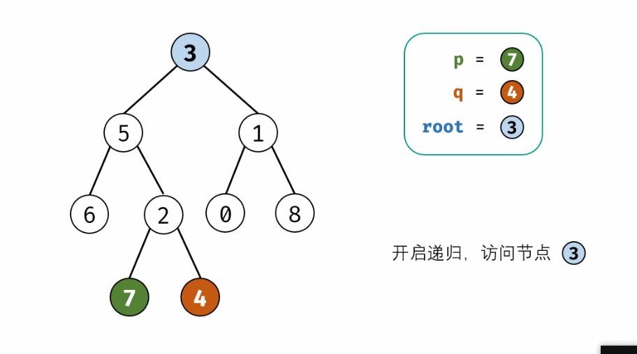

# 题目总结如下：

## 1. [二叉树的最近公共祖先](https://leetcode-cn.com/problems/lowest-common-ancestor-of-a-binary-tree/)

* 思路一： 后序遍历+递归

  这个题目我们都知道是二叉树后序遍历应用的经典题目， 但是为啥要用二叉树的后序遍历呢？  我们考虑过这个问题吗？ 这次做的时候， 特意思考了一下， 其实我们**对于每一个问题， 寻找解法的时候， 应该从问题的本身特点出发**。也就是从实际出发， 去找问题的答案。  这个题目之所以要用后序遍历， 是因为**后序遍历是先访问左右子树， 再去访问它本身**， 而给定两个节点， 我们去找最近公共祖先的时候， 是需要**先去找到两个节点各自的祖先， 然后再去找公共祖先**， 即对于当前的一棵树， 我们没法判断该节点是不是p和q的最近公共祖先的， 而需要先去看他左子树和右子树里面有没有p和q， 或者是不是已经找到了p和q的最近公共祖先， 然后才能对当前做出判断。 所以你看到这里面的逻辑了吗？  **是不是后序遍历的思想？**。 所以用后序遍历的原因是和问题本身挂钩的， 而不要死记住后序遍历的经典题目是寻找最近公共祖先。

  

  说回到这个题目， 这个题目的解题核心**就是如何基于后序遍历把大问题拆分成一个个的相似子问题， 然后用递归来解**， 后序遍历我们都知道， 是先遍历左右子树， 然后访问根节点。 那么这个题里面我们遍历左右子树是去干啥呢？   相似子问题到底长啥样？ 

  可以这样想， 我们是找p和q的最近公共祖先， 而首先拿到的是一棵大树root和节点p，q， **那么我们不妨先去当前树的左子树和右子树进行找p, q的公共祖先**， 也就是基于当前的树， 我们先去它左右子树找p和q的公共祖先， 这样就把当前问题， 转成了相似的子问题， 因为对于它左右子树， 又是一个相同的找最近公共子问题的过程。通过这个分析， 更能够确定**后序遍历+递归**。

  

  那么下一个问题就是对于当前的某棵树root， 我们如何去确定最近公共祖先？  **首先看当前层root是不是p或者q**。如果root是p或者q的话， 说明找到了p和q自己的最近祖先， 那么直接返回root。  这种情况也包含了p是q的祖先和q是p的祖先的情况， 因为

  * 如果p是q的祖先，如果发现当前层root等于p， 直接返回root， 这就是p和q的最近公共祖先p
  * 如果q是p的祖先，  如果发现当前层root等于去， 直接返回root， 这就是p和q的最近公共祖先q

  **这个也就是当前层的逻辑**。 如果当前层不是p或者q， 那么就需要看他左右孩子的返回情况，因为我们是先去遍历它的左右子树寻找答案嘛， 于是根据左右子树的返回情况我们就可以判断当前层的情况

  * 左右子树里面都不为空： 这个说明p和q在root的左右子树里面， 那么root就是他俩的最近公共祖先。
  * 左右子树都为空， 那么说明p和q都不在， 返回None
  * 左右子树有一个不为空： 这种情况说明已经在左子树或者右子树里面找到了最近公共祖先了， 把不为空的那个答案返回即可， 因为那个就是找到的最近公共祖先。

  看下这个过程：

  

    代码逻辑和上面的差不多， 根据模板， 我们一一分析：

  * 递归的终止条件： 当前层的root为空
  * 当前层的逻辑： 如果当前层为p或者q， 直接返回
  * 下一层： 去访问左右子树， 找p和q的最近公共祖先
  * 返回结果： 根据左右子树的情况返回结果

  代码如下：

  ```python
  class Solution:
      def lowestCommonAncestor(self, root: 'TreeNode', p: 'TreeNode', q: 'TreeNode') -> 'TreeNode':
  
          # 递归出口
          if not root:
              return 
          
          # 当前层的逻辑， 对于当前层， 如果发现是p或者是q， 那么就直接返回， 因为这就是p或者q自己的祖先
          # 这个其实包含了p是q的祖先或者q是p祖先的情况， 即如果p是q的祖先， 那么最近公共祖先就是p本身, 如果q是p的祖先， 
          # 最近公共祖先就是q本身
          if root == p or root == q:
              return root
          
          # 去root的左右子树里面去找p和q的公共祖先
          left = self.lowestCommonAncestor(root.left, p, q)
          right = self.lowestCommonAncestor(root.right, p, q)
  
          # 返回结果， 这里分三种情况， 左子树为空， 右子树为空， 以及都不为空
          if not left and not right: return
          if not left: return right    # 左子树为空， 说明公共祖先要么在右子树里面， 要么没有（right也为空的情况)
          if not right: return left   # 右子树为空， 说明公共祖先要么在左子树，要么没有
  
          # 两个都不为空， 这说明p和q在root的左右子树里面， 而root为他俩的最近公共祖
          return root
  
  class Solution:
      def lowestCommonAncestor(self, root: 'TreeNode', p: 'TreeNode', q: 'TreeNode') -> 'TreeNode':
  
          # 递归出口
          if not root:
              return 
          
          # 当前层的逻辑， 对于当前层， 如果发现是p或者是q， 那么就直接返回， 因为这就是p或者q自己的祖先
          # 这个其实包含了p是q的祖先或者q是p祖先的情况， 即如果p是q的祖先， 那么最近公共祖先就是p本身, 如果q是p的祖先， 
          # 最近公共祖先就是q本身
          if root == p or root == q:
              return root
          
          # 去root的左右子树里面去找p和q的公共祖先
          left = self.lowestCommonAncestor(root.left, p, q)
          right = self.lowestCommonAncestor(root.right, p, q)
  
          # 返回结果， 这里分三种情况， 左子树为空， 右子树为空， 以及都不为空
  
          # 都不为空
          if left and right: 
              return root
          
          # 有一个为空， 返回不为空的
          return left or right
  
      
  # 精简代码， 其实也是挺好理解的
  def lowestCommonAncestor(self, root, p, q):
      if root in (None, p, q): return root
      left, right = (self.lowestCommonAncestor(kid, p, q)
                     for kid in (root.left, root.right))
      return root if left and right else left or right
  ```

  时间复杂度$O(n)$， 也就是最坏情况下遍历一遍所有节点， 空间复杂度$O(n)$.

  * 思路二： 存储父节点

    这个思路比较 简单直接， 就是先弄两个列表先存储p和q的所有父节点， 然后遍历两个列表， 找到最后一个相同的点， 就是最近的公共祖先节点。这里的关键就是**如何找到p和q的所有父节点组成的路径**。这个思路要学一下， 依然是递归。

    ```python
    class Solution:
        def lowestCommonAncestor(self, root: 'TreeNode', p: 'TreeNode', q: 'TreeNode') -> 'TreeNode':
    
            # 先定义一个dfs函数， 存储从根节点到p和q的路径节点， 即p和q的所有父节点
            def dfs(node, path, target, res):
                if not node:
                    return
                
                if node == target:
                    path.append(node)
                    res.extend(path[:])  # 这个地方注意[:]， 浅拷贝
                    return
                path.append(node)
                dfs(node.left, path, target, res)   
                dfs(node.right, path, target, res)
                path.pop()   # 这里要记得回溯
            
            path_p = []
            path_q = []
            dfs(root, [], p, path_p)
            dfs(root, [], q, path_q)
    
            res = None
            for u, v in zip(path_p, path_q):
                if u == v:
                    res = u
                else:
                    break
            
            return res
    ```

  参考：

  * [中文题解](https://leetcode-cn.com/problems/lowest-common-ancestor-of-a-binary-tree/solution/236-er-cha-shu-de-zui-jin-gong-gong-zu-xian-hou-xu/)
  * [国际站](https://leetcode.com/problems/lowest-common-ancestor-of-a-binary-tree/discuss/152682/Python-simple-recursive-solution-with-detailed-explanation)
  
  这个题里面还有一个知识点， 就是给定x， 如何去打印x的所有祖先或者找到x的所有祖先？
  
  ```python
  def dfs(node, path, target, res):  # 这里的target就是x
      if not node:
          return
  
      if node == target:
          path.append(node)
          res.extend(path[:])  # 这个地方注意[:]， 浅拷贝
          return
      path.append(node)
      dfs(node.left, path, target, res)   
      dfs(node.right, path, target, res)
      path.pop()   # 这里要记得回溯
  ```
  
  