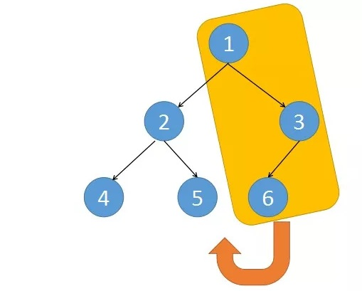
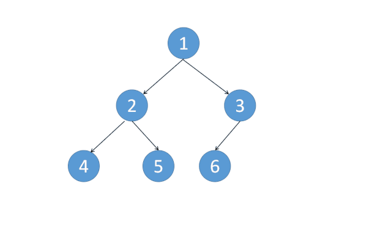
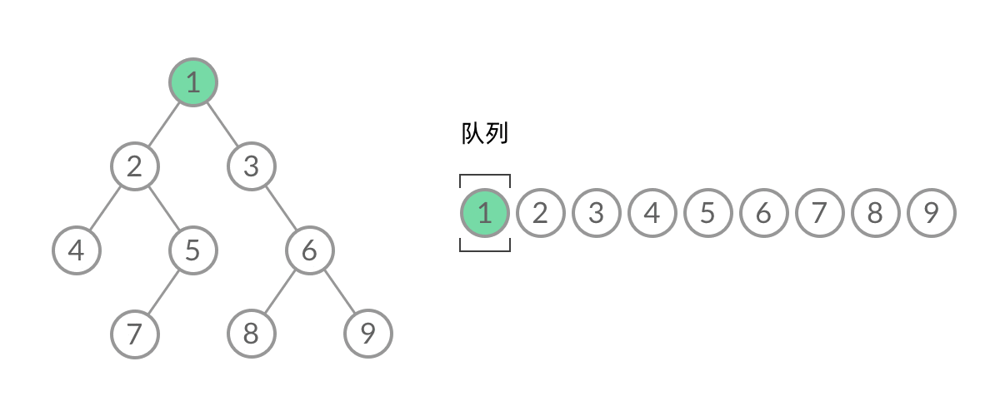

这里整理有关二叉树的相关题目， 核心知识包括二叉树的前中后序遍历，一定要熟记于心， 包括递归解法和非递归解法。 掌握了核心知识之后， 就是分专题进行题目的练习， 二叉树这部分的题目大多都是基于遍历的这几种思想进行的延伸。

# 核心知识整理

## 1. [二叉树的前序遍历](https://leetcode-cn.com/problems/binary-tree-preorder-traversal/)（中等）

由于中序遍历写的比较详细了， 这里就只给出前序遍历的递归和非递归版本， 思想其实差不多的。

* 思路一： 递归

  ```python
  class Solution:
  
      def __init__(self):
          self.res = []
  
      def preorderTraversal(self, root: TreeNode) -> List[int]:
  
           if root:
               self.res.append(root.val)
               self.preorderTraversal(root.left)
               self.preorderTraversal(root.right)
  
           return self.res
  ```

* 思路二： 非递归

  非递归的话依然可以通过一个栈来解决问题， 不过要比中序遍历的简单点， 可以梳理一下这个过程， 

  1. 首先是先定义一个栈
  2. 和中序遍历一样， 当根节点不为空或者栈不为空的时候，进行循环(脑海中可以走一遍过程的这种) 
     1. 首先， 来到root， 如果此时的root不为空， 那么干下面三件事
        1. 访问root
        2. root入栈
        3. root = root.left （开始往左子树走)
     2. 上面的循环退出， 说明此时root为空了
     3. 出栈会到它上面的节点， 然后访问父节点的右子树即可
  
  ```python
  class Solution:
  
      def __init__(self):
          self.res = []
  
      def preorderTraversal(self, root: TreeNode) -> List[int]:
  
           stack = []
           
           while root or stack:
               while root:
                   self.res.append(root.val)
                   stack.append(root)
                 root = root.left
               
             root = stack.pop()
             root = root.right
  
           return self.res
  ```
  
  下面再给出一个前中后序统一起来的一个版本， 但是这个并没有真正的模仿到我们真实遍历时的情况，所以还是建议上面两个
  
  ```python
  class Solution:
  
      def __init__(self):
          self.res = []
  
      def preorderTraversal(self, root: TreeNode) -> List[int]:
  
           stack = []
           stack.append(root)
           t = type(root)
  
           while stack:
  
               # 栈顶元素出栈
               root = stack.pop()
  
               if type(root) != t and root:    # 不是树节点和空， 那么就是数字了
                   self.res.append(root)
                   continue
  
               if root:           # 这里一定要注意， 先访问的后压栈， 通过这个思路， 就可以把前中后统一起来
                   stack.append(root.right)         
                   stack.append(root.left)
                   stack.append(root.val)
  
           return self.res
  ```

参考：

* [中文站](https://leetcode-cn.com/problems/binary-tree-preorder-traversal/solution/pythongai-bian-yi-xing-dai-ma-shi-xian-er-cha-shu-/)
* [国际站](https://leetcode.com/problems/binary-tree-preorder-traversal/discuss/?currentPage=1&orderBy=most_votes&query=)

## 2. [二叉树的中序遍历](https://leetcode-cn.com/problems/binary-tree-inorder-traversal/)（中等）

* 思路一： 递归版本

  这个思路就比较简单了， 首先还是三件套， **终止条件， 返回值， 循环体**

  * 返回值： 由于我们是要访问， 所以我们需要返回的是根节点
  * 终止条件： 就是我们的根节点为空的时候
  * 循环体： 对于单次的循环， 首先需要先遍历其左孩子， 然后访问， 然后遍历右孩子

  ```python
  class Solution:
      def __init__(self):
          self.res = []
  
      
      def inorderTraversal(self, root: TreeNode) -> List[int]:
  
          if root:
              self.inorderTraversal(root.left)
              self.res.append(root.val)
              self.inorderTraversal(root.right)
  
          return self.res
  ```

  时间复杂度是O(n), 空间复杂度O(n)， 因为弄了个栈保存一些节点。

* 思路二： 非递归版本

  这个就是自己通过一个栈来模拟中序遍历的过程， 首先， 我们要有一个栈， 然后对于当前的某个根节点， 我们得把他压入栈， 然后去找他最左边的那个节点， 也就是这句代码：

  ```python
  while root:
      stack.append(root)
      root = root.left
  ```

  找到最左边的节点之后， 如果此时栈不为空， 我们出栈最左边的节点， 然后访问它的值

  ```python
  if len(stack) != 0:
      root = stack.pop()
      res.append(root.val)
  ```

  然后， 就是去访问它的右孩子， 对于右孩子依然又是上面的这个过程， 先找右孩子为根的子树的最左边的节点， 然后访问， 然后去找它右孩子。

  ```python
  root = root.right
  # 再次循环上面的这个过程
  ```

  所以， 把上面的这个过程综合起来， 就是中序遍历的非递归版本， 回忆下这个过程： 

  

  1. 首先， 我们定义一个栈
  2. 和前序遍历一样， 我们来到root， 如果root不为空或者栈不为空，我们进入循环
     1. 如果此时的root不为空， 我们需要找到最左边的节点，所以干下面两件事
        1. 把当前的root入栈
        2. root = root.left（往左走)
     2. 如果此时的root为空， 说明它上面的节点就是最左边的， 我们干下面两件事
        1. 出栈一个节点， 然后进行访问
        2. 访问该节点的右子树

  上面这个过程使得前序和后序遍历能统一起来。

  ```python
  class Solution:
      def __init__(self):
          self.res = []
  
      def inorderTraversal(self, root: TreeNode) -> List[int]:
  
          stack = []
  		# 根节点不为空或者是栈不为空
          while root or stack:
  			# 根节点不为空， 去找最左边
              while root:
                  stack.append(root)
                  root = root.left
              
              # 为空， 出栈访问
              root = stack.pop()
              self.res.append(root.val)
              
              # 访问右子树， 又是上面的过程
              root = root.right
              
          return self.res
  ```

  和前中后序遍历的统一版本：

  ```python
  class Solution:
  
      def __init__(self):
          self.res = []
  
      def inorderTraversal(self, root: TreeNode) -> List[int]:
  
           stack = []
           stack.append(root)
           t = type(root)
  
           while stack:
  
               # 栈顶元素出栈
               root = stack.pop()
  
               if type(root) != t and root:    # 不是树节点和空， 那么就是数字了
                   self.res.append(root)
                   continue
  
               if root:           # 这里一定要注意， 先访问的后压栈， 通过这个思路， 就可以把前中后统一起来
                   stack.append(root.right)         
                   stack.append(root.val)
                   stack.append(root.left)
  
           return self.res
  ```

* 思路三： Morris中序遍历

  这个思路确实挺厉害的， 上面的空间复杂度是O(n)， 用到了栈， 而这里把空间复杂度降到了O(1)， 不需要任何辅助空间， 而这样做的代价就是改变了树的结构本身， 强行把一棵二叉树改成了一段链表结构， 这个看的是一个大佬的解释， 豁然开朗

  

  我们将黄色区域部分挂到节点5的右子树上，接着再把2和5这两个节点挂到4节点的右边。这样整棵树基本上就变改成了一个链表了，之后再不断往右遍历。所以这个过程是这样子的：

  

  当根节点不为空的时候

  ​	如果根节点的左节点存在， 将当前节点连带着右子树全部挂到左节点的最右子树下面， 然后root移到其左节点上， 否则， 说明已经把这个树连乘了链表， 访问即可。

  ```python
  class Solution:
      def __init__(self):
          self.res = []
  
      def inorderTraversal(self, root: TreeNode) -> List[int]:
  
          while root:
              # 左节点存在， 把根和右子树全部连接到左节点的最右边的树上
              if root.left:
                  pre = root.left
                  while pre.right:     # 去找最右边的节点
                      pre = pre.right
                  
                  pre.right = root
  
                  temp = root
                  root = root.left
                  temp.left = None
              
              else:
                  self.res.append(root.val)
                  root = root.right
  
              
          return self.res
  ```

* 思路四： 颜色标记遍历(这个了解一下吧， 不建议记住这个， 太麻烦)

  这个也是看的题解里面一个大佬的方案， **这种方式既能高效得迭代， 又像递归方法一样简洁易懂，更重要的是，这种方法对于前序、中序、后序遍历，能够写出完全一致的代码**。核心思想如下：

  * 使用颜色标记节点的状态，新节点为白色，已访问的节点为灰色。
  * 如果遇到的节点为白色，则将其标记为灰色，然后将其右子节点、自身、左子节点依次入栈。
  * 如果遇到的节点为灰色，则将节点的值输出。

  ```python
  class Solution:
      def __init__(self):
          self.res = []
  
      def inorderTraversal(self, root: TreeNode) -> List[int]:
  
         WHITE, GRAY = 0, 1
         stack = [(WHITE, root)]
         
         # 栈非空
         
         while stack:
             # 出栈当前节点
             color, root = stack.pop()
             if root == None: continue
  
             # 如果此时color是白色， 说明还没有访问过此节点， 那么如果是中序遍历， 
             # 先不要访问此节点， 而是对其进行标记，
             if color == WHITE:     # 如果是前序或者是后序遍历， 就改下面的顺序， 一定要注意， 先访问的后进栈
                 stack.append((WHITE, root.right))     # 右节点先入栈， 因为这个是后面访问
                 stack.append((GRAY, root))         # 标记为灰色了， 但是依然不访问
                 stack.append((WHITE, root.left))          # 先去访问左子树
  
             else:
                 self.res.append(root.val)
         
         return self.res        
  ```

参考：

* [中文站](https://leetcode-cn.com/problems/binary-tree-inorder-traversal/solution/)
* [国际站](https://leetcode.com/problems/binary-tree-inorder-traversal/discuss/?currentPage=1&orderBy=most_votes&query=)

## 3.  [二叉树的后序遍历](https://leetcode-cn.com/problems/binary-tree-postorder-traversal/)（中等）

这个依然是递归解法和非递归解法

* 思路一： 递归解法

  ```python
  class Solution:
  
      def __init__(self):
          self.res = []
  
      def postorderTraversal(self, root: TreeNode) -> List[int]:
  
          if root:
              self.postorderTraversal(root.left)
              self.postorderTraversal(root.right)
              self.res.append(root.val)
          
          return self.res
  ```

* 思路二： 非递归解法

  这里依然是先给出非统一版本， 这个如果是要模拟后序遍历的话， 会麻烦一些， 因为后序遍历是最后访问root， 先访问左子树和右子树， 所以这里的一个问题就是当拿到一个root的时候， 得需要看一下之前是不是被遍历过(也就是是否是访问完了它的右子树之后访问的它还是只访问了左子树之后到了它， 第一种情况下可以访问它的值， 第二种情况得访问它的右子树)， 这是一个比较难的点吧。所以这里得需要一个flag进行标记一下， 这个可以用字典。所以思路可以是这样：

  1. 首先， 定义一个栈(和前，中一样)， 定义一个flag字典来标记每个节点是否被遍历过
  2. 和前中一样， 如果root不为空或者是栈不为空的时候， 循环
     1. 依然是找最左边的节点， 对于当前的root， 如果不为空，干下面三件事：
      1. root入栈
        2. root对应的标记为0(这个意思是说再碰到它的时候，不能访问它的值)
      3. root = root.left
     2. 如果root为空， 说明最左边的是栈顶元素， 那么就干下面三件事
        1. root指向栈顶元素
        2. 这里判断一下， 它的标记是不是1， 如果是1可以访问了， 否则标记改成1， 去访问它的右子树
  
  其实， 和前中的基本差不多， 完全还是真实环境中遍历的思想。
  
  ```python
  class Solution:
  
      def __init__(self):
          self.res = []
  
      def postorderTraversal(self, root: TreeNode) -> List[int]:
  
          stack = []
          flag = {}
  
          while root or stack:
  
              # root不为空， 找最左
              while root:
                  stack.append(root)
                  flag[root] = 0
                  root = root.left 
              
              # 此时root为空， 栈顶即为最左边的元素
              root = stack[-1]
              if flag[root] == 0:          # 说明还没有访问右子树， 去访问右子树
                  flag[root] = 1
                  root = root.right
              else:                          # 说明右子树访问完了， 可以访问值了
                  self.res.append(root.val)
                  stack.pop()
                  root = None            # 这个不要忘了置空， 否则还指向的栈顶元素呢
              
          return self.res
  
  # 还有种完全用栈的方式  思路就是找叶子节点， 找到之后直接访问， 然后判断其是不是父节点的左子树， 如果是， 那么访问父节点的右子树， 否则， 返回
  class Solution:
  
      def __init__(self):
          self.res = []
  
      def postorderTraversal(self, root: TreeNode) -> List[int]:
  
          stack = []
          
          while root or stack:
  
              # 找叶子节点
              while root:
                  stack.append(root)
                  root = root.left if root.left is not None else root.right
              
              # root为空， 说明栈顶元素就是叶子节点(没有左右孩子)， 出栈访问
              root = stack.pop()
              self.res.append(root.val)
  
              # 下面判断它是父亲的左孩子还是右孩子
              if stack and stack[-1].left == root:    # 如果是左孩子， 那么就要访问右子树
                  root = stack[-1].right
              else:      
                  root = None
              
          return self.res
  ```
  
  下面是个统一的版本， 但是已经不再是模仿后序遍历去做了
  
  ```python
  class Solution:
  
      def __init__(self):
          self.res = []
  
      def postorderTraversal(self, root: TreeNode) -> List[int]:
  
          stack = []
          stack.append(root)
          t = type(root)
  
          while stack:
  
              root = stack.pop()
  
              if type(root) != t and root:  # 如果不是树和空， 就是数字了
                  self.res.append(root)
                  continue
              
              if root:     # 这里一定要注意， 先访问的后压栈， 通过这个思路， 就可以把前中后统一起来
                  stack.append(root.val)
                  stack.append(root.right)
                  stack.append(root.left)
          
          return self.res
  ```

参考：

* [中文题解](https://leetcode-cn.com/problems/binary-tree-postorder-traversal/solution/)
* [国际站](https://leetcode.com/problems/binary-tree-postorder-traversal/discuss/?currentPage=1&orderBy=most_votes&query=)

## 4. [二叉树的层序遍历](https://leetcode-cn.com/problems/binary-tree-level-order-traversal/)（中等）

首先是先解决这个题目，然后整理一下这个地方的知识点， 层序遍历是**BFS**的一个应用之一，  BFS就是广度优先遍历了， 上面的前中后， 一直在用DFS（深度优先遍历）， **DFS和BFS是树和图这块非常重要的两种遍历方式**， 一定要熟记于心。 下面先简单的看一下这两个哥们的代码比较， 这两个也算是模板性的东西了。

* DFS:

  ```python
  def dfs(root):
  	if root:
  	    dfs(root.left)
          dfs(root.right)
  ```

* BFS:

  ```python
  def bfs(root):
  	if not root:
  		return
  	d = collections.deque([])
  	d.append(root)
  	while d:
  		root = d.popleft()
  		if root.left:
  			d.append(root.left)
  		if root.right:
  			d.append(root.right)
  ```

由于DFS使用了递归， 所以代码看起来简洁了些， 虽然DFS 与 BFS 都是将二叉树的所有结点遍历了一遍，但它们遍历结点的顺序不同。看这个图感受一下， 图片来自题解中某个大佬的总结：


BFS的经典应用场景之一就是层序遍历， 另一个是常用来解决最短路径， 这个后面会一块总结， 先说层序遍历， 也就是本题了。什么是层序遍历呢？

> 给定一个二叉树，返回其按层序遍历得到的节点值。 层序遍历即逐层地、从左到右访问所有结点。

其实就是这样：


但是和BSF不一样的是直接用 BFS 得出层序遍历结果。然而，**层序遍历要求的输入结果和 BFS 是不同的。层序遍历要求我们区分每一层，也就是返回一个二维数组。而 BFS 的遍历结果是一个一维数组，无法区分每一层**。


那么怎么给BFS的结果分层？  首先来观察一下 BFS 遍历的过程中，结点进队列和出队列的过程：


这个过程中， 我们是**无法区分队列中的节点来自哪一层**。 所以层序遍历的话， 我们需要在每一层遍历开始前，先记录队列中的结点数量 $n$（也就是这一层的结点数量），然后一口气处理完这一层的 $n$个结点。

```python
from collections import deque
class Solution:
    def levelOrder(self, root: TreeNode) -> List[List[int]]:

        if not root:
            return []

        res = []
        d = deque([root])
        res.append([root.val])
        while d:
            size = len(d)       # 获取当前层的节点个数
            level = []

            # 遍历当前层的所有节点
            for _ in range(size):
                root = d.popleft()
                level.append(root.val)
                if root.left:
                    d.append(root.left)
                if root.right:
                    d.append(root.right)
            
            res.append(level)

        return res[1:]
```

这时候， 过程如下：



可以看到，在 while 循环的每一轮中，都是将当前层的所有结点出队列，再将下一层的所有结点入队列，这样就实现了层序遍历。

这个题目也可以用递归， 但是并不是太好， 所以先不写到这里， 可以参考具体的题解。

这里面类似的变种题目(这些后期整理到LevelOrder里面)：

* [LeetCode103之字形层序遍历](https://leetcode-cn.com/problems/binary-tree-zigzag-level-order-traversal/)
* [找每一层的最右结点](https://leetcode-cn.com/problems/binary-tree-right-side-view/)
* [计算每一层的最大值](https://leetcode-cn.com/problems/find-largest-value-in-each-tree-row/)
* [计算每一层的平均值](https://leetcode-cn.com/problems/average-of-levels-in-binary-tree/)

还有最短路径的相关题目。

参考:

* [一个大佬的题解， 总结的很详细， 还有其他类似的题目](https://leetcode-cn.com/problems/binary-tree-level-order-traversal/solution/bfs-de-shi-yong-chang-jing-zong-jie-ceng-xu-bian-l/)
* [给出了BFS和DFS的刷题模板](https://leetcode-cn.com/problems/binary-tree-level-order-traversal/solution/tao-mo-ban-bfs-he-dfs-du-ke-yi-jie-jue-by-fuxuemin/)

## 

