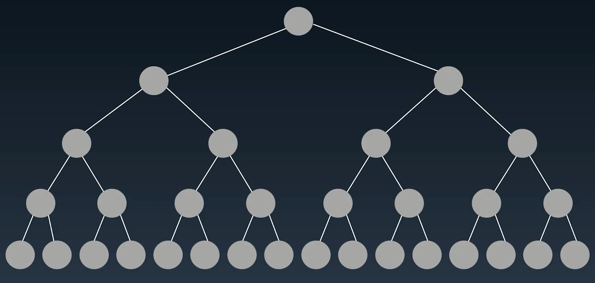

# 基础知识点

## 树（Tree）

树的结构十分直观，而树的很多概念定义都有一个相同的特点：**递归**，也就是说，一棵树要满足某种性质，往往要求每个节点都必须满足。例如，在定义一棵二叉搜索树时，每个节点也都必须是一棵二叉搜索树。

正因为树有这样的性质，大部分关于树的面试题都与递归有关，换句话说，面试官希望通过一道关于树的问题来考察你对于递归算法掌握的熟练程度。

先看一下Tree的基本结构：


在面试中常考的树的形状： 普通二叉树， 平衡二叉树， 完全二叉树， 二叉搜索树， 四叉树， 多叉树。

对于一些特殊的树，例如红黑树（Red-Black Tree）、自平衡二叉搜索树（AVL Tree），一般在面试中不会被问到，除非你所涉及的研究领域跟它们相关或者你十分感兴趣，否则不需要特别着重准备。

**链表是特殊化的树， 每个节点不止有一个next指针， 而树是特殊化的图， 无环的图就可以看成一棵树。**

树的节点构造代码：

```python
class TreeNode:
	def __init__(self, val):
		self.val = val
		self.left, self.right = None, None
```

关于树的考题，无非就是要考查**树的遍历以及序列化（serialization)**。所以树的遍历一定要了然于胸。

## 树的遍历

树的遍历是基于递归实现的。

1. 前序遍历

   **方法：**先访问根节点，然后访问左子树，最后访问右子树。在访问左、右子树的时候，同样，先访问子树的根节点，再访问子树根节点的左子树和右子树，这是一个不断递归的过程。 

   

   ​	示例代码：

   ```python
   # 递归代码
   def preorder(self, root):
   	if root:
   		self.traverse_path.append(root.val)
   		self.preorder(root.left)
   		self.preorder(root.right)
   ```

   ​	应用场景： 运用最多的场合包括在树里进行搜索以及创建一棵新的树。

   2. 中序遍历

      **方法：**先访问左子树，然后访问根节点，最后访问右子树，在访问左、右子树的时候，同样，先访问子树的左边，再访问子树的根节点，最后再访问子树的右边。

      

      示例代码：

      ```python
      # 递归代码
      def inorder(self, root):
      	if root:
               self.inorder(root.left)
      		self.traverse_path.append(root.val)
      		self.inorder(root.right)
      ```

      场景：最常见的是二叉搜素树，由于二叉搜索树的性质就是左孩子小于根节点，根节点小于右孩子，对二叉搜索树进行中序遍历的时候，被访问到的节点大小是按顺序进行的。 

   3. 后序遍历

      **方法：**先访问左子树，然后访问右子树，最后访问根节点。

      

      示例代码：

      ```python
      # 递归代码
      def postorder(self, root):
      	if root:
              self.postorder(root.left)
      	    self.postorder(root.right)
              self.traverse_path.append(root.val)
      ```

      场景：在对某个节点进行分析的时候，需要来自左子树和右子树的信息。收集信息的操作是从树的底部不断地往上进行，好比你在修剪一棵树的叶子，修剪的方法是从外面不断地往根部将叶子一片片地修剪掉。

   **注意**：

   * 掌握好这三种遍历的递归写法和非递归写法是非常重要的，懂得分析各种写法的时间复杂度和空间复杂度同样重要。
   * 无论是前端工程师，还是后端工程师，在准备面试的时候，树这个数据结构都是最应该花时间学习的，既能证明你对递归有很好的认识，又能帮助你学习图论
   * 树的许多性质都是面试的热门考点，尤其是二叉搜索树（BST）

   建议： 这个地方的题目要多练， 多总结。


## 二叉树




## 二叉搜索树

也称为有序二叉树， 排序二叉树， 是指一棵空树或者具有下列性质的二叉树：

1. 左子树上**所有节点**的值均小于它的根节点的值
2. 右子树上**所有节点**的值均大于它的根节点的值
3. 以此类推： 其左右子树也分别为二叉搜索树

中序遍历： 升序遍历

二叉搜索树常见的操作：

* 查询： 时间复杂度($logn$)
* 插入新节点: 时间复杂度($logn$)
* 删除

这里给出一个演示二叉搜索树常见操作的非常好的一个动画网站： [https://visualgo.net/zh/bst](https://visualgo.net/zh/bst)

# 目前做过的题目：

二叉树部分：

* 二叉树的前、中、后序遍历
* 基于二叉树的前序遍历思想
* 基于二叉树的中序遍历思想
* 基于二叉树的后序遍历思想
* 基于二叉树的层序遍历思想

二叉搜索树部分：


树部分：

