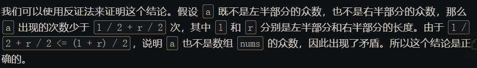
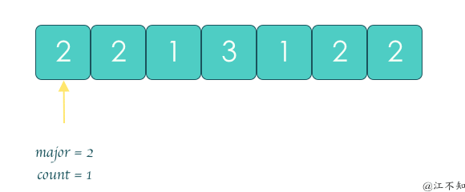

# 题目整理

分治算法是构建基于多项分支递归的一种很重要的算法范式， 字面上解释【分而治之】， 就是把一个复杂的问题分成两个或者更多相同，相似的子问题， 直到最后子问题可以简单的直接求解， 原问题的解即子问题的解的合并。这个技巧是很多高效算法的基础， 如排序算法（快速排序， 归并排序）， 傅里叶变换。


分治算法的模板如下：

```python
def divide_conquer(problem, param1, param2, ...):
	# recursion terminator
	if problem is None:
		print_result
		return
	
	# prepare data(split your big problem)
	data = prepare_data(problem)
	subproblems = split_problem(problem, data)
	
	#   conquer subproblems
	sub_result1 = self.divide_conquer(subproblems[0], p1, ...)
	sub_result2 = self.divide_conquer(subproblems[1], p1, ...)
	sub_result3 = self.divide_conquer(subproblems[2], p1, ...)
	
	# process and generate the final result
	result = process_result(subresult1, subresult2, subresult3, ...)
	
	# revert the current level states
```

 下面开始总结题目：

## 1. [Pow(x,n)](https://leetcode-cn.com/problems/powx-n/)（中等）

这个题目最简单的想法就是用暴力的解法来解决， 即写一个for循环把n个x乘起来得到最终结果， 时间复杂度是$O(n)$, 但是可惜， python中， 时间会超时：

```python
class Solution:
    def myPow(self, x: float, n: int) -> float:

        if n == 0 or x == 1:
            return 1.0
        
        if x == 0:
            return 0.0
        
        # 如果n为负数， 转成正数先
        if n < 0:
            n = -n
            x = 1/x
        
        # 然后开始遍历
        res = 1
        for i in range(n):
            res *= x
        
        return res 
```

所以， 这个题目还有更快的思路， 那就是快速幂运算的思路， 这个具体的可分为“二进制”和“二分法”两种方法。 

* 思路一： 分治法（快速幂+递归）

  上面我们发现， 暴力破解会超时， 这是因为这个用了$O(n)$的时间复杂度， 比如我们要求$2^{10}$,  我们需要连续10次2相乘。 但其实我们可以进行简化这个过程， 我们可以先求出$2^5$, 然后在这个基础上乘$2^5$就得到了结果， 而这里， 我们仅连续乘了2次， 而对于$2^5$， 我们可以再进行分解， 先求出$2^2$， 然后在这个基础上乘$2^2\times 2$就会得到最终的结果。 所以通过上面的这种思路， 把大问题化解成了小问题：
  $$
  x^n=x^{\frac{n}{2}}\times x^{\frac{n}{2}} = (x^2)^{({\frac{n}{2}})}
  $$
  令$n/2$为整数， 则需要分为奇数和偶数两种情况：
  $$
  x^{n}=\left\{\begin{array}{ll}
  \left(x^{2}\right)^{n / / 2} & , n \text { 为偶数 } \\
  x\left(x^{2}\right)^{n / / 2} & , n \text { 为奇数 }
  \end{array}\right.
  $$
  即当$n$为奇数， 二分后会多出一项$x$。

  所以这个思路就比较清晰了：

  1. 当我们要计算$x^n$, 我们可以先递归计算出$y=x^{n/2}$, 当然这个地方需要下取整一下
  2. 根据递归运算结果， 如果$n$为偶数， 那么$x^n=y^2$， 如果$n$为奇数， 那么$x^n=y^2\times x$
  3. 递归的边界就是$n=0$， 任何数的0次方为1

  每次递归会使得指数减少一半， 所以递归层数为$O(logn)$， 时间复杂度会减少。 我们依然是使用上面的分治框架， 代码如下：

  ```python
  class Solution:
  
      def helper(self, x, n):
  
          # 递归结束条件
          if n == 0:
              return 1.0
              
          # 分治
          y = self.helper(x, n>>1)
          #y = self.helper(x, n//2)
          
  
          # 合并结果
          if n % 2 == 0:   # if n&1 == 0
              return y * y
          else:
              return y * y * x
  
      def myPow(self, x: float, n: int) -> float:
  
          if x == 0.0:
              return 0.0
          
          if x == 1.0 or n == 0:
              return 1.0
          
          if n < 0:
              x, n = 1 / x, -n
          
          return self.helper(x, n) if n > 0 else 1 / self.helper(x, n)
  ```

  如果把上面的两个运算转成位运算的话， 时间会加速一些：

  - 向下整除 $n // 2$ **等价于** 右移一位 $n >> 1$ ；
  - 取余数 $n\%2$ **等价于** 判断二进制最右位 $n \& 1$；

* 思路二： 二进制的思路（快速幂+迭代）

  利用十进制数字$n$的二进制表示， 可对快速幂进行数学化解释。

  对于任何十进制正整数$n$, 设其二进制为“$b_m,..., b_3b_2b_1$"， 则有：

  * 二进制转十进制： $n=1b_1+2b_2+4b_3+...+2^{m-1}b_m$
  * 幂的二进制展开： $x^n=x^{1b_1+2b_2+4b_3+...+2^{m-1}b_m}=x^{1b_1}\times x^{2b_2}\times ....x^{2^{m-1}b_m}$

  根据上面推导， 可把计算$x^n$转化为解决下面两个问题：

  1. 计算$x^1, x^2, .. x^{2m-1}$的值： 循环赋值$x=x^2$
  2. 获取二进制各位$b_1, b_2, ..b_m$的值： 循环执行下面的操作
     1. $n \& 1$（与操作）：判断 n 二进制最右一位是否为 1
     2. $n >> 1$: n右移动一位

  代码如下：

  ```python
  class Solution:
  
      def myPow(self, x: float, n: int) -> float:
  
          if x == 0.0:
              return 0.0
          
          if x == 1.0 or n == 0:
              return 1.0
          
          if n < 0:
              x, n = 1 / x, -n
          
          res = 1
  
          while n:
              if n & 1:     # 最后一位
                  res *= x
              x *= x
              n >>= 1
  
          return res
  ```

## 2. [多数元素](https://leetcode-cn.com/problems/majority-element/description/)（简单）

* 思路一： 哈希计数

  这个是我一上来就想到的办法， 就是先遍历一遍， 用哈希表统计每个元素的个数， 然后再遍历哈希表， 返回元素个数大于n/2的数即可。

  ```python
  class Solution:
      def majorityElement(self, nums: List[int]) -> int:
  
          n = len(nums)
  
          num_count = {}
  
          for i in range(n):
              if nums[i] not in num_count:
                  num_count[nums[i]] = 1
              
              else:
                  num_count[nums[i]] += 1
          
          for key, number in num_count.items():
              if number > n // 2:
                  return key
  ```

  时间复杂度O(n)， 空间复杂度O(n)， python里面， 还可以调包实现：

  ```python
  import collections
  class Solution:
      def majorityElement(self, nums: List[int]) -> int:
  
         count = collections.Counter(nums)
         return max(count.keys(), key=count.get)
  ```

* 思路二： 排序

  从大到小或者从小到大排序， 然后返回n/2的位置， 这个数就是众数。官方题解给出了证明。那这样的话， 程序会更加简单：

  ```python
  class Solution:
      def majorityElement(self, nums: List[int]) -> int:
  
         nums.sort()
         return nums[len(nums) // 2]
  ```

  时间复杂度$O(nlog(n))$， 空间复杂度$O(logn)$。

* 思路三： 分治法

  这个题用分治法可能时间复杂度并不是最低的， 但是可以由这个题目学习一下分治的思想， 因为这个题目想起来会比较简单， 也很符合分治的那个模板。

  有这么一个结论： 如果数$a$是数组nums的众数， 如果我们将nums分成两部分， 那么a必定是至少一部分的众数。关于证明， 官方题解中给了出来：

  

  这样一来， 就可以使用分治法解决这个问题： 将数组分成左右两部分， 分别求出左半部分的众数$a_1$和右半部分的众数$a_2$， 随后在$a_1$和$a_2$中选出正确的众数。

  代码的逻辑是这样：

  1. 递归结束条件： 所有子问题的长度为1， 那么这个数肯定是众数， 直接返回这个数
  2. 大于1的情况下， 我们把整个数组分成左右两部分， 然后去左边去找众数， 右边去找众数
  3. 如果左右两部分的众数一致， 说明这一段区间的众数是它们相同的值， 返回
  4. 否则， 在这段区间中统计左边部分众数的个数， 右边部分众数的个数， 返回个数大的那个。

  由于我们需要分成两部分， 那么最好的方式就是**用起始下标去控制标记左右两部分**。具体代码如下， 我们依然是分治的模板：

  ```python
  class Solution:
  
      def findmod(self, nums, low, high):
  
             # 递归结束条件
             if low == high:
                 return nums[low]
              
             # 下面去左右两部分找众数
             mid = (high-low) // 2 + low
             left_mod = self.findmod(nums, low, mid)
             right_mod = self.findmod(nums, mid+1, high)
  
             # 下面进行判断
             if left_mod == right_mod:
                  return left_mod
              
             # 否则返回两者中个数最多的
             left_mod_cou = nums[low:high+1].count(left_mod)
             right_mod_cou = nums[low:high+1].count(right_mod)
  
             return left_mod if left_mod_cou > right_mod_cou else right_mod
  
      def majorityElement(self, nums: List[int]) -> int:
          
          return self.findmod(nums, 0, len(nums)-1)
  ```

  这个时间复杂度O(logn)

* 思路四： 摩尔投票法

  候选人cand初识为nums[0], 票数count为1. 但遇到与cand相同的数， 票数count=count+1， 否则票数等于count-1， 当票数为0的时候， 更换候选人， 遍历完数组后， cand即为最终的答案。 但是这种情况适用于**cand的个数要大于n/2**的时候。

  

  具体代码如下：

  ```python
  class Solution:
      def majorityElement(self, nums: List[int]) -> int:
  
          cand = nums[0]
          count = 1
  
          for i in range(1, len(nums)):
  
              if count == 0:
                  cand = nums[i]
              
              if cand == nums[i]:
                  count += 1
              else:
                  count -= 1
          
          return cand
  ```

  这个的时间复杂度是O(n)