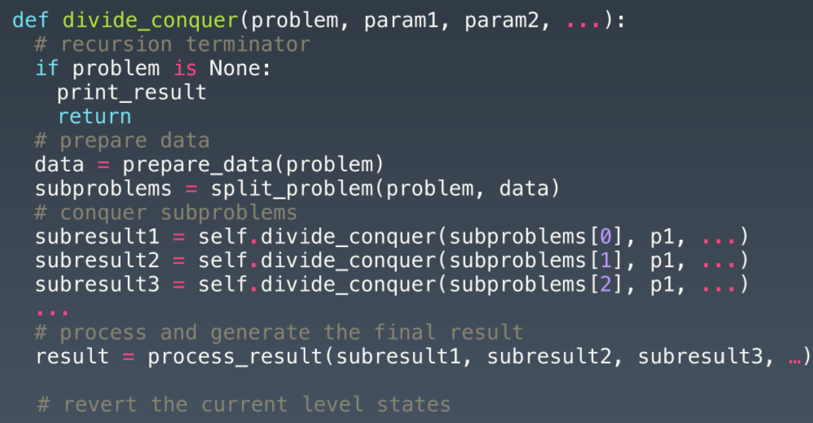

# 知识点梳理

递归和回溯是非常重要的算法思想， 递归和回溯的关系密不可分：

- 递归的基本性质就是函数调用，在处理问题的时候，递归往往是把一个大规模的问题不断地变小然后进行推导的过程。
- 回溯则是利用递归的性质，从问题的起始点出发，不断地进行尝试，回头一步甚至多步再做选择，直到最终抵达终点的过程。

## 递归

**算法思想**： 递归算法是一种调用自身函数的算法（二叉树的许多性质在定义上就满足递归）。

**举例**：（汉诺塔问题）有三个塔 A、B、C，一开始的时候，在塔 A 上放着 n 个盘子，它们自底向上按照从大到小的顺序叠放。现在要求将塔 A 中所有的盘子搬到塔 C 上，让你打印出搬运的步骤。在搬运的过程中，每次只能搬运一个盘子，另外，任何时候，无论在哪个塔上，大盘子不能放在小盘子的上面。

 **解法**：


1. 首先， 要把 n 个盘子按照大小顺序叠放在塔 C 上，就需要将塔 A 的底部最大的盘子搬到塔 C；

2. 为了实现步骤 1，需要将除了这个最大盘子之外的其余盘子都放到塔 B 上。

由上可知，将原来的问题规模从 n 个盘子变成了 n-1 个盘子，即将 n-1 个盘子转移到塔 B 上。

如果一个函数，能将 n 个盘子从塔 A，借助塔 B，搬到塔 C。那么，也可以利用该函数将 n-1 个盘子从塔 A，借助塔 C，搬到塔 B。同理，不断地把问题规模变小，当 n 为 1，也就是只有 1 个盘子的时候，直接打印出步骤。所以这个问题的代码如下：

```python
def hano(A, B, C, n):
	if n > 0:
		hano(A, C, B, n-1)      # 把n-1个盘子借助C， 从A移到B
		move(A, C)        # 最后一个盘子移动到C
		hano(B, A, C, n-1)    # 把那n-1个盘子借助A， 从B移到C
```

由上述总结出递归的算法思想，将一个问题的规模变小，然后再利用从小规模问题中得出的结果，结合当前的值或者情况，得出最终的结果。

通俗来说，把要实现的递归函数看成是已经实现好的， 直接利用解决一些子问题，然后需要考虑的就是如何根据子问题的解以及当前面对的情况得出答案。这种算法也被称为自顶向下（Top-Down）的算法。

关于递归， 这里给到两个算法模板， 这两个模板的思想基本上都是一样的， 包括递归的终止条件， 终止时候的处理方法， 重复的递归逻辑。

第一个代码模板：


第二个代码模板（这个其实就类似于分治了）：


**思维要点**

* 不要人肉进行递归(最大误区)
* 找到最近最简单的方法， 将其拆解成可重复解决的问题（重复子问题）
* 数学归纳法思维

**递归的时间复杂度分析**(这个很重要)， 两种方法：

1. 迭代法
2. 公式法

### 迭代法：

**举例**：分析汉诺塔递归函数的时间复杂度。假设这个递归函数的运行时间是 T(n)。

```python
def hano(A, B, C, n):
	if n > 0:
		hano(A, C, B, n-1)      # 把n-1个盘子借助C， 从A移到B
		move(A, C)        # 最后一个盘子移动到C
		hano(B, A, C, n-1)    # 把那n-1个盘子借助A， 从B移到C
```

1. if 语句（一般取 if 块或 else 块之间最大的时间复杂度）中，比较和判断 n 的大小，CPU 的执行时间为 1 个单位。

2. 两次调用递归函数，每次都使问题的规模减少 1 个，得到两倍的 T(n-1)。打印输出的语句，CPU 的执行时间也为 1 个单位。因此得出：

   $T(n)=1+2×T(n - 1)+1$。

   此处 if 语句和打印输出语句的执行时间与问题规模 n 无关，因此它们的算法时间复杂度可以记为 O(1)，表达式变为：$T(n) = 2×T(n - 1) + O(1)$。当 n=0 的时候，T(0) = 1，因为当没有盘子的时候，if 语句也要进行一次比较，判断 n 是否大于 0。

3. 用迭代法将 $T(n)$ 进行展开。$T(n - 1) = 2×T(n - 2) + 1$，以此类推，不断地代入到 $T(n)$ 的表达式当中，得到如下关系：

    T(n) = 2× (2×T(n - 2) + 1) + 1 = 22×T(n - 2) + (2 + 1)

   T(n) = 2×(2× (2×T(n - 3) + 1) + 1) + 1 = 23×T(n - 3) + (4 + 2 + 1)

   T(n) = 2×(2×(2×(2×T(n - 4) + 1) + 1) + 1) + 1 = 24×T(n - 4) + (8 + 4 + 2 + 1)

   …

   T(n) = 2k×T(n - k) + (2k - 1)

​	其中，1 + 2 + 4 + 8 + … 是一个等比数列，由求和公式得到 2k - 1。当 k 等于 n 的时候，$T(n) = 2n×T(0) + (2n - 1)$，由于 T(0) 等于 1，所以最终 T(n) = $2×2n - 1$。对 T(n) 求 O 的值得到：$O(n) = O(T(n)) = O(2×2n - 1)$ ，忽略掉常量和系数，$O(n) = O(2n)$。

 所以，整个算法的时间复杂度就是 $O(2n)$。

而很难通过迭代法推导出比较复杂的时间复杂度的时候，可以借用公式法。

### 公式法:

公式法可以说是计算递归函数复杂度最方便的工具，当递归函数的时间执行函数满足如下的关系式时，我们可以利用公式法：
$$
T(n) = a×T(n/b) + f(n)
$$
其中，$f(n) $是每次递归完毕之后额外的计算执行时间。例如，在归并排序中，每次递归处理完两边的数组后，我们需要执行合并的操作，那么这个操作的执行时间就是 $f(n)$。

当参数 a、b 都确定的时候，光看递归的部分，它的时间复杂度就是：$O(n^{logba})$

由于时间复杂度求的是上界（upper bound)，通过对比递归部分的时间复杂度和 $f(n)$ 的大小关系，得出最后的整体时间复杂度。牢记以下三种情况和相应公式：

1. 当递归部分的执行时间 $nlog(b)a$ 大于 $f(n)$ 的时候，最终的时间复杂度就是 $O(n^{logba})$。
2. 当递归部分的执行时间 $nlog(b)a$ 小于 $f(n)$ 的时候，最终的时间复杂度就是 $f(n)$。
3. 当递归部分的执行时间 $nlog(b)a$ 等于 $f(n)$ 的时候，最终的时间复杂度就是 $O(n^{logba})logn$。

**举例 1**：分析归并排序的时间复杂度。

​	T(n) = 2T(n/2) + n

​	a = 2，b = 2，f(n) = n

​	logba = 1，n1 = n

​	符合第三种情况，最终的时间复杂度就是 O(nlogn)。

**举例 2**：分析下面函数的时间复杂度。

```c++
int recursiveFn(int n) {
    if (n == 0) {
        return 0;
    }
    return recursiveFn(n / 4) + recursiveFn(n / 4);
}
```

得出时间执行函数：T(n) = 2×T(n/4) + 1，a = 2，b = 4，f(n) = 1。代入公式得到：$n^{log4*2} = n0.5$，当 n>1 的时候，n0.5>1，因此，时间复杂度就是  O(n0.5)。

**举例 3**：已知时间执行函数如下，分析时间复杂度。

​	T(n) = 3×T(n/2) + n2

​	a = 3，b = 2，f(n) = n2

最复杂的操作发生在递归完成之后，符合第二种情况。代入公式得到：$n^{log2*3} = n1.48<n2$，最后递归的时间复杂度是 $O(n2)$。

## 回溯

回溯实际上是一种试探算法，这种算法跟暴力搜索最大的不同在于，在回溯算法里，是一步一步地小心翼翼地进行向前试探，会对每一步探测到的情况进行评估，如果当前的情况已经无法满足要求，那么就没有必要继续进行下去，也就是说，它可以帮助我们避免走很多的弯路。拿一个经典回溯题目全排列来看一下：


回溯算法的特点在于，当出现非法的情况时，算法可以回退到之前的情景，可以是返回一步，有时候甚至可以返回多步，然后再去尝试别的路径和办法。这也就意味着，想要**采用回溯算法，就必须保证，每次都有多种尝试的可能, 每一次取尝试一种可能， 然后回退**。 就比如上面这个图， 假设输出[1, 2, 3]的全排列， 这时候初识一个空列表， 第一个位置会有三种可能， 1， 2， 3， 这时候就需要算法一次次的尝试这三种可能， 而对于每一种， 例如选定了1之后， 第二个位置又会有[2, 3]的全排列， 两种可能， 算法有需要尝试， 比如选了2， 那么剩下3一种可能， 这样得到了一种结果[1, 2, 3]输出， 然后回退到上一步， 也就是只选1之后的情形， 这样再选3， 就又得到了[1, 3, 2]的情形， 然后回退， 1开头的完事， 再回退， 选2开头， 又开始上面的工作。 **所以回溯中这种树比较形象的说明了过程， 这种树也非常重要**。

回溯法通常用最简单的递归方法来实现，在反复重复上述的步骤后可能出现两种 情况：

* 找到一个可能存在的正确的答案； 

* 在尝试了所有可能的分步方法后宣告该问题没有答案。 

  在最坏的情况下，回溯法会导致一次复杂度为指数时间的计算。

这里给出一个回溯的解题模板， 解题步骤如下：

1. 判断当前情况是否非法， 如果非法就立即返回
2. 当前情况是否已经满足递归结束条件， 如果是就将当前结果保存起来并返回
3. 当前情况下， 遍历所有可能出现的情况并进行下一步的尝试
4. 递归完毕后， 立即回溯， 回溯的方法就是取消前一步进行的尝试

代码模板如下：


## 分治

分治法采用了分而治之的思想， 也是利用了递归的思路， 把大问题分解成很多个相似的子问题， 这样， 我先去求解子问题， 然后把子问题的结果进行合并得到最终大问题的结果， **分而治之**的思想在这里面淋淋尽致。 这个和递归非常像， 只不过是需要先去求解子问题， 然后往上返回组合。 注意， 这个和回溯可不太一样了。 看下面图更好理解， 也是一棵递归状态树：


这里会发现， 原先的一个大问题， 会拆分成几个小问题， 然后分而治之。 这里举了一个非常形象的例子：比如给定一串小写字母， 转换成大写字母。


很容易就看出分治和回溯的区别了吧。这里也给出分治的代码模板， 和递归的第二种方式简直一模一样：



# 目前做过的题目

递归部分

* 括号生成(中等)
* 翻转一棵二叉树(简单)
* 验证二叉搜索树(中等)
* 二叉树的最大深度(简单)
* 二叉树的最小深度(简单)
* 二叉树的序列化与反序列化(困难)
* 二叉树的最近公共祖先(中等)
* 从前序与中序遍历构造二叉树(中等)
* 从后序与中序遍历构造二叉树(中等)
* 解码方法(中等)

回溯部分

* 组合(中等)
* 全排列(中等)
* 全排列II(中等)
* 组合总和(中等)
* 组合总和II(中等)
* 子集(中等)
* 子集II(中等)
* 电话号码的字母组合(中等)
* N皇后(困难)

分治部分

* 多数元素(简单)
* Pow(x,y)(中等)

# 总结

递归和回溯、分治可以说是算法面试中最重要的算法考察点之一， 回溯和分治更像是递归里面的一个子集， 很多其他算法都有它们的影子。例如，二叉树的定义和遍历就利用到了递归的性质；归并排序、快速排序的时候也运用了递归；就连后面的动态规划，它其实是对递归的一种优化；还有后面的二分搜索，也可以利用递归去实现。递归、回溯和分支其实背后都是同一个思想**找重复子问题**。

 另一个就是要能熟练掌握好分析递归复杂度的方法，必须得有比较扎实的数学基础，比如对等差数列、等比数列等求和公式要牢记。

关于这块的题目， 要反复练习和思考， 基于LeetCode， 把相应的题目先分门别类的整理好， 然后再对比递归、回溯和分治的细小差别。