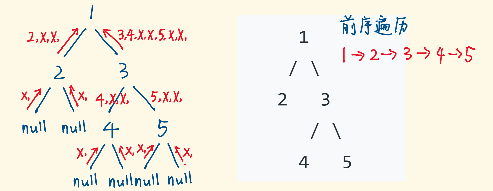

# 题目整理

递归这里的题目一定要多练+多想， 由于这个思想遍及很多地方，像分治和回溯也是基于递归衍生出的一些细小的分支， 所以很多题目皆可递归， 只要有**重复子问题**。 由于递归的范围很广， 很多题目没有整理到这里， 而是整理到相应的数据结构里面了， 尤其是树那块， 这里放出链接。递归模板：

```python
def recursion(level, param1, param2, ...):
	# recursion terminator
	if level > MAX_LEVEL:
		process_result
		return
	
	# process logic in current level
	process(level, data....)
	
	# drill down
	self.recursion(level+1, p1, ...)
	
	# reverse the current level status if needed
```

## 1. [括号生成](https://leetcode-cn.com/problems/generate-parentheses/)(中等)

这个题如果先想象成有$2n$个格子， 然后每个格子可以任意的添加左括号和右括号， 且每一次添充格子之间互不影响，那么每一次填充格子之间的动作就是重复的， 就可以使用递归来解决， 所以我们可以先简化成**先生成所有可能的情况， 不考虑有不有效**，那么这个问题用递归应该怎么实现呢？

根据上面给出的递归模板， 我们来考虑一下这个问题， 递归模板里面有三步非常重要

1. 参数： 这里的参数需要有当前的level， 也就是当前格子， Max_level， 也就是最后的格子， 还有存放结果的字符串s
2. 递归结束条件： 如果当前格子大于最大格子， 处理结果结束
3. 处理当前逻辑： 当前格子可以加左括号， 可以加右括号
4. 带着当前结果进入下一层

根据上面的逻辑， 代码如下：

```python
def generate(cur_level:1, max_level:2*n, s=''):
	# 终止条件
	if cur_level > max_level:
		print(s)
		return
	
	# 当前逻辑
	s1 = s + '('
	s2 = s + ')'
	
	# 进入下一层
	generate(cur_level+1, max_level, s1)
	generate(cur_level+1, max_level, s2)
```

这样就完成了简化版的递归程序， 但是上面这个没有考虑有没有效， 只负责生成所有的情况， 所以我们可以在终止的时候， 写一个判断函数(栈的那个)来判断括号到底有没有效， 但是这样时间复杂度会超级高的， 两层循环了相当于， 所以我们可以在填充当前格子的时候就可以判断插入左括号和右括号是否会有效， 如果无效的话直接不插入。 那么插入左括号和右括号的条件是什么？  下面就是判断有效的核心代码了：

* 可以插入左括号： 如果当前左括号数目没有达到要求的上限n， 就可以加
* 可以插入右括号： 如果当前右括号的数目没有达到要求的上限n且当前右括号的个数小于左括号的个数， 才可以加

这样， 就可以对上面的代码进行修改， 首先是参数部分， 不需要记录当前层， 而是换成左括号和右括号的数目， 最大层换成限制个数n

```python
# 这里写一个递归函数， 负责生成每个格子里面的左右括号
# 参数的话需要左括号的数量， 右括号的数量， n和记录结果的串s
def generate(self, left_num, right_num, n, s=''):

    # 递归终止条件
    if left_num == n and right_num == n:
        self.res.append(s)
        return

    # 该层的处理逻辑
    # 往下一层探索， 这两步可以写一块， 这块的处理逻辑就是每个格子加左右括号， 而要符合添加的条件

    # 如果左括号的个数小于n， 可以加左括号
    if left_num < n:
        self.generate(left_num+1, right_num, n, s+'(')

    # 如果右括号小于n且小于左括号的时候， 加右括号
    if right_num < left_num:
        self.generate(left_num, right_num+1, n, s+')')
```

所以最终代码是这样：

```python
class Solution:
    def __init__(self):
        self.res = []
    
    # 这里写一个递归函数， 负责生成每个格子里面的左右括号
    # 参数的话需要左括号的数量， 右括号的数量， n和记录结果的串s
    def generate(self, left_num, right_num, n, s=''):

        # 递归终止条件
        if left_num == n and right_num == n:
            self.res.append(s)
            return
            
        # 该层的处理逻辑
        # 往下一层探索， 这两步可以写一块， 这块的处理逻辑就是每个格子加左右括号， 而要符合添加的条件

        # 如果左括号的个数小于n， 可以加左括号
        if left_num < n:
            self.generate(left_num+1, right_num, n, s+'(')
        
        # 如果右括号小于n且小于左括号的时候， 加右括号
        if right_num < left_num:
            self.generate(left_num, right_num+1, n, s+')')


    def generateParenthesis(self, n: int) -> List[str]:
        self.generate(0, 0, n)
        return self.res
    

# 这种是从n减的方式
def generateParenthesis(self, n):
    def generate(p, left, right, parens=[]):
        if left:         generate(p + '(', left-1, right)
        if right > left: generate(p + ')', left, right-1)
        if not right:    parens += p,
        return parens
    return generate('', n, n)
```

这个题目这样解感觉是思路最清晰的，当然还有很多其他的方式， 比如动态规划， 比如左括号的数量从n开始往下减等。 具体的不在这里整理了， 看题解吧。

参考：

* [中文题解](https://leetcode-cn.com/problems/generate-parentheses/solution/)
* [英文题解](https://leetcode.com/problems/generate-parentheses/discuss/10096/4-7-lines-Python)

## 2. [翻转一棵二叉树](https://leetcode-cn.com/problems/invert-binary-tree/description/)（简单）

这个题目我们可以使用递归，仔细看下题目的 **输入** 和 **输出**，输出的左右子树的位置跟输入正好是相反的，于是我们可以递归的交换左右子树来完成这道题。


 由于是左右两棵树进行翻转， 那么我们可以这么想， 传进来一个root， 我需要翻转它的左右两棵子树， 那么核心代码就是：

```python
root.left, root.right = root.right, root.left
```

这样， 就完成了当前层的翻转， 然后进入到下一层即可， 也就是翻转当前root的左子树和右子树。 所以如果按照上面的模板， 代码应该是这样：

```python
class Solution:
    def invertTree(self, root: TreeNode) -> TreeNode:
        
        # 如果当前的节点为空了， 就不需要翻转了， 返回即可
        if not root:
            return 
        
        # 当前层的处理逻辑  左右子树交换
        root.left, root.right = root.right, root.left
        
        # 进入到下一层
        self.invertTree(root.left)
        self.invertTree(root.right)
        
        # 函数返回表示当前节点及他的左右子树都已经交换完， 返回树
        return root
    
# 其他简洁代码
class Solution:
    def invertTree(self, root: TreeNode) -> TreeNode:

        if root:
            root.left, root.right = self.invertTree(root.right), self.invertTree(root.left)
        return root
    
class Solution:
    def invertTree(self, root: TreeNode) -> TreeNode:

        if root:
            self.invertTree(root.left)
            self.invertTree(root.right)
            root.left, root.right = root.right, root.left
        return root
```

时间复杂度是O(n), 空间复杂度O(h)， h是树的高度

这个题的另一个思路就是广度优先遍历， 广度优先遍历需要额外的数据结构--队列， 来存放临时遍历到的元素。 所以， 我们首先需要将根节点放入到队列中， 然后不断的迭代队列中的元素， 对当前元素调换左右子树的位置， 然后：

* 判断其左子树是否为空， 不为空就放入队列
* 判断右子树是否为空， 不为空放入队列

看个图理解一下：


代码如下：

```python
from collections import deque
class Solution:
    def invertTree(self, root: TreeNode) -> TreeNode:

        if not root:
            return 
        
        # 根节点入队列
        d = deque([root])

        while d:
            # 出队一个元素
            temp = d.popleft()
            # 交换左右子树
            temp.left, temp.right = temp.right, temp.left

            # 左右子树入队列
            if temp.left:
                d.append(temp.left)
            if temp.right:
                d.append(temp.right)
        
        return root
```

## 3. [验证二叉搜索树](https://leetcode-cn.com/problems/validate-binary-search-tree/)(中等)

这个题目两种思路可以解决

* 思路一：递归法

  递归的方式， 这里会有一个坑**如果该二叉树的左子树不为空，则左子树上所有节点的值均小于它的根节点的值； 若它的右子树不空，则右子树上所有节点的值均大于它的根节点的值**，一定要注意这里说的是左子树和右子树， 而不是单纯的左孩子和右孩子。 这时候， 就启发我们需要写一个递归函数， 这个递归函数里面需要有上界和下界才行。

  - 当前节点的值是其**左子树的值的上界（最大值）**
  - 当前节点的值是其**右子树的值的下界（最小值）**

  那么根据这个思路， 我们可以一一考虑上面模板里面的几个条件应该咋写：

  1. 迭代终止条件： 这个简单，就是当前root为空的时候，返回True即可
  2. 当前层的逻辑： 对于当前的root来说， 我们需要判断他的值是否在lower和upper之间， 如果不在， 那么说明不是二叉搜索树
  3. 进入下一层： 这里进入下一层的时候， 一定要注意修改上下界， 因为当看root左子树是否是二叉树搜索树的时候，上界需要改成root.val， 看root右子树是否是儿茶搜索树的时候， 下界需要改成root.val。
  4. 返回值就是如果上面的条件都过了， 就说明当前是二叉搜索树， 返回True
  5. 参数： root, lower, upper

  看下面这个图挺清晰：

  

  根据上面的逻辑， 我们就可以写代码：

  ```python
  class Solution:
      def helper(self, node, lower=float('-inf'), upper=float('inf')):
  
          # recursion terminator
          if not node:
              return True
          
          # process logic in current level
          # 如果当前节点的值在lower和upper之间， 则合法， 否则不合法
          if node.val <= lower or node.val >= upper:
              return False
  
          # drill down
          if node.left and not self.helper(node.left, lower, node.val):
              return False
          if node.right and not self.helper(node.right, node.val, upper):
              return False
          
          return True
  
      def isValidBST(self, root: TreeNode) -> bool:
  
          return self.helper(root)
  ```

  时间复杂度是O(n), 空间复杂度是O(n), 感觉上面的那个模板挺好用的， 如果仿照着来， 思路挺清晰。

  * 思路二：中序遍历

    对于二叉搜索树来说， 有个非常重要的性质**二叉搜索树的中序遍历递增**， 基于这个思路， 我们就可以通过中序遍历一遍二叉树， 如果遍历途中发现当前节点的值比前面节点的值小， 那么就不是一棵二叉搜索树。

    

    那么梳理一下这个逻辑过程， 我们需要在遍历过程中看当前节点与前一节点的值的大小， 就需要用pre记录前一个节点，所以步骤如下：

    1. 首先， pre=-inf
    2. 然后中序遍历， 也就是先去左子树， 这时候开始递归
    3. 当前逻辑就是， 如果左子树不是二叉搜索树， 返回False， 如果当前值小于pre， 返回False， **然后把pre更新为当前值**
    4. 去递归右子树

    递归代码如下：

    ```python
    class Solution:
        def __init__(self):
            self.pre = float('-inf')
    
        def isValidBST(self, root: TreeNode) -> bool:
    
            # 结束条件
            if not root:
                return True
            
            # 判断左子树是否是二叉搜索树
            if not self.isValidBST(root.left):    # 如果左子树不是二叉搜索树
                return False
            
            if root.val <= self.pre:
                return False
            
            self.pre = root.val          # 这里要更新pre才能去看右子树
            return self.isValidBST(root.right)
    
    ```

    非递归代码， 这里也写一个非递归代码， 顺便复习一下非递归的中序遍历：

    ```python
    class Solution:
        def isValidBST(self, root: TreeNode) -> bool:
    
    
            stack = []
            pre = float('-inf')
    
            while root or stack:
    
                # 去找最左边的节点
                while root:
                    stack.append(root)
                    root = root.left
                
                root = stack.pop()
                if root.val <= pre:
                    return False
                pre = root.val
    
                # 去右边
                root = root.right
            return True
    ```

    中序遍历可以干很多事情， 具体的可以看中序遍历里面的题目。

## 4. [二叉树的最大深度](https://leetcode-cn.com/problems/maximum-depth-of-binary-tree/)（简单）

这个题依然是可以用递归来解决，因为如果我们知道了左子树和右子树的最大深度$l_{depth}$和$r_{depth}$, 那么该二叉树的最大深度为
$$
max(l,r) + 1
$$
而左子树和右子树的最大深度又可以用同样的方式进行计算， 因此我们在计算当前二叉树的最大深度时，可以先递归计算出其左子树和右子树的最大深度，然后在 O(1)O(1) 时间内计算出当前二叉树的最大深度。递归在访问到空节点时退出

 依然是考虑上面的模板， 我们可以这样想：

* 退出条件： 如果当前的树的节点是空， 那么就返回0， 回去
* 当前层的逻辑： 如果当前层的节点没有左孩子， 没有右孩子， 那么就返回1
* 进入到下一层： 计算左孩子的树的深度， 右孩子的树的深度
* 返回结果： 两个孩子深度的最大值+1

代码如下：

```python
class Solution:

    def maxDepth(self, root: TreeNode) -> int:

        # 如果当前树为空了， 返回
        if not root:
            return 0
        
        # 当前层
        if not root.right and not root.left:
            return 1
        
        # 去下一层
        l_depth = self.maxDepth(root.left)
        r_depth = self.maxDepth(root.right)
        
        # 返回结果
        return max(l_depth, r_depth)+1
  
## 简洁版本
def maxDepth(self, root):
    return 1 + max(self.maxDepth(root.left), self.maxDepth(root.right)) if root else 0
   #return 1 + max(map(self.maxDepth, (root.left, root.right))) if root else 0   # map竟然可以这么用
```

思路二： 广度优先搜索

也可以使用广度优先搜索来解决这个题目， 但是需要进行修改， 广度优先搜索的队列中存放**当前层的所有节点**。 每次拓展下一层的时候， 不同于广度优先搜索的每次只从队列拿出一个节点， 我们需要将队列里的所有节点拿出来进行拓展， 这样能保证每次拓展完的时候，队列存放的是当前层的所有节点， 即我们一层一层的进行拓展， 最后我们用一个变量$ans$来维护拓展的次数， 该二叉树的最大深度即$ans$ 。 广度优先的代码模板一定要记好了。

```python
class Solution:

    def maxDepth(self, root: TreeNode) -> int:

        if not root: 
           return 0
        d = deque([root])
        max_depth = 0
        while d:
            d_node_num = len(d)        # 记录一下当前层节点的数量
            while d_node_num > 0:
                root = d.popleft()
                if root.left:
                    d.append(root.left)
                if root.right:
                    d.append(root.right)
                
                d_node_num -= 1
            max_depth += 1
        
        return max_depth
```

时间复杂度O(n)。

参考：

* [中文题解](https://leetcode-cn.com/problems/maximum-depth-of-binary-tree/solution/)
* [国际站](https://leetcode.com/problems/maximum-depth-of-binary-tree/discuss/?currentPage=1&orderBy=most_votes&query=)

## 5. [二叉树的最小深度](https://leetcode-cn.com/problems/minimum-depth-of-binary-tree/)（简单）

这个题猛地一看， 和上面那个仿佛差不多， 但是还是有一些细节的， 所以我初期还以为直接上面的max改成min就能把这个题给a了， 但是发现想多了哈哈。  有个样例是过不去的[1,2]， 这是因为， 题目没有弄清楚， 就开始写代码。 这个题目中说了： **最小深度是从根节点到最近叶子节点的最短路径上的节点数量**。那么什么叫最近叶子节点？  必须是叶子节点， 如果上面代码单纯改成min的话， 会发现[1,2]的时候返回1， 这是因为1为根节点， 2为它的左孩子， 当1为root传入的时候， 它左右孩子的最小值是0， 因为它没有右孩子， 这时候最小值加1为1。 但是这个题实际上1的左孩子才是叶子节点。 所以**这个题要在最后返回结果的时候， 考虑好当前层的节点是同时有左右孩子， 还是只有左孩子或者只有右孩子， 前面那种情况的话， 就和上面一样， 返回左右孩子的最小值+1， 而后面这种情况， 要考虑不为空的那个孩子。所以递归代码如下：

```python
class Solution:
    def minDepth(self, root: TreeNode) -> int:

        # 如果当前树为空了， 返回
        if not root:
            return 0
        
        # 当前层
        if not root.right and not root.left:
            return 1
        
        # 去下一层
        l_depth = self.minDepth(root.left)
        r_depth = self.minDepth(root.right)
        
        # 返回结果
        if l_depth==0 or r_depth==0:          #左孩子和右孩子有个为空了， 那么应该返回不为空的那个加1
            return l_depth + r_depth + 1

        return min(l_depth, r_depth)+1
 

## 简短代码， 巧用or, 但是这种代码可读性感觉不是太高
def minDepth(self, root):
    if not root: return 0
    d = list(map(self.minDepth, (root.left, root.right)))
    return 1 + (min(d) or max(d))
```

这个题如果用BFS或许更好想一点， 这个和上面不同的一点就是， 但出队的时候， 如果发现该节点没有左孩子和右孩子了， 那么直接返回深度就可以了。

```python
from collections import deque
class Solution:
    def minDepth(self, root: TreeNode) -> int:

        if not root:
            return 0
        
        d = deque([root])
        mindepth = 1
        while d:
            cur_level_num = len(d)
            for i in range(cur_level_num):
                root = d.popleft()
                if not root.left and not root.right:        # 如果左孩子和右孩子都为空， 说明这个就是最近的叶子节点了， 直接返回
                    return mindepth
                if root.left:
                    d.append(root.left)
                if root.right:
                    d.append(root.right)
            mindepth += 1
```

参考：

* [国际站](https://leetcode.com/problems/minimum-depth-of-binary-tree/discuss/?currentPage=1&orderBy=most_votes&query=)
* [中文题解](https://leetcode-cn.com/problems/minimum-depth-of-binary-tree/solution/)

## 6. [二叉树的序列化与反序列化](https://leetcode-cn.com/problems/serialize-and-deserialize-binary-tree/)（困难）

这个题目还是考察了很多细节的，依然是有两种方式： 递归(DFS)和非递归(BFS)， 下面分别看一下：

* 思路一：递归(DFS)

  这个思路的话可以考虑使用二叉树的前序遍历来序列化二叉树， 因为前序遍历是根 | 左 | 右的打印顺序， 而反序列化的时候， 可以快速定位出根的位置。 另外一个就是遇到None， 也要添加一个符号进行标识， 方便反序列化。

  

   所以递归的思路是这样， 依然按照上面的模板：

  * 递归结束条件： 如果当前节点为空了， 返回'X'进行标识
  * 当前层的逻辑： 当前层就是需要得到root.val
  * 进入到下一层： 序列化root的左右子树， 并且返回回来
  * 返回结果： 把root.val， 左右子树都保存到字符串中

  代码如下：

  ```python
  class Codec:
  
      def serialize(self, root):
          """Encodes a tree to a single string.
          
          :type root: TreeNode
          :rtype: str
          """
          # 递归出口
          if not root:
              return 'X,'
          
          # 当前层的逻辑， 获取root.val， 所以不用处理
          # 下一层
          left_ser = self.serialize(root.left)
          right_ser = self.serialize(root.right)
  
          # 返回结果
          return str(root.val) + ',' + left_ser + right_ser
  ```

  然后是反序列化， 序列化的格式是下面这样的：
  $$
  "root|(root|(root|root.left|root.right)(root|root.left|root.right))|(root|(root|root.left|root.right)|(root|root.left|root.right))"
  $$
  

现在要还原这棵树， 写一个辅助的递归函数， 接收由序列化字符串, 然后递归的建树， 过程是这样：

依次弹出list数组的首项， 用它构建子树的根节点， 顺着list数组， 就会先构建根节点， 构建左子树和右子树。 但是弹出的时候做一下判断：

* 如果弹出字符为'X', 返回None节点
* 如果弹出字符不为'X'， 把它当做根节点， 然后递归构建其左右子树
* 返回结果： 当前的这棵子树


代码如下：

```python
def deserialize(self, data):
        """Decodes your encoded data to tree.
        
        :type data: str
        :rtype: TreeNode
        """
        data = data.split(',')
        root = self.builttree(data)
        return root
    
def builttree(self, data):
    val = data.pop(0)

    if val == 'X': return None
    node = TreeNode(val)
    node.left = self.builttree(data)
    node.right = self.builttree(data)

    return node
```

好了， 下面看看思路二， 广度优先遍历。

* 思路二： 广度优先(BFS)

  这个是基于树的层序遍历做的， 思路是这样：

  * 考察出列节点
    * 如果出列的节点不是Null， 那么将它的值放入一个res里面， 并将它的左右子节点入队列， 这里注意子节点null也需要入队列， 并用'X'做记录， 只不过不用子节点入队列
    * 如果出列的是null， 那么将'X'， 推入res数组
  * 出列， 入列，  直到队列为空， 所有节点遍历完毕， res数组也构建完， 将它转成字符串即可

  这个也是我一开始采用的序列化的方式， 只不过反序列化不会做， 取巧a了这道题目， 哈哈。

  ```python
  from collections import deque
  class Codec:
  
      def serialize(self, root):
          """Encodes a tree to a single string.
          
          :type root: TreeNode
          :rtype: str
          """
          if not root:
              return []
          
          res = []
          d = deque([root])
          while d:
              root = d.popleft()
              if root:
                  res.append(str(root.val))
                  d.append(root.left)
                  d.append(root.right)
              else:
                  res.append('X')
          
          return ','.join(res)
  ```

  序列化应该会比较简单， 这里关键的是反序列化， 思想还是要理解一下的， 通过序列化， 得到的字符串和DFS不同， 这里是一层一层的。

  

   这时候， 我们会发现， 除了第一个节点是根节点的值， 后面的都是成对的，对应左右子节点， 那么我们就可以用个指针从第二项开始扫描， 每次考察两个节点。思路是这样：

  * 开始的时候， 根节点值构建根节点， 并让他入队列
  * 让节点出队， 考察出列节点， 指针字符指向的字符是它左子节点， 指针右边字符是它右子节点
    * 如果子节点的值不为'X'， 为他创建节点， 并认父亲， 并且要入队列作为未来的父亲
    * 如果子节点的值为'X'， 什么都不做

  

  代码如下：

  ```python
  def deserialize(self, data):
      """Decodes your encoded data to tree.
  
      :type data: str
      :rtype: TreeNode
      """
      if not data: return None
      data = data.split(',')
  
      d = deque([])
      root = TreeNode(data.pop(0))
      d.append(root)
  
      while d:
          node = d.popleft()
  
          if data:
              val = data.pop(0)
              if val != 'X':
                  node.left = TreeNode(val)
                  d.append(node.left)
  
          if data:
              val = data.pop(0)
              if val != 'X':
                  node.right = TreeNode(val)
                  d.append(node.right)
  
      return root
  ```

  这个想起来还是挺难的感觉， 多练几遍吧。 这个参考了一个题解：[手画图解  二叉树的序列化与反序列化 | 剖析两种解法](https://leetcode-cn.com/problems/serialize-and-deserialize-binary-tree/solution/shou-hui-tu-jie-gei-chu-dfshe-bfsliang-chong-jie-f/)

## 7. [二叉树的最近公共祖先](https://leetcode-cn.com/problems/lowest-common-ancestor-of-a-binary-tree/)（中等）

这个题目由于是二叉树后序遍历的经典应用， 所以整理到了二叉树的后序遍历的模块中， 具体可以去二叉树的后序遍历里面去看。

## 8. [从前序与中序遍历序列构造二叉树](https://leetcode-cn.com/problems/construct-binary-tree-from-preorder-and-inorder-traversal/)(中等)

这个题目的常规思路就是递归构造， 关键就是牢牢抓住**前序和中序遍历的定义**：

* 前序遍历的第一个节点一定是二叉树的根节点，根节点后面的部分， 先是二叉树的左子树部分， 后是二叉树的右子树部分
* 在中序遍历中， 根节点把中序遍历序列分成了两个部分， 左边部分构成了二叉树的根节点的左子树， 右边部分构成了二叉树根节点的右子树

基于上面的这个规律， 我们就可以把**大问题拆分成小问题， 然后使用递归**。 如何拆分：

思路就是我们拿到的是一棵整体的树， 我们需要先从前序遍历里面构造根节点， 也就是第一个元素， 然后去中序遍历序列里面找根节点的位置， 它的左边部分就是左子树， 右边部分就是右子树， 然后我们基于这个范围也可以拿到左子树和右子树的前序序列（因为**左子树和右子树的个数前序和中序是一样的， 所以根据中序序列中左右子树的长度就可以定出左右子树的前序序列**）。 这样我们就把**根据前序和中序序列构造整棵树这个问题拆分成了根据前序和中序序列构造左子树和右子树**， 问题就小了， 这很显然， 是个递归构造的过程。


所以， 整体思路比较清晰， 这里用递归， 且关键就是要确定好左子树和右子树在前序序列和中序序列里面的下标， 也就是范围。 所以递归函数里面需要接收的参数有6个， 前序和中序序列（数组）， 然后就是p_start, p_end, i_start, i_end来控制左右子树的下标。 为了更方便理解， 可以先画一个图来看看下标究竟是怎么回事：


代码如下：

```python
# 先序遍历里面找到根节点， 中序遍历里面找根节点的左右子树
class Solution:

    # 弄一个辅助函数构建树， pre_l, pre_r控制前序遍历的下标， in_l, in_r控制中序遍历的下标范围， 构建子树的时候要用
    def help(self, preorder, inorder, p_start, p_end, i_start, i_end): 

        # 建立根节点
        root = TreeNode(preorder[p_start])

        # 中序遍历中找根节点的位置， 确定左右子树边界
        i = i_start
        while inorder[i] != root.val:
            i += 1

        l_len = i - i_start
        r_len = i_end - i 
        
        if l_len != 0:
            root.left = self.help(preorder, inorder, p_start+1, p_start+l_len, i_start, i_start+l_len-1)
        else:
            root.left = None
        
        if r_len != 0:
            root.right = self.help(preorder, inorder, p_end-r_len+1, p_end, i_end-r_len+1, i_end)
        else:
            root.right = None
        
        return root


    def buildTree(self, preorder: List[int], inorder: List[int]) -> TreeNode:

        if not preorder:
            return 
        
        return self.help(preorder, inorder, 0, len(preorder)-1, 0, len(inorder)-1)
```

这个的时间复杂度是$O(n^2)$的， 原因是我们在前序序列中每个节点， 都需要在中序遍历里面找一遍，锁定位置， 这个是非常耗费时间的， 而我们其实可以通过哈希映射的方式， 用一个数组来存放中序遍历中各个元素的下标位置， 这样我们就不需要每次找了， 就可以通过**空间换时间的方式**把时间复杂度降到$O(n)$， 但这样空间复杂度也是$O(n)$了。代码如下：  这种思路还是很重要的

```python
# 先序遍历里面找到根节点， 中序遍历里面找根节点的左右子树
class Solution:

    # 弄一个辅助函数构建树， pre_l, pre_r控制前序遍历的下标， in_l, in_r控制中序遍历的下标范围， 构建子树的时候要用
    def help(self, hash_map, preorder, inorder, p_start, p_end, i_start, i_end): 

        # 建立根节点
        root = TreeNode(preorder[p_start])

        # 中序遍历中找根节点的位置， 确定左右子树边界
        i = hash_map[root.val]

        l_len = i - i_start
        r_len = i_end - i 
        
        if l_len != 0:
            root.left = self.help(hash_map, preorder, inorder, p_start+1, p_start+l_len, i_start, i_start+l_len-1)
        else:
            root.left = None
        
        if r_len != 0:
            root.right = self.help(hash_map, preorder, inorder, p_end-r_len+1, p_end, i_end-r_len+1, i_end)
        else:
            root.right = None
        
        return root

    def buildTree(self, preorder: List[int], inorder: List[int]) -> TreeNode:

        if not preorder:
            return 
        
        # 定义一个hash映射， 快速定位中序遍历里面的根节点的值
        hash_map = {element: i for i, element in enumerate(inorder)}
        print(hash_map)

        return self.help(hash_map, preorder, inorder, 0, len(preorder)-1, 0, len(inorder)-1)
 

# 简洁清晰版
# 先序遍历里面找到根节点， 中序遍历里面找根节点的左右子树
class Solution:
    def __init__(self):
        self.hash_map = None
    
    def hash_map_init(self, inorder):
        self.hash_map = {element: i for i, element in enumerate(inorder)}

    def help(self, preorder, inorder):

         if inorder:
            ind = self.hash_map[preorder.pop(0)]  # 这里的pop起的关键
            root = TreeNode(inorder[ind])
            root.left = self.buildTree(preorder, inorder[:ind])
            root.right = self.buildTree(preorder, inorder[ind+1:])

            return root

    def buildTree(self, preorder: List[int], inorder: List[int]) -> TreeNode:

        # 定义一个hash映射， 快速定位中序遍历里面的根节点的值
        self.hash_map_init(inorder)

        return self.help(preorder, inorder)
```

趁热打铁， 可以做一下面这个， 基于二叉树的中序和后序遍历构造二叉树。

## 9. [从中序遍历和后序遍历序列构造二叉树](https://leetcode-cn.com/problems/construct-binary-tree-from-inorder-and-postorder-traversal/)（中等）

这个和上面的思路一样， 只不过是后序遍历里面最后一个是根节点的位置， 然后每次递归的时候后序序列的下标需要换。 这个具体的就不解释了， 画个图感受一下。


代码如下：	

```python
class Solution:

    def helper(self, hash_map, inorder, postorder, i_start, i_end, po_start, po_end):
        
        if not postorder:
            return None

        root = TreeNode(postorder[po_end])

        # 中序序列中找到根节点的位置
        i = hash_map[root.val]

        l_len = i - i_start
        r_len = i_end - i

        if l_len != 0:
            root.left = self.helper(hash_map, inorder, postorder, i_start, i_start+l_len-1, po_start, po_start+l_len-1)
        else:
            root.left = None
        
        if r_len != 0:
            root.right = self.helper(hash_map, inorder, postorder, i_end-r_len+1, i_end, po_end-r_len, po_end-1)
        else:
            root.right = None
        
        return root


    def buildTree(self, inorder: List[int], postorder: List[int]) -> TreeNode:

        if not postorder:
            return None

        # 定义一个hash_map用来快速锁定中序序列中根的位置
        hash_map = {ele: i for i, ele in enumerate(inorder)}
        print(hash_map)

        return self.helper(hash_map, inorder, postorder, 0, len(inorder)-1, 0, len(postorder)-1)
```

## 10. [解码方法](https://leetcode-cn.com/problems/decode-ways/)(中等)


## 11. [中心对称数I II III]()

这个目前没有解锁， 不能看， 后期刷。

