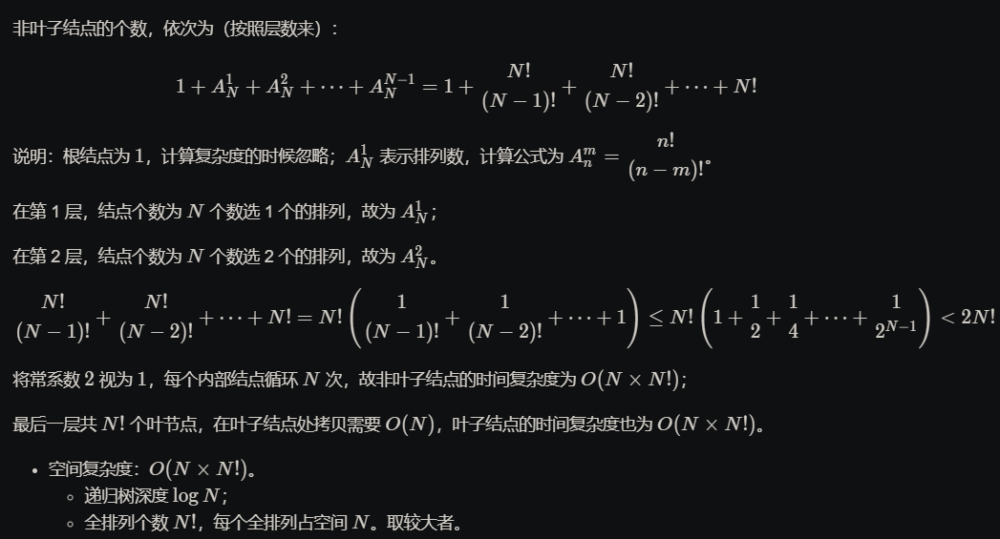
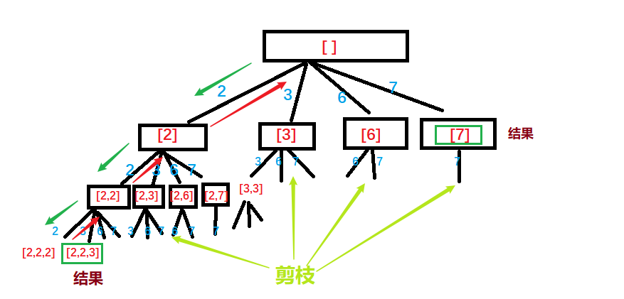
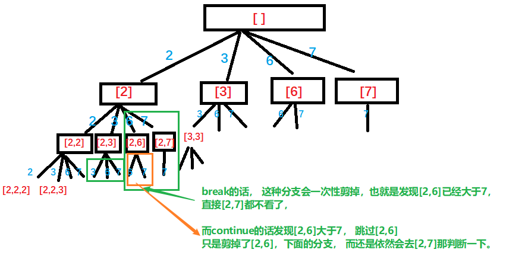
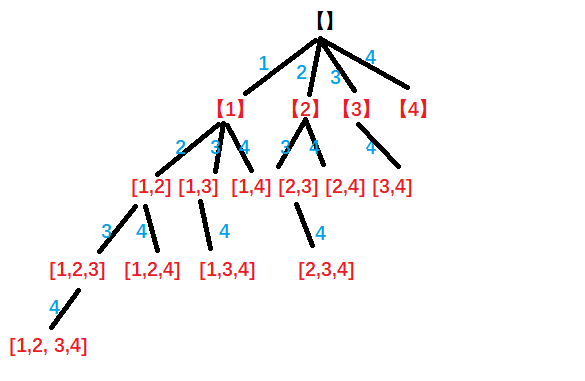
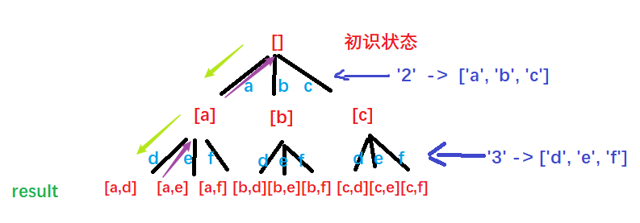
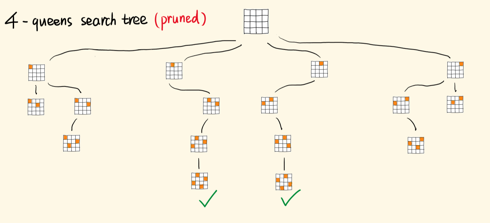

# 题目整理

回溯算法也非常重要， 这是一种遍历算法，以 **深度优先遍历** 的方式尝试所有的可能性。有些教程上也叫「暴力搜索」。回溯算法是 **有方向地** 搜索，区别于多层循环实现的暴力法。在回溯算法里，是一步一步地小心翼翼地进行向前试探，会对每一步探测到的情况进行评估，如果当前的情况已经无法满足要求，那么就没有必要继续进行下去，当出现非法的情况时，算法可以回退到之前的情景，可以是返回一步，有时候甚至可以返回多步，然后再去尝试别的路径和办法。这也就意味着，想要**采用回溯算法，就必须保证，每次都有多种尝试的可能, 每一次尝试一种可能， 然后回退**。解题模板如下：

```python
def fn(n):
	# 第一步： 判断输入或者状态是否非法？
	if input/state is invalid:
		return
	
	# 第二步： 判断递归是否应当结束？
	if match condition:
		return some value
	
	# 遍历所有可能出现的情况
	for all possible cases:
		
		# 第三步： 尝试下一步的可能性
		solution.push(case)
		# 递归到下面一层
		result = fn(n+1)
		# 第四步： 回溯到上一步， 这个很关键
		solution.pop(case)
```

下面通过题目练熟这个模板吧。

## 1. [组合](https://leetcode-cn.com/problems/combinations/)（中等）

* 思路一

  这个题目是递归加回溯的典型应用。

  我们先来分析一下这个题目：这个题目要我们穷举出所有的长度为k的数字组合， 那么这个问题如果想用递归的话需要把大问题化成相似子问题， 那么如何化简呢？假设$n=4, k=2$,  我们可以发现如下递归结构：

  1. 假设我们组合里有了1， 那么只需要[2, 3, 4]里面再找一个数
  2. 假设我们组合里有了2， 那么只需要在[3, 4]里面再找一个数。 注意这里不能再考虑1， 因为1的时候在上面已经包含了

  所以， 递归结构比较清晰， 即在以$n$结尾的候选数组里， 选出若干个元素。 如果画出递归结构， 如下：


​	最终的叶子节点就是组合的答案。 而每个节点， 都在递归的做同样的事情， 区别就是在于**搜索起点**的不同。

​	所以， 接下来写递归的时候， 我们要考虑下面额外的两个参数：

1. path: 这个要记录从根节点到叶节点的路径信息， 作为每次寻找可行路径的试探列表， 这是一个栈结构。 作用就是一次次的试探， 如果满足最终的k个数的条件， 就会加入到最终结果

 		2. start： 这个参数表示搜索的起点， 表示再区间[start, n]里面选出若干个数的组合

那么代码的逻辑可以想一下：

1. 参数： n, k, start, path， 每个的作用上面给出
2. 结束条件： 如果当前的path里面的数达到了k个， 那么就把path当前里面的数加入到最终结果， 返回
3. 当前层与下一层要写到一块： 就是遍历[start, n]， 先尝试加入遍历的当前元素i到path里面， 然后进入下一层，在i+1到n里面选元素， 当返回的时候， 要记得回溯

这个结合着上面的图就会一目了然， 代码如下：

```python
class Solution:
    def __init__(self):
        self.res = []

    def dfs(self, n, k, start, path):

        # 递归结束条件  个数够了
        if len(path) == k:
            self.res.append(path[:])      # 这里要是浅复制， 不能是path， 因为path本身会变
            return
        
        # 遍历所有可能的搜索点
        for i in range(start, n):
            path.append(i)          # 先加入当前     
            #print(path)      # 如果不了解回溯， 可以打印一下结果看一下
            self.dfs(n, k, i+1, path)   # 去下一层
            path.pop()              # 回溯
            #print(path)


    def combine(self, n: int, k: int) -> List[List[int]]:

        if k <= 0 or n < k:
            return self.res
        
        path = []
        self.dfs(n, k, 1, path)

        return self.res
```

这是第一版代码， 但这里面遍历可能搜索点的时候， 会做很多无用功， 比如$n=7, k=4$的时候， 其实从**5搜索就已经没有意义了**， 因为即使5选上， 后面只有6和7， 也凑不起4个数。 因此， **搜索点是有上界的**。分析搜索点的上界，其实是在深度优先遍历的过程中剪枝，剪枝可以避免不必要的遍历，剪枝剪得好，可以大幅度节约算法的执行时间。尤其是n很大的时候。 看下面这个图：


这里面绿色的部分其实没必要去做， 也就是可以剪枝掉。容易知道：搜索起点和当前还需要选几个数有关，而当前还需要选几个数与已经选了几个数有关，即与 `path` 的长度相关。我们举几个例子分析：例如：$n=6, k=4$

* len(path) == 1: 接下来还需要选3个数， 搜索起点最大是4， 最后一个备选是[4,5,6]
* len(path) == 2: 接下来还需要选2个数， 搜索起点最大是5， 最后一个备选是[5, 6]
* len(path) == 3: 接下来还需要选1个数， 搜索起点最大是6， 最后一个备选是[6]

所以， len(path)==1的时候， 遍历的终止数到4就可以了， 没有必要到$n$， 那么这个关系到底是什么呢？ 可以发现：

```
搜索起点的上界 + 接下来要选择的元素个数 - 1 = n
```

即

```
搜索起点的上界 = n - (k - len(path)) + 1
```

所以， 我们可以对上面的代码进行剪枝， 只需要搜索遍历的时候改一下上界， 把

```python
# 遍历所有可能的搜索点
for i in range(start, n-(k-len(path))+2):       # 改这里
    path.append(i)             
    #print(path)      
    self.dfs(n, k, i+1, path)   # 去下一层
    path.pop()              # 回溯
    #print(path)
```

这时候， 会发现程序快了很多很多。

* 思路二： 利用组合的数学公式

  《概率论和数理统计》中学过：
  $$
  C_{n}^{k}=C_{n-1}^{k-1}+C_{n-1}^{k}
  $$
  等式左边是从n个元素里面选k个元素， 右边是实现这一过程的方式， 即任意选择一个元素作为特殊元素， 从n中选k个元素就分为了包不包含这个特殊元素：

  * 包含， 就相当于从n-1个元素里面选出k-1个元素， 加上这个特殊的就是k个
  * 不包含， 相当于从n-1个里面选出了k个元素

  看下面的图：

  

  代码如下：

  ```python
  class Solution:
      def __init__(self):
          self.res = []
  
      def dfs(self, n, k, start, path):
  
          # 递归结束条件  个数够了
          if k == 0:
              self.res.append(path[:])      # 这里要是浅复制， 不能是path， 因为path本身会变
              return
          
          if start > n-k+1:   # 后面的不够了
              return 
          
          # 不考虑当前的数start， 直接进入下一层去找， 此时我们还是需要找k个数
          self.dfs(n, k, start+1, path)
  
          # 选当前的数start， 然后进入下一层， 此时我们还需要找k-1个数
          path.append(start)
          self.dfs(n, k-1, start+1, path)
          path.pop()        # 回溯
  
      def combine(self, n: int, k: int) -> List[List[int]]:
  
          if k <= 0 or n < k:
              return self.res
          
          path = []
          self.dfs(n, k, 1, path)
  
          return self.res
  ```

这里多整理一个， python里面其实已经实现了排列组合的函数， 在itertools包里面， 实际应用中可以直接使用， 速度还要比自己实现要快很多， 关于ITERTOOLS模块小节， 找了一个不错的文章：[ITERTOOLS模块小结](https://www.jianshu.com/p/73b17486ef8c)

```python
import itertools
class Solution:

    def combine(self, n: int, k: int) -> List[List[int]]:
        return list(itertools.combinations(range(1, n+1), k))
```

**这里总结一下，重点概括**：

* 如果解决一个问题有多个步骤，每一个步骤有多种方法，题目又要我们找出所有的方法，可以使用**回溯算法**；
* 回溯算法是在一棵树上的 **深度优先遍历**（**因为要找所有的解，所以需要遍历**）；
* 组合问题，相对于排列问题而言，不计较一个组合内元素的顺序性（即 [1, 2, 3] 与 [1, 3, 2] 认为是同一个组合），因此很多时候需要按某种顺序展开搜索，这样才能做到不重不漏。
* 回溯算法要会画递归树， 且**画图帮助分析**是非常重要的解题方法。

这里当然也可以三层循环搞定， 但效率有点低， 也放上来吧：思路的话借鉴全排列那里的思路做的。

```python
class Solution:

    def combine(self, n: int, k: int) -> List[List[int]]:

        res = [[val] for val in range(1, n+1)]

        # 控制次数， k次
        for i in range(k-1):
            temp_res = []
            # 第二次遍历所有已有结果
            for re in res:
                # 第三次遍历添加新元素
                for j in range(re[-1]+1, n+1):
                    temp_res.append(re + [j])
            #print(temp_res, len(temp_res[0]))
            res = temp_res
            
        return res
```

## 2. [全排列](https://leetcode-cn.com/problems/permutations/)（中等）

这个题目如果想明白了上面的组合问题， 其实不是很难的一个题目。 套路一致， 并且回溯框架也基本一致。 我们先来梳理一下这个过程：

假设[1, 2, 3]， 我们求全排列， 那么一开始的时候， 我们有三种选择： 1， 2， 3

* 如果选1开头， 那么是[1, 2, 3]和[1, 3, 2]两种情况， 即[1] + [2, 3]的全排列（你看到递归了吗？）
* 如果选2开头， 那么是[2, 1, 3]和[2, 3, 1]两种情况， 即[2] + [1, 3]的全排列
* 如果是3开头， 那么是[3, 1, 2]和[3, 2, 1]两种情况， 即[3] + [1, 2]的全排列

所以我们同样是发现了， **每次都会面临很多次选择， 选择其中一个之后， 问题变成和上面一样的子问题**， 那么回溯就是解决这种问题最好的方式， 而要想理解回溯， 最好的方式就是先画一棵树出来模拟这个过程， 这里我用题解里面的一张图了， 自己画的不如人家的好看：


说明：

* **每一个节点表示了求解全排列问题的不同阶段**， 这些阶段通过变量的不同的值体现， 这些变量不同的值， 称之为【状态】
* 使用dfs变量有回头的过程， 在回头之后， **状态变量需要设置为和原来一样**， 因此在回到上一层节点的过程中， 需要撤销上一次的选择， 这个操作称为【状态重置】
* 深度优先遍历， 借助系统栈空间， 保存所需要的状态变量， 在编码中只需要注意遍历到相应的结点的时候，状态变量的值是正确的，具体的做法是：往下走一层的时候，path 变量在尾部追加，而往回走的时候，需要撤销上一次的选择，也是在尾部操作，因此 path 变量是一个栈；
* 深度优先遍历通过【回溯】操作， 实现了全局使用一份状态变量的效果。

这个题我们会发现， 除了根结点和叶子结点以外，每一个结点做的事情其实是一样的，即：在已经选择了一些数的前提下，在剩下的还没有选择的数中，依次选择一个数，这显然是一个 **递归** 结构；

那么我们分析一下上面模板里面的条件：

1. 终止条件： **一个排列中的数字选够了**， 因为我们需要用一个变量记录一下当前程序递归到了第几层， 可以用depth来记录， 当depth==数组个数的时候， 说明终止了， 保存结果并返回
2. 接下来就是遍历数组里面的所有数组， 尝试加入当前数， 然后去下一层， 然后再回溯， 但是我们需要注意一个问题， 就是加入当前数之后， 下一层里面是不能再有当前这个数了， 要从剩下的里面再进行选择。 **这个问题我一开始尝试remove和pop, 但是失败了， 在循环的时候，我们切记改变列表本身， 尤其是递归里面**。所以这个参考了题解， 可以使用一个used字典， 来标记每个元素是否已经被使用过， 没有使用的元素， 我们才可以加入， 然后更新标记，去下一层， 回溯的时候恢复为原来的状态**这是一种空间换时间的思路**， 如果不用这样的一个数组， 也可以， 那么就需要加入当前数之前判断是否path里面有当前这个数， 没有的时候再加入， 但是这时候会浪费一次遍历的时间。

下面就可以写代码， 套用上面的模板：

```python
class Solution:
    def __init__(self):
        self.res = []
    
    def dfs(self, nums, depth, used, path, size):
        """
        nums:  原数组（注意不能改变)
        depth: 当前已经到了哪一层
        used: 和原数组长度一样， 用来标记每个元素是否已经备用
        path: 试错的结果存储
        """
        # 结束条件， 如果个数够了， 结束
        if depth == size:
            self.res.append(path[:])   # 这个地方一定要是拷贝， path的话是执行同一块内存空间， 那这样path会回溯， 也就是内存里面的数会变
            return
        
        # 遍历所有元素
        for i in range(size):
            if not used[i]:
                # 加入当前结果
                path.append(nums[i])
                used[i] = True

                # 去下一层
                self.dfs(nums, depth+1, used, path, size)

                # 回溯
                used[i] = False
                path.pop()
            

    def permute(self, nums: List[int]) -> List[List[int]]:

        if len(nums) == 0:
            return 
        
        used = [False] * len(nums)    # 默认都没被使用

        self.dfs(nums, 0, used, [], len(nums))

        return self.res
```

时间复杂度$O(n*n!)$。这回溯算法由于其遍历的特点，时间复杂度一般都比较高，有些问题分析起来很复杂。一些回溯算法解决的问题，剪枝剪得好的话，复杂度会降得很低，因此分析最坏时间复杂度的意义也不是很大。但还是视情况而定。看一下题解的分析， 排列的公式：



参考题解， 感觉写的很好： [回溯算法入门级详解 + 练习（持续更新）](https://leetcode-cn.com/problems/permutations/solution/hui-su-suan-fa-python-dai-ma-java-dai-ma-by-liweiw/), 里面还归类了类似的题目。

其实， 对于全排列， python里面也已经有实现好的库了， itertools里面的permutations。

```python
import itertools

class Solution:
    def permute(self, nums: List[int]) -> List[List[int]]:
        return list(itertools.permutations(nums))
```

在国际站还看到了一种思路， 三层循环， 插入的思想， 可以扩展一下思路。 **为了排列n个数字，我们可以从n-1个数，在每一个可能的位置插入第n个数得到一种结果。**比如我们要排列[1, 2, 3]， 我们可以从遍历1开始， 把1放入结果中。 然后遍历到2的时候， 把2插入到1的前面和后面就会得到[1, 2], [2, 1]两种结果。 遍历到3的时候， 对于这两种结果的每一种， 我们就可以遍历可以插入的位置进行插入， 比如[1, 2]， 我们有三个位置插入3， [3, 1, 2], [1, 3, 2], [1,2,3]， 这样就会得到6种最终结果。 所以这个需要三层循环： 循环每个数， 对于每个数， 循环目前的结果， 对于每个结果， 循环插入的位置进行插入。

代码如下：

```python
class Solution:
    def permute(self, nums: List[int]) -> List[List[int]]:

        perms = [[]]    # 初始化一个空结果

        # 遍历每个数
        for num in nums:
            new_perms = []          # 一个临时的结果
            # 遍历每个结果
            for perm in perms:

                # 对于每个结果， 遍历每个位置
                for loc in range(len(perm)+1):
                    new_perms.append(perm[:loc] + [num] + perm[loc:])     # 把当前num插入到每个位置
            
            # 更新结果
            perms = new_perms
        
        return perms
```

组合里面应该也可以用这样的一个思路解决。

## 3. [全排列 II](https://leetcode-cn.com/problems/permutations-ii/)(中等)

全排列II和全排列1的思想是一致的， 但是由于这个可以进行重复， 但是结果又不允许重复， 那么很关键的一点就是**在生成结果的过程中要预判一下， 发现可能生成重复的结果时立即剪枝**， 这个说起来简单， 但是如何做到预判和剪枝呢？ 首先， 如果对结果进行去重呢？ 由于产生的结果是列表， 那么去重的方式就是先排序然后去重， 而这里也是同样的思想， 先把原数组排序， 然后一旦发现某个分支搜索下去可能搜到重复元素就停止搜索。 那么哪些地方会产生重复呢？  这个题目的解决核心是理解下面这个图： 这个图依然来自题解的大佬：


这个就是[1, 1, 2]的那个例子， 我们可以看到， 如果不剪枝的时候， 最后面的结果一定会出现重复， 就是红色框框柱的那部分。那么如何在判断的时候， 就可以进行剪枝呢？  我们可以模拟一下这个过程， 还是和上面一样的思路：

1. 初始的时候， 我们会选择1， 然后面临[1', 2]两种选择， 而回溯就是遍历嘛， 就会都试一下， 然后得到第一个分支的结果
2. 主要是第二个分支， 选择的是[1']， 这时候面临[1, 2]两种选择， 这时候其实再做下去其实和第一种情况是一样的， 当我们遍历到这个[1']的时候， 就要想办法停掉剪枝， 不进行后面的操作。  但这时候是一种什么操作呢？  怎么判断当前遍历的是[1']呢？   **这个其实好判断， 就是当前遍历的元素是否等于前一个位置的元素**。 也就是nums[i]==nums[i-1]?   如果相等， 就可以判断接下去**可能**会发生重复了。
3. 注意这里我说了一个可能， 啥时候不是重复， 就是标号2的那种情况下， 此时虽然遍历到了[1']， 但是由于它上面的1正在使用， 这时候不会发生重复。 这个情况要和标号1的这种情况区分开。  区分的标准就是他前面那个是否正在被用。 即used[nums[i-1]] == False?  如果这个等于False， 就是标号1的这两种情况， 这时候就可以剪掉。 而如果这个不等于False， 就是标号2的情况， 不要剪掉。

所以根据上面的分析， 代码里面要在遍历的地方加剪枝的语句：

```python
# 对于当前i， 先判断上面的这两种情况是不是符合， 如果都符合， 进行剪枝
if i > 0 and nums[i] == nums[i-1] and used[i-1] == 0:  # 第一个条件防止越界， 第二个条件可能存在重复， 第三个条件是确定存在重复了
	continue
```

但是这里不能用字典来标记了， 而是用一个数组来标记每个元素是否被使用过。**并且要记得nums要先排序**。

```python
class Solution:
    def __init__(self):
        self.res = []
    
    def dfs(self, nums, depth, used, path):
        """
        nums:  原数组（注意不能改变)
        depth: 当前已经到了哪一层
        used: 和原数组长度一样， 用来标记每个元素是否已经备用
        path: 试错的结果存储
        """
        # 结束条件， 个数够了
        if depth == len(nums):
            self.res.append(path[:])   
            return
        
        # 遍历所有元素
        for i in range(len(nums)):

            # 这里要剪枝一下
            if i > 0 and nums[i] == nums[i-1] and used[i-1]==0:
                continue
                
            if used[i] == 0:
                # 加入当前结果
                path.append(nums[i])
                used[i] = 1

                # 去下一层
                self.dfs(nums, depth+1, used, path)

                # 回溯
                used[i] = 0
                path.pop()
            

    def permuteUnique(self, nums: List[int]) -> List[List[int]]:

        if len(nums) == 0:
            return 
        
        used = [0] * len(nums)   # 这里用个列表
        
        # 排序
        nums.sort()

        self.dfs(nums, 0, used, [])

        return self.res
```

三层循环遍历的那个在这里没有那么多顾虑， 只需要加一句代码判断是否有重复即可：

```python
class Solution:

    def permuteUnique(self, nums: List[int]) -> List[List[int]]:
        perms = [[]]    # 初始化一个空结果

        # 遍历每个数
        for num in nums:
            new_perms = []          # 一个临时的结果
            # 遍历每个结果
            for perm in perms:

                # 对于每个结果， 遍历每个位置
                for loc in range(len(perm)+1):
                    temp = perm[:loc] + [num] + perm[loc:]
                    if temp not in new_perms:       # 这里加一句判断即可， 保证没有重复的
                        new_perms.append(temp)     # 把当前num插入到每个位置
            
            # 更新结果
            perms = new_perms
        
        return perms
```

## 4. [组合总和](https://leetcode-cn.com/problems/combination-sum/)(中等)

做完了前3个题目之后， 对于回溯， 慢慢的开始有感觉， 所以这道题就可以直接用前面的方式进行a掉， 下面是我没看任何题解前的思考过程， 先记录， 然后再摘抄好的题解。 

这个题目拿到手之后， 首先第一步就是画树形结构， 列出所有可能：以[2, 3, 6, 7]为例



看这个图， 首先一目了然， 这是回溯的经典应用， 每一次也是面临不同的选择， 然后需要分别去试探， 试探完毕之后回溯。 所以依然采用上面递归的那种框架， 但是有两个细节：

1. 题目里面说不能有重复结果， 这个就需要控制遍历的范围， 如果不控制范围， 即每一层分支都面临四种可能， 这时候肯定会出现重复。上面能够清晰的看到， 如果遍历的是2， 那么下一层就是它以及它后面的元素， 也就是【2,3,6,7】， 但如果是3， 同样后面要是它以及它后面的元素【3,6,7】，如果是6， 那么下一层就是【6,7】，也就是在遍历的时候， 我们需要一个参数start来控制下一层遍历的起始位置。这样才能保证不重复。 否则如果是3， 再去遍历【2,3,6,7】的话， 2那个分支肯定会出现重复的。因为在组合里面【2,3】，【3,2】没有区别。
2. 第二个问题就是要在遍历每个数的时候， 尝试加入之前， 有一个剪枝的过程。 这样可以大大减少遍历次数， 看上图就可以显而易见了。 如果不剪枝， 这个体系会很庞大。 那么如果剪枝呢？ 那就是在加入之前， 先判断一下是否加上当前遍历的这个数已经大于了target， 如果大于了， 就没有必要去她下一层了， 跳过这个分支即可。

所以， 基于上面的两个细节， 我们来考虑代码的逻辑， 依然是回溯的框架：

1. 参数这次有哪些？  题中给出的候选集， target， 然后就是需要summ， 来记录当前的数的和， 如果summ==target了， 说明这个临时结果有效， 保存且返回。 还得有个path， 根据上面的讨论还需要begin控制遍历的起始位置， len(候选集)来控制遍历的终止位置。
2. 递归的结束条件： 就是summ==target， 这时候保存结果， 返回
3. 遍历每个可能， 对于当前可能， 先判断一下summ+这个数是否已经大于了target， 如果大于， 跳过这个可能， 这就是剪枝， 否则， summ加上这个数，且path也收入这个数， 进入到下一层。
4. 回溯， summ减去这个数， path减去这个数

如果明白了回溯的特点， 这个应该好理解：

```python
class Solution:
    def __init__(self):
        self.res = []
    
    def dfs(self, candidates, target, summ, path, begin, size):

        # 递归结束条件
        if summ == target:
            self.res.append(path[:])
            return 
        
        # 遍历每个数
        for i in range(begin, size):
            # 剪枝
            if summ + candidates[i] > target:
                continue
            
            # 尝试加入
            summ += candidates[i]
            path.append(candidates[i])
            #print(path)

            # 去下一层
            self.dfs(candidates, target, summ, path, i, size)

            # 回溯
            summ -= candidates[i]
            path.pop()


    def combinationSum(self, candidates: List[int], target: int) -> List[List[int]]:

        if len(candidates) == 0:
            return []
        
        self.dfs(candidates, target, 0, [], 0, len(candidates))

        return self.res
```

当然， 如果事先把候选数组进行排序的话， 剪枝还可以更加彻底。也就是排序一下， 还可以提速， 请注意上面和下面两段代码的差别：

```python
class Solution:
    def __init__(self):
        self.res = []
    
    def dfs(self, candidates, target, summ, path, begin, size):

        # 递归结束条件
        if summ == target:
            self.res.append(path[:])
            return 
        
        # 遍历每个数
        for i in range(begin, size):
            # 剪枝
            if summ + candidates[i] > target:
                break
            
            # 尝试加入
            summ += candidates[i]
            path.append(candidates[i])
            #print(path)

            # 去下一层
            self.dfs(candidates, target, summ, path, i, size)

            # 回溯
            summ -= candidates[i]
            path.pop()


    def combinationSum(self, candidates: List[int], target: int) -> List[List[int]]:

        if len(candidates) == 0:
            return []
        
        candidates.sort()
        self.dfs(candidates, target, 0, [], 0, len(candidates))

        return self.res
```

这个相对于上面那个， 只改了两行代码， 一行是主函数中调用dfs之前， 先排序了。 另一行就是剪枝那里， 把continue改成了break。



所以break会比continue剪的更加彻底， 但是前提**数组需要排好序**。 如果排好序， 还有更加简洁的代码：

```python
class Solution:
    def combinationSum(self, candidates: List[int], target: int) -> List[List[int]]:

        candidates.sort()

        res = []

        def dfs(begin, path, remain):

            for i in range(begin, len(candidates)):
                c = candidates[i]
                if c == remain:
                    res.append(path+[c])
                if c < remain:
                    dfs(i, path+[c], remain-c)
                if c > remain:
                    return
        
        dfs(0, [], target)

        return res
```

但是这个不如上面两个快， 做参考吧。并且我还发现， 把结果存储在类的成员变量里面， 不如直接在函数里面写快：

```python
class Solution:
    def combinationSum(self, candidates: List[int], target: int) -> List[List[int]]:

        res = []
        candidates.sort()
        def dfs(candidates, target, summ, path, begin, size):

            if summ == target:
                res.append(path[:])
                return

            for i in range(begin, size):
                if summ + candidates[i] > target:
                    break
                path.append(candidates[i])
                summ += candidates[i]
                dfs(candidates, target, summ, path, i, size)
                path.pop()
                summ -= candidates[i]
        
        dfs(candidates, target, 0, [], 0, len(candidates))
        return res
```

## 5. [组合总和II](https://leetcode-cn.com/problems/combination-sum-ii/)

这个题目， 我们先和上面的那个对比一下， 会发现两点不同：

1. 元素不能重复使用了
2. 候选数组里面有重复了

针对这两点改进， 我们基于前面的那个代码，进行一些改进即可。 

1. 关于第一点， 元素不能重复使用了， 这个就要求我们改begin， 也就是遍历的起始点， 不能再包括当前元素自身， 遍历的范围应该是[begin+1, size]。
2. 关于第二点， 候选数组里面有重复元素， 而最终结果不能有重复， 那么要求我们在剪枝的过程中， 要去重。 这个参考全排列II里面的思路， 需要遍历当前元素的时候， 加一句判断， 这个加的和全排列II中的一样， 原因可以参考那个。

```python
class Solution:
    def __init__(self):
        self.res = []
    
    def dfs(self, candidates, target, summ, path, begin, size, used):

        # 递归结束条件
        if summ == target:
            self.res.append(path[:])
            return 
        
        # 遍历每个数
        for i in range(begin, size):
            # 剪枝
            if i > 0 and candidates[i] == candidates[i-1] and used[i-1]==0:
                continue

            if summ + candidates[i] > target:
                break
            
            # 尝试加入
            summ += candidates[i]
            path.append(candidates[i])
            used[i] = 1
            #print(path)

            # 去下一层
            self.dfs(candidates, target, summ, path, i+1, size, used)

            # 回溯
            summ -= candidates[i]
            path.pop()
            used[i] = 0


    def combinationSum2(self, candidates: List[int], target: int) -> List[List[int]]:

        if len(candidates) == 0:
            return []
        
        used = [0] * len(candidates)

        candidates.sort()
        self.dfs(candidates, target, 0, [], 0, len(candidates), used)

        return self.res
```

## 6. [子集](https://leetcode-cn.com/problems/subsets/)（中等）

给定一个数组， 找出所有的子集， 这个我们也是需要画一棵递归树， 然后用回溯的模板就可以解决， 通过上面的几道题， 估计已经掌握这种题目的套路了吧， 首先， 通过递归树先模拟一遍， 如果我们手动找，应该怎么找？



首先， 我们能够看到这个又是每一次会面临很多种情况， 需要我们每一种情况去试探， 然后就是发现， 每一次试探的范围会变， 因为不能够重复， 所以需要用一个begin来控制试探范围。 **PS：在组合的相关题目里面， 都基本上会有个begin来控制试探范围， 在排列里面， 则基本上会有个used数组来标记是否被使用**.

这又是一个经典的回溯问题， 套用我们上面的模板， 分析一下：

1. 参数： nums,  path, begin, size  不解释了， 和上面一样
2. 递归结束条件： 这里会发现， 啥时候， 返回呢？   就是当path的最后一个值， 与nums最后一个值相等的时候， 就该返回了。 但是**结果这次不要再这里加， 因为不止是叶子上会有结果**
3. 遍历[begin,size]范围内的元素， 对于每个元素， 尝试加入， 然后去下一层。  **当回来的时候， 我们在这里加结果**
4. 然后回溯

所以看清楚这次和上面的不同之处， 由于这次的结果不全在叶子上， 而是在每一次试探的路径上， 所以， **我们添加结果是在回溯之前添加的**。其他地方没变：

```python
class Solution:
    def __init__(self):
        self.res = []
    
    def dfs(self, nums, path, begin, size):
	    
        # 递归结束， 注意， 这次不在这里面加结果
        if path[-1] == nums[-1]:
            return
        
        for i in range(begin, size):
            path.append(nums[i])
            self.dfs(nums, path, i+1, size)
            #print(path)
            # 在这里加入结果
            self.res.append(path[:])
            
            # 回溯
            path.pop()

    def subsets(self, nums: List[int]) -> List[List[int]]:

        self.dfs(nums, [-1], 0, len(nums))  # 这里的path初始值没设置成[]， 因为设置成空之后， 上面判断path[-1]会越界， 所以设置了个哨兵

        return [val[1:] for val in self.res] + [[]]
```

当然， 这个题还有更简洁的代码， 上面的是由下往上， 而竟然可以直接由上到下。这个写法更好一些

```python
class Solution:
    def __init__(self):
        self.res = []
    
    def dfs(self, nums, path, begin, size):

        # 直接加入结果
        self.res.append(path[:])
        
        for i in range(begin, size):
            path.append(nums[i])
            self.dfs(nums, path, i+1, size)    # 这三行可以合并为一行 self.dfs(nums, path+[nums[i]], i+1, size)
            path.pop()

    def subsets(self, nums: List[int]) -> List[List[int]]:

        self.dfs(nums, [], 0, len(nums))

        return self.res 
```

这个空间复杂度会很低。

关于回溯， 这里可以在总结两条规律：

1. 如果我们的结果都集中在叶子上， 那么我们保存最终结果的时候， 是在终止条件里面进行保存， 但是如果在路径上， 那么保存最终结果的时候， 是在回溯之前或者不写终止条件， 直接一路保存过来。 这里有自底向上和自顶向下两种写法， 感觉第二种方式比较好（也就是下面的这种写法）
2. 一般对于组合的问题， 我们一般会设置一个begin来控制遍历范围， 因为这个问题不讲究顺序(即[2,2,3]和[2,3,2]视为相同列表), 需要按照某种顺序搜索。
3. 一般对于排列问题， 我们会用used数组来标记是否元素被使用。 因为这个问题讲究顺序(即[2,2,3]和[2,3,2]视为不同列表), 需要记录哪些数字已经使用过。

和上面排列组合的那种思路一样， 一开始， 初始化[[]]， 然后遍历每个元素, 比如[1, 2, 3]， 遍历1的时候， 会得到[[], [1]], 然后遍历每个结果， 在结果里面添加新的数。 上面这种情况遍历到2的时候， [[], [1], [2], [1,2]]， 遍历到3的时候， [[], [1], [2], [1,2], [3], [1,3], [2,3], [1,2,3]] 就会得到最终的答案。 代码如下：

```python
class Solution:

    def subsets(self, nums: List[int]) -> List[List[int]]:

        res = [[]]

        for num in nums:
            res = res + [temp_res + [num] for temp_res in res]
        
        return res
```

还可以掉包实现：

```python
import itertools

class Solution:

    def subsets(self, nums: List[int]) -> List[List[int]]:

        res = []

        for i in range(len(nums)+1):
            for temp in itertools.combinations(nums, i):
                res.append(temp)
        
        return res
```

## 7. [子集II](https://leetcode-cn.com/problems/subsets-ii/)(中等)

这个题目采用由上到下的思路， 只需要剪枝去除即可。 和全排列II一样， 得需要一个used数组来标识是否被使用， 发现这种题目去重剪枝的话， 只需要加一句话：

```python
if i > 0 and nums[i]==nums[i-1] and used[i-1]==0
```

还有一点不同就是先排序。 

```python
class Solution:
    def __init__(self):
        self.res = []
    
    def dfs(self, nums, path, begin, size, used):
	    
        self.res.append(path[:])

        for i in range(begin, size):
            # 剪枝去重
            if i > 0 and nums[i] == nums[i-1] and used[i-1] == 0:
                continue

            if used[i] == 0:
                path.append(nums[i])
                used[i] = 1
                self.dfs(nums, path, i+1, size, used)
                # 回溯
                path.pop()
                used[i] = 0

    def subsetsWithDup(self, nums: List[int]) -> List[List[int]]:
        
        # 排序
        nums.sort()
        used = [0] * len(nums)
        self.dfs(nums, [], 0, len(nums), used) 
        return self.res
```

遍历的方式也可以a掉这个题目，但是会有点慢， 因为得去判断是不是里面已经有了， 这个得需要一层循环。

```python
class Solution:
    def subsetsWithDup(self, nums: List[int]) -> List[List[int]]:
        nums.sort()

        res = [[]]

        for num in nums:
            res = res + [temp_res + [num] for temp_res in res if temp_res+[num] not in res]
        
        return res
```

## 8. [电话号码的字母组合](https://leetcode-cn.com/problems/letter-combinations-of-a-phone-number/)（中等）

这个题目也是比较经典的回溯题目， 和上面不一样的是， 每一层遍历的时候， 会换列表， 而上面那些都是基于同一个列表进行操作的， 但思想还是一样的。 同样的， 根据这个题目的说明， 我们可以画一棵递归树出来， 就比如输入是“23”。 '2'对应的字母是'abc'， '3'对应的字母是'def'。 我们从'abc'开始：



所以， 这个题的思考思路就是我们先定义一个字典， 可以通过每个数字拿到它对应的字母组合。具体运行的时候， 由于我们每一层用的列表都不一样， 那么就需要一个depth来记录当前的层数， 基于这个层数我们获取相应的列表， 然后再进行遍历和回溯。 依然是我们的算法框架：

1. 参数： [digits, mapp, path, depth],  digits表示数字字符串， mapp是一个字典， 每个数字对应的字母组合， path穷举时记录结果， depth标记层数
2. 结束条件： 如果path里面的数字个数等于了dights的个数， 就结束了， 因为每次只会取一个字母， 两者的长度应该一样
3. 遍历循环， 这里需要根据层数获取相应的列表， 然后再进行遍历， 怎么获取？  mapp[digits[depth]]
4. 对于每个元素， 尝试加入， 然后去下一层
5. 回溯即可

按照上面的逻辑， 代码如下：

```python
class Solution:

    def letterCombinations(self, digits: str) -> List[str]:

        res = []

        # 合法性检测  空串直接返回
        if len(digits) == 0: 
            return res
        
        def dfs(digits, mapp, path, depth):

            # 结束条件
            if len(path) == len(digits):
                res.append(''.join(path[:]))
                return
            
            # 遍历
            cur_list = mapp[digits[depth]]

            for ele in list(cur_list):
                path.append(ele)
                #print(path)
                dfs(digits, mapp, path, depth+1)            # 这三行代码可以直接写成dfs(digits, mapp, path+[ele], depth+1)一行代替
                path.pop()
                
        # 字典映射
        mapp = {'2': 'abc', '3': 'def', '4': 'ghi', '5': 'jkl', '6': 'mno', '7': 'pqrs', '8': 'tuv', '9': 'wxyz'}

        dfs(digits, mapp, [], 0)
        return res
```

时间复杂度$O(3^m\times4^n)$, $m$输入中对应3个字母的数字个数， $n$是输入中对应4个字母的数字个数。 $m+n=len(digits)$。空间复杂度$O(m+n)$, 递归层数。 字典那个不太算了在这里。

这个题要注意输入为空的情况， **所以以后每个题都要注意合法性的检测**。 这个在面试的时候是非常重要的一个点。 代码的鲁棒性和正确性要时刻注意。下面一个简洁代码：

```python
class Solution(object):
    def letterCombinations(self, digits):
        if not digits:
            return []
        m = {"2":"abc", '3':"def", '4':"ghi", '5':"jkl", '6':"mno", '7':"pqrs", '8':"tuv", '9':"wxyz"}
        ret = []
        self.dfs(m, digits, "", ret)
        return ret
    
    def dfs(self, m, digits, path, ret):
        if not digits:
            ret.append(path)
            return 
        for c in m[digits[0]]:
            self.dfs(m, digits[1:], path+c, ret)
```

在这里面学习到了回溯的简便写法， 就是下面那一行的， 这样通过参数进行传递， 就不用了先试探， 然后回溯了。 因为去下一层的时候改变的参数， 回来之后， 该层的变量值path并没有变。上面的排列组合的也都可以进行简化书写， 但可能理解起来不如先试探然后回溯的清晰。

## 9. [N皇后](https://leetcode-cn.com/problems/n-queens/)(困难)

这个题依然是用回溯算法， 只不过和前面又不一样的是操作的数组由一维升到了二维， 之前都是一个列表， 这里是一个棋盘。但是依然同样的思想+模板。

先来分析一下这个题目， 在$n\times n$的棋盘里面， 要摆放n个皇后， 且让它们不能互相冲突。 **即这n个皇后不同横行， 不同纵行， 不同对角线**。 那么我们就可以先控制横行不冲突， 也就是每一横行摆放一个皇后， 即回溯的每一层代表每一横行， 而每一层我们要遍历纵行， 去搜索合适的位置摆放一个皇后使得纵行和对角线不冲突。这个又是一个典型的回溯问题。 看下面的递归树就了然了（由于画起来比较麻烦， 直接采用了[这个题解里面的图了](https://leetcode-cn.com/problems/n-queens/solution/shou-hua-tu-jie-cong-jing-dian-de-nhuang-hou-wen-t/))：



一开始， 我们的棋盘上没有皇后， 也就是为空。 那么第一横行， 我们要摆放一个皇后， 由于每一横行有n列， 那么就会有n种选择。 而对于每一种选择， 下一横行依然会有n选择， **是不是典型的回溯应用**， 只不过， 我们在后面每一层里面皇后摆放位置的时候， 都需要检查一下是不是和前面的有冲突（纵行和对角线）， 如果有冲突， 我们会跳过这种选择， 这是啥？  对的， 剪枝。  上面这个图是剪完枝以后的了， 所以看起来会非常简洁。 

所以根据上面的分析， 依然是我们的回溯模板， 下面分析模板里面的代码逻辑， （如果是从第一个题目一路走过来的话， 这个应该会很容易理解）：

1. 参数： 这里的参数， 首先会有棋盘(board), 一个row来控制层数， 相当于之前的depth， 一个size来表示列的个数， 控制每一层循环的范围
2. 回溯结束条件： if(row) == len(board)， 也就是层数到了棋盘的行数， 这时候说明n个皇后摆放完毕， 结束掉
3. 遍历循环： 对于每一层， 这里要遍历每一列
4. 剪枝： 对于每一行每一列这个位置， 判断这个位置是否有效（要保证和前面的纵行，对角线都不冲突)
5. 把这个位置加上皇后， 进入到下一层， depth+1
6. 回溯， 也就是拿掉这个位置的皇后

代码的逻辑大框架如下：

```python
def dfs(self, board, row, size):
    # 结束条件
	if row == len(board):
        # 加入结果
        return
    
    # 遍历
    for col in range(size):
        # 剪枝
        if not isvalid(board, row, col):
            continue
       
    	# 尝试放一个皇后
        board[row][col] = 'Q'
        
        # 下一层
        self.dfs(board, row+1, size)
        
        # 回溯
        board[row][col] = '.'
```

有了这个大框架之后， 剩下的就是细节了， 比如加入结果这里， 由于是二维列表， 而题目中要求的结果是里面的需要是字符串， 那么这里就需要转一下， 具体可以看最终代码。  主要是剪枝这个地方如何判断有没有效？   就是要保证**纵行和对角线不冲突**。

```python
def isvalid(self, board, row, col):
    # 纵行不能冲突
    for r in range(len(board)):
        if board[r][col] == 'Q':
            return False
   
	# 左上角对角线不冲突
    l_row, l_col = row, col
    while l_row > 0 and l_col > 0:
        l_row -= 1
        l_col -= 1
        if board[l_row][l_col] == 'Q':
            return False
   
	# 右上角对角线不冲突
    r_low, r_col = row, col
    while r_low > 0 and r_col < len(board):
        r_low -= 1
        r_col += 1
        if board[row_low][r_col] == 'Q':
            return False
   
	return True
```

好了， 这基本上就是代码的全貌了， 上最终代码：

```python
class Solution:
    def __init__(self):
        self.res = []
    
    # dfs函数
    def dfs(self, board, row, size):

        # 结束条件
        if row == len(board):
            self.add_res(board)
            return 
        
        # 遍历
        for col in range(size):

            # 剪枝
            if not self.isvalid(board, row, col, size):
                continue
            
            board[row][col] = 'Q'
            self.dfs(board, row+1, size)
            board[row][col] = '.'
    
    # 加入结果函数
    def add_res(self, board):
        # board是一个棋盘， 要把内层的列表转成字符串，然后加入self.res
        self.res.append([''.join(e_row) for e_row in board])

    # 判断有效函数
    def isvalid(self, board, row, col, size):

        # 列合法
        for r in range(size):
            if board[r][col] == 'Q':
                return False
        
        # 左上角合法
        l_row, l_col = row, col
        while l_row > 0 and l_col > 0:
            l_row -= 1
            l_col -= 1
            if board[l_row][l_col] == 'Q':
                return False
        
        # 右上角合法
        r_row, r_col = row, col
        while r_row > 0 and r_col < size-1:
            r_row -= 1
            r_col += 1
            if board[r_row][r_col] == 'Q':
                return False
        
        return True

    def solveNQueens(self, n: int) -> List[List[str]]:

        # 初始化棋盘
        board = [['.']*n for _ in range(n)]   # 这里切记这种初始化 [['.']*n] * n  这是一种浅拷贝， 每一行是同一块内存空间
        self.dfs(board, 0, n)

        return self.res
```

这个代码由于判断合法的时候， 存在着好多次遍历， 使得时间复杂度比较高， 所以我们可以用**空间换时间**的思想进行优化一下。 也就是事先用三个数组来表示当前的列， 当前的主对角线， 当前的副对角线是否已经被占用了。 如果占用了， 那么就跳过当前位置。那么如何表示呢？  纵行不冲突的这个好说， 就是用一个r数组来记录当前位置的行是不是已经被上面的占用了（列不冲突是要保证行号不一样)。 主要是对角线这个如何表示：


这个就是用两个数组来分别记录主对角线的位置和副对角线的位置是否已经被占用了， 主对角线不重复即(row-col)要唯一， 副对角线不重复即(row+col)要唯一。 所以我们可以用三个数组来替代剪枝里面的三个遍历， 节省时间， 所以剪枝的代码可以变成这个样子：

```python
def isvalid(self, board, row, col, size, r_d, main_d, sub_d):
    if r_d[col] or main_d[row-col+size-1] or sub_d[row+col]: 
        return False
    return True
```

最后总代码简化如下（去掉了加入结果函数和剪枝函数， 直接写到dfs里面即可)， 并且上面这种or的判断， 写成了not and的形式会快很多：

```python
class Solution:
    def __init__(self):
        self.res = []
    
    # dfs函数
    def dfs(self, board, row, size, r_d, main_d, sub_d):

        # 结束条件
        if row == len(board):
            self.res.append([''.join(e_row) for e_row in board])
            return 
        
        # 遍历
        for col in range(size):
            # 剪枝   下面这种剪枝方法， 要比判断or， 然后continue的方式快， 可以省掉很多冗余的计算过程
            if not r_d[col] and not main_d[row-col+size-1] and not sub_d[row+col]:
                # 尝试加入
                board[row][col] = 'Q'
                r_d[col] = True
                main_d[row-col+size-1] = True    # 主对角线， 横-纵不变， +n-1移动到正区间
                sub_d[row+col] = True     # 副对角线， 横+纵不变

                self.dfs(board, row+1, size, r_d, main_d, sub_d)
                
                # 回溯
                board[row][col] = '.'
                r_d[col] = False
                main_d[row-col+size-1] = False    
                sub_d[row+col] = False    
 
    def solveNQueens(self, n: int) -> List[List[str]]:

        # 初始化棋盘
        board = [['.']*n for _ in range(n)]   # 这里切记这种初始化 [['.']*n] * n  这是一种浅拷贝， 每一行是同一块内存空间

        # 初始化三个数组
        r_d = [False] * n
        main_d = [False] * (2*n-1)
        sub_d = [False] * (2*n-1)
        self.dfs(board, 0, n, r_d, main_d, sub_d)

        return self.res
```

关于深浅拷贝[https://blog.csdn.net/m0_37362454/article/details/82151193](https://blog.csdn.net/m0_37362454/article/details/82151193), 发现如果是写到一个函数里面， 速度会更快， 所以以后换成下面这种代码：

```python
class Solution:
    def solveNQueens(self, n: int) -> List[List[str]]:

        res = []

        # 初始化
        board = [['.'] * n for _ in range(n)]
        r_d = [False] * n
        main_d = [False] * (2*n-1)
        sub_d = [False] * (2*n-1)

        def dfs(board, row, size, r_d, main_d, sub_d):

            # 结束条件
            if row == len(board):
                res.append([''.join(e_row) for e_row in board])
                return 
            
            # 遍历
            for col in range(size):

                if not r_d[col] and not main_d[row-col+size-1] and not sub_d[row+col]:

                    board[row][col] = 'Q'
                    r_d[col] = True
                    main_d[row-col+size-1] = True
                    sub_d[row+col] = True
                    dfs(board, row+1, size, r_d, main_d, sub_d)
                    board[row][col] = '.'
                    r_d[col] = False
                    main_d[row-col+size-1] = False
                    sub_d[row+col] = False
        
        dfs(board, 0, len(board), r_d, main_d, sub_d)

        return res
```

