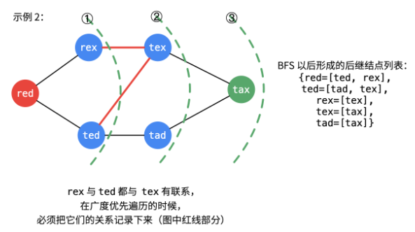
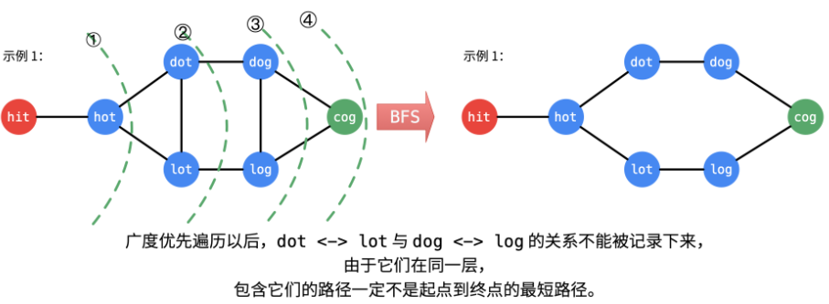

# 题目整理

和深度优先搜索不同，广度优先的搜索是从起始点出发，一层一层地进行，每层当中的点距离起始点的步数都是相同的，当找到了目的地之后就可以立即结束。关于广度优先， 我们要手动维护一个队列：

```python
def bfs(graph, start, end):
	queue = []
	queue.append([start])
	visited.add(start)
	
	while queue:
		node = queue.pop(0)
		visited.add(node)
		process(node)
		nodes = generate_related_nodes(node)
		queue.push(nodes)
```

题目如下：

## 1. [二叉树的层序遍历](https://leetcode-cn.com/problems/binary-tree-level-order-traversal/#/description)（中等）

这个题目由于在二叉树的遍历那里详细整理过， 这里就不再过多赘述， 这是一个典型的广度优先遍历的题目。 代码如下：

```python
from collections import deque
class Solution:
    def levelOrder(self, root: TreeNode) -> List[List[int]]:

        if not root:
            return []
        
        queue = deque([root])

        res = []

        while queue:

            size = len(queue)
            level = []

            # 遍历当前层所有节点
            for _ in range(size):
                node = queue.popleft()
                level.append(node.val)

                if node.left:
                    queue.append(node.left)
                if node.right:
                    queue.append(node.right)
            
            res.append(level)
        
        return res
```

## 2. [每个树行中找最大值](https://leetcode-cn.com/problems/find-largest-value-in-each-tree-row/solution/)（中等）

这个题目和上面的思路其实是一样的， 无非就是把遍历改成了找最大值， 同样的模板， 我们需要在遍历当前层所有节点的那里，把**访问改成找最大值的操作**， 即可，第一款代码如下：

```python
from collections import deque
class Solution:
    def largestValues(self, root: TreeNode) -> List[int]:

        if not root:
            return []
        
        d = deque([root])

        res = []

        while d:
            # 记录每一层的节点数
            size = len(d)

            max_value = float('-inf')
            for _ in range(size):  # 这里就是对于每一层的操作
                node = d.popleft()
			   # 这里找最大值或者最小值等
                if node.val > max_value:
                    max_value = node.val
                
                if node.left:
                    d.append(node.left)
                if node.right:
                    d.append(node.right)
            
            res.append(max_value)
        
        return res
```

这个框架其实非常的灵活， 时间复杂度O(n)。这个题目也可以用dfs的思路， 不过这时候就要设置一个depth来记录层数， 这样才能获取到某一层的最大值， 可以用之前的递归模板， 具体来分析一下：

* 递归结束条件： 这个就是root为空了， 返回
* 当前层： 这个先判断一下是不是当前层的初始值， 如果是的话， 初始化一个最小值占位， 然后比对root.val的值和当前层值大小
* 下一层逻辑就是去左右子树， depth+1

代码也不是很复杂， 并且时间会快

```python
class Solution:
    def largestValues(self, root: TreeNode) -> List[int]:

        if not root:
            return []
        
        
        res = []

        def dfs(root, depth, res):
            
            # 递归结束条件
            if not root:
                return
            
            # 当前层的逻辑  如果发现res里面的个数和depth相等了， 这时候， 要初始化当前层的一个最小值占位
            if len(res) == depth:
                res.append(float('-inf'))
            
            # 当前层的最大值
            res[depth] = max(res[depth], root.val)

            # 下面一层
            if root.left:
                dfs(root.left, depth+1, res)
            
            if root.right:
                dfs(root.right, depth+1, res)
        
        dfs(root, 0, res)

        return res
```

更多的题目， 可以都整理到了树模块的层序遍历里面， 可以去那边看。

## 2. [最小基因变化](https://leetcode-cn.com/problems/minimum-genetic-mutation/)（中等）

* 思路一：BFS

  这竟然是一个广度优先遍历的题目， 可能对于题意理解的并不是很清晰。这个题开始让我想到了深度DFS+回溯的思路， 单纯的以为是只改变与目标串不同的位置上的， 后来再仔细一读题目， 看了题解之后， 发现理解上有问题， 这个题就是给定一个初始串， 一个终止串， 起始串每次只能变一个字母， 看看变到终止串需要多少步。 注变换之后必须在基因库里面。 这其实是一个典型的广度优先遍历。

  

  思路就是从头开始， 每个元素位置从[a, g,c,t]四个里面变化， 每次变化一个字符， 然后去基于库里面找是否有， 如果有的话， 把该元素从基因库里面删除， 把这个新的序列加入到队列当中， 步数加1.当出队的字符串等于了终止字符串， 返回结果即可。

  ```python
  class Solution:
      def minMutation(self, start: str, end: str, bank: List[str]) -> int:
  
          possible = ["A", "C", "G", "T"]
  
          queue = [(start, 0)]      # 把start入队列
          while queue:
              # 广度优先遍历
              (word, step) = queue.pop(0)   # 出队元素
              if word == end:
                  return step
              
              # 开始进行遍历word的每个位置
              for i in range(len(word)):
  
                  # 从四个里面挨个替换
                  for p in possible:
  
                      temp = word[:i] + p + word[i+1:]
                      if temp in bank:
                          # 如果从基因库中， 就移除， 这样不用重复计数了
                          bank.remove(temp)
  
                          # 加入队列， 步数加1
                          queue.append((temp, step+1))
          
          return -1
  ```

* 思路二： DFS 

  这个题目也可以用dfs+回溯的思路， 之前想错了， 我们可以利用基因库中的字符串， 每一次我们找基因库中与start相差一个字符的字符串， 可以看做是start变化一下得到的， 我们基因库中的这个字符串当做start， 然后计算这个start到目标串的最小步数， 这就形成了一种递归。但是在递归的时候， 我们必须用一个used数组来记录是否该字符串已经被访问， 以防止递归的时候又遍历到该字符串。我们套用模板框架：

  1. 递归终止： if start == end
  2. 遍历bank， 找bank中与当前start相差一个字符的，并且之前没有用到的， 把这个当做新的start
  3. 回溯

  代码如下：

  ```python
  class Solution:
      def __init__(self):
          self.cou = -1
      
      def dfs(self, start, end, bank, temp_cou, used):
  
          if start == end:
              self.cou = temp_cou
              return
              
          # 遍历bank, 找bank中与start相差一个字符的
          for i in range(len(bank)):
              diff = 0
              for j in range(8):
                  if bank[i][j] != start[j]:
                      diff += 1
                  if diff > 1: break
          
              if diff == 1 and not used[i]:
                  used[i] = True
                  self.dfs(bank[i], end, bank, temp_cou+1, used)
                  used[i] = False
  
      def minMutation(self, start: str, end: str, bank: List[str]) -> int:
          used = [False] * len(bank)
          self.dfs(start, end, bank, 0, used)
  
          return self.cou
  ```

## 3. [单词接龙](https://leetcode-cn.com/problems/word-ladder/)（中等）

该题是一个比较经典的BFS的题目， 但是如果是第一次看到这样的题， 可能没法想到BFS的解题思路， 其实这个题目需要我们根据给出的题目信息， 构造出一个图来， 然后用BFS， 求起始节点到终止节点的最短路径问题。所以**如何构造图是本题的关键**。

我们把每个单词看成图中的顶点， 如果两个顶点之间相差一个字母， 这时候就可以连一条线构成边，表示这两个节点之间构成一条路，即题目中的改变一个字母就能进行转换。 这时候我们就可以得到像下面这样的无向图：


有了这样的一个图之后， 剩下的问题就比较简单了， 那就是进行广度优先遍历， 求hit -> cog的最短路径了。

这里面有个关键的问题就是， 如何构造边呢？  也就是如何判断两个相邻顶点之间是否相差一个字母？

* 第一种思路： 对于每个单词， 遍历词典中其他的单词， 然后判断这些单词之间是否只差一个字符（需要遍历每个位置）， 如果是，就可以连接一条边， 时间复杂度($N*wordLen$)

* 第二种思路： 对于每个单词的每个位置， 从26个字母中进行替换， 如果替换后的单词在词典里面， 说明换过去了， 相应单词连接边， ($26*wordLen$)的复杂度

显然第二种思路的时间复杂度更小。 所以这里我们可以考虑第二种思路。模板依然是BFS的经典模板。

代码的行为逻辑：

1. 初始化一些变量，比如词典集合， 队列，visited数组， 提前做一些异常判断， 这里注意， 把第一个词从词典中去掉， 也就是起点，起始单词入队
2. 当队列非空：
   1. 要记录与队首元素相邻的单词的个数， 因为类似于一圈圈扩散的思想，这里需要记录这一圈多少个单词
   2. 然后开始遍历， 出队一个元素， 对于出队的这个元素， 遍历它的每个位置
      1. 对于每个位置， 从26个字母中选出字母替换得到新的单词
      2. 判断该单词是否在词典中， 如果在词典中， 且为终点单词的话，直接返回step
      3. 如果该单词没有被访问过， 加入visit集合和队列
   3. 遍历一圈之后， step+1， 到外面的一圈
3. 队列空了，就结束即可

总体的代码如下：

```python
from collections import deque

class Solution:
    def ladderLength(self, beginWord: str, endWord: str, wordList: List[str]) -> int:

        # 词典
        word_set = set(wordList)

        # 异常判断
        if len(word_set) == 0 or endWord not in word_set:
            return 0
        
        # 如果开始单词在词典中，我们要移除
        if beginWord in word_set:
            word_set.remove(beginWord)
        
        queue = deque()
        queue.append(beginWord)
        word_len = len(beginWord)
        visited = set(beginWord)
        step = 1

        # BFS
        while queue:
            current_size = len(queue)

            for i in range(current_size):

                # 出队， 得到单词
                word = queue.popleft()
                word_list = list(word)

                # 遍历单词每个位置
                for j in range(word_len):
                    # 保留原来的字符， 方便后面的还原
                    origin_char = word_list[j]
                    # 遍历26个英文字母进行替换
                    for k in range(26):
                        word_list[j] = chr(ord('a') + k)
                        next_word = ''.join(word_list)
                        
                        if next_word == word:
                            continue
                            
                        # 在词典里面
                        if next_word in word_set:

                            # 如果到了终止单词
                            if next_word == endWord:
                                return step + 1
                            
                            if next_word not in visited:
                                queue.append(next_word)
                                visited.add(next_word)   
                    word_list[j] = origin_char
            step += 1
        
        return 0
```

有些图论中的问题， 不是直接把图建好， 而是需要我们自己去构建图。这一点需要好好的体会一下。

这里还有种优化的思路， 双向BFS， 也就是从两边进行扩散的思路， 这个方法可以大大的提高搜索效率。


* 已知**目标顶点的情况**下，可以分别从起点和目标顶点（终点）执行广度优先遍历，直到遍历的部分有交集。这种方式搜索的单词数量会更小一些；
* 更合理的做法是，**每次从单词数量小的集合开始扩散**；
* 这里 `beginVisited` 和 `endVisited` 交替使用，等价于单向 BFS 里使用队列，每次扩散都要加到总的visited里。

这里参考的课后的weiwei哥的题解。具体可以看那里， 这里的代码逻辑思路就是：

1. 声明辅助变量  word_set, visited, begin_visited, end_visited
2. 从begin_visited开始进行扩散， 和上面的思路一样， 也是寻找下一层的所有与节点， 找到之后，存入一个叫做next_level_visited的集合里面， 然后在当前层的遍历结束之后， 更新begin_visited
3. 这里有两个小技巧： 第一个是默认begin_visited是最小的集合， 如果end_visited比begin_visited小， 那么就交换一下。 这个是为了更快的搜索， 可以试想一下， 如果begin_visited里面的节点的下一层节点特别多的话，这时候，从end_visited扩散显然更好一些。也就是每次扩散，都选择**节点比较少的一端**。第二个技巧就是下一层的所有节点记录好，然后进行更新
4. 还有一个点和上面不同的是， 终止出，这里是如果另一端已经访问过了， 就停止

具体的代码如下：

```python
class Solution:
    def ladderLength(self, beginWord: str, endWord: str, wordList: List[str]) -> int:
        
        word_set = set(wordList)
        
        if len(word_set) == 0 or endWord not in word_set:
            return 0
        
        if beginWord in word_set:
            word_set.remove(beginWord)
            
        
        visited = set()
        visited.add(beginWord)
        visited.add(endWord)
        
        
        # 双向BFS的思路， 声明一个beginset和一个endset
        begin_visited = set()
        begin_visited.add(beginWord)
        
        end_visited = set()
        end_visited.add(endWord)
        
        word_len = len(beginWord)
        
        step = 1
        
        while begin_visited:
            
#             print('begin_visited: ', begin_visited)
#             print('end_visited: ', end_visited)
            
            if len(begin_visited) > len(end_visited):
                begin_visited, end_visited = end_visited, begin_visited
            
            next_level_visited = set()
            
            # 从begin开始扩散
            for word in begin_visited:
                
                word_list = list(word)
                
                for j in range(word_len):
                    origin_char = word_list[j]
                    
                    for k in string.ascii_lowercase:
                        word_list[j] = k
                        next_word = "".join(word_list)
                        
                        if next_word in word_set:
                            
                            if next_word in end_visited:
                                return step + 1
                            
                            if next_word not in visited:
                                next_level_visited.add(next_word)
                                visited.add(next_word)
                    
                    word_list[j] = origin_char
            
            begin_visited = next_level_visited
            step += 1
        
        return 0
```

时间复杂度$O(len(wordlist)*{len(beginWord)})$， 官方的那个平方不知道是为啥？

## 4. [单词接龙II](https://leetcode-cn.com/problems/word-ladder-ii/description/)（困难）

该题在上一题的基础上， 加了一些难度，不是输出最短路径的长度了，而是把所有符合最短路径的结果给输出出来。 这个就需要我们在进行遍历图的时候， 记录一些东西。 整体的思路是BFS + DFS集合。

BFS负责找到所有节点的下一层节点，然后用邻接表的方式存储。 DFS负责遍历邻接表输出所有的最短路径结果。

这里面重点在于BFS， 有些思路是和单词接龙I类似的，比如判断是否是邻接点的过程， 但是也有一些需要注意的点：

1. 由于要记录所有的路径，广度优先遍历「当前层」到「下一层」的所有路径都得记录下来。因此找到**下一层的结点 wordA 以后，不能马上添加到 visited 哈希表里，还需要检查当前队列中未出队的单词是否还能与 wordA 建立联系**；就比如下面的这种情况：

   

   所以在BFS的时候，不像单词接龙I那样， 如果找到了某个元素`rex`的下一层的节点`tex`，就把`tex`放到visited里面就完事， 这里还涉及到了当前层队列中的其他元素`ted`和`tex`也可能有联系。 这种路径也需要考虑进去。 所以需要在寻找下一层节点的时候， 要单独的设置一个level层级的visited， 只标记某一层的节点是否被重复访问过。但遍历完当前层的所有节点之后， 再把这个层级的visited合并到总的visited里面去。

2. 广度优先遍历位于同一层的单词，即使有联系，也是不可以被记录下来的，这是因为**同一层的连接肯定不是起点到终点的最短路径的边**；

   

   这种情况，在设置层级标识符的时候，就可以避免掉这种情况了

3. BFS的目的是找到每个节点的所有后继节点，进行保存下来， 所以这里需要声明一个successors的字典来存储所有的后继节点。key是当前节点， value是个集合的形式，表示所有的到当前节点的后继节点，比如{hot: (dot, lot)}

剩下的思路就基本上和单词接龙I的思路一样了， 直接看BFS的代码：

```python
def _bfs(self, beginWord, endWord, word_set, successors):
        
        # 声明辅助遍历， 队列， visited数组
        queue = deque([beginWord])
        
        visited = set()
        visited.add(beginWord)
        
        found = False
        
        word_len = len(beginWord)
        
        # BFS
        while queue and not found:
            
            # 记录当前队列中的元素个数， 可以区分在哪一层上
            current_size = len(queue)
            
            # 层级的访问标识
            next_level_visited = set()
            
            # 遍历每一层的节点
            for i in range(current_size):
                
                current_word = queue.popleft()  # 出队元素
                word_list = list(current_word)  # 转成列表
                
                for j in range(word_len):
                    origin_char = word_list[j]
                    for k in string.ascii_lowercase:
                        word_list[j] = k
                        next_word = "".join(word_list)
                        
                        # 如果单词在词典中， 且没被访问过
                        if next_word in word_set and next_word not in visited:
                            
                            if next_word == endWord:
                                found = True
                            
                            if next_word not in next_level_visited:
                                next_level_visited.add(next_word)
                                queue.append(next_word)
                            
                            # 加入到successors里面去
                            successors[current_word].add(next_word)
                    word_list[j] = origin_char
            
            # 把next_level_visited合并到visited里面
            visited |= next_level_visited
        return found
```

这里面用到了一个string模块的小写字母的函数， 关于string模块， 可以参考:[Python标准库笔记(1) — string模块](https://www.cnblogs.com/jhao/p/6344869.html)

这里也可以使用双向的BFS， 思路和上面的一样， 只不过这里会多一个forward遍历， 来记录一下后继和前驱的顺序。

```python
def bidirectional_bfs(self, beginWord, endWord, word_set, successors):
    
        # 声明辅助遍历 visited, begin_visited, end_visited
        visited = set()
        visited.add(beginWord)
        
        begin_visited = set()
        begin_visited.add(beginWord)
        
        end_visited = set()
        end_visited.add(endWord)
        
        word_len = len(beginWord)
        
        found = False
        forward = True    # 这个变量的作用要好好体会一下
        
        while begin_visited and not found:
            
            if len(begin_visited) > len(end_visited):
                begin_visited, end_visited = end_visited, begin_visited
                forward = not forward
            
            next_level_visited = set()
            
            for current_word in begin_visited:
                word_list = list(current_word)
                for j in range(word_len):
                    origin_char = word_list[j]
                    for k in string.ascii_lowercase:
                        word_list[j] = k
                        next_word = "".join(word_list)
                        if next_word in word_set:
                      
                            if next_word in end_visited:
                                found = True
                                self.add_to_successors(successors, forward, current_word, next_word)
                            
                            if next_word not in visited:
                                next_level_visited.add(next_word)
                                self.add_to_successors(successors, forward, current_word, next_word)
                    word_list[j] = origin_char
                    
            begin_visited = next_level_visited
            
            # 合并
            visited |= next_level_visited
            
        return found
    
 def add_to_successors(self, successors, forward, current_word, next_word):
        if forward:
            successors[current_word].add(next_word)
        else:
            successors[next_word].add(current_word)
```

而DFS的思路，就是普通的图遍历的思路了， 直接看代码：

```python
def _dfs(self, beginWord, endWord, successors, path, res):
        
        # 递归结束条件
        if beginWord == endWord:
            res.append(path[:])
            return
        
        if beginWord not in successors:
            return
        
        # 找到起始点的所有后继节点
        successors_words = successors[beginWord]
        for next_word in successors_words:
            path.append(next_word)
            self._dfs(next_word, endWord, successors, path, res)
            path.pop()
```

最终的代码程序， 就是BFS + DFS组合的形式，通过这一个题目， 竟然可以把BFS和DFS都复习一遍。

```python
def findLadders(self, beginWord: str, endWord: str, wordList: List[str]) -> List[List[str]]:
        
        # 声明一些辅助变量  词典, 邻接表
        word_set = set(wordList)
        
        # 存储结果
        res = []
        
        # 异常判断
        if len(word_set) == 0 or endWord not in wordList:
            return res
        
        successors = defaultdict(set)
        
        # BFS
        found = self._bfs(beginWord, endWord, word_set, successors)
        
        if not found:
            return res
        
        path = [beginWord]
        
        # DFS
        self._dfs(beginWord, endWord, successors, path, res)
        
        return res
```

关于时间复杂度和空间复杂度的分析，可以参考[这个题解](https://leetcode-cn.com/problems/word-ladder-ii/solution/yan-du-you-xian-bian-li-shuang-xiang-yan-du-you--2/), 这个题目还有优化思路，就是在BFS的同时就记录所有的路径， 而不需要再DFS一遍。 这个参考的是[这个题解](https://leetcode-cn.com/problems/word-ladder-ii/solution/java-duo-jie-fa-bfs-shuang-xiang-bfsdfssi-lu-fen-x/)， 这里写成了python的形式。

这里学到了一点新东西，就是队列里面， 这里并不是存放的某个节点， 而是直接某条路径。 这样的话， 在遍历的同时，就能把路径都给存储下来。这是一个整体的思路：

1. 在单词接龙的基础上，需要将找到的最短路径存储下来；
2. 之前的队列只用来存储每层的元素，那么现在就得存储每层添加元素之后的结果：比如起始点是"ab", 终止点"if",词典{"cd","af","ib","if"}；则队列里面的元素是下面的这种了
   （1）第一层：{"ab"}
   （2）第二层：{"ab","af"}、{"ab","ib"}
   （3）第三层：{"ab","af","if"}、{"ab","ib","if"}
3. 如果该层添加的某一个单词符合目标单词，则该路径为最短路径，该层为最短路径所在的层，但此时不能直接返回结果，必须将该层遍历完，将该层所有符合的结果都添加进结果集；
4. 每层添加单词的时候，不能直接添加到总的已访问单词集合中，需要每层有一个单独的该层访问的单词集，该层结束之后，再会合到总的已访问单词集合中，原因就是因为3.

比较大的一个改变就是这里的2， 其他的和上面差不多了， 看下代码：

```python
from collections import deque
class Solution:
    def findLadders(self, beginWord: str, endWord: str, wordList: List[str]) -> List[List[str]]:
        
        # 声明辅助变量
        word_set = set(wordList)
        
        res = []
        
        # 异常判断
        if len(word_set) == 0 or endWord not in word_set:
            return res
        
        # 队列， visited集合
        queue = deque()
        queue.append([beginWord])
        
        visited = set()
        visited.add(beginWord)
        
        word_len = len(beginWord)
        
        flag = False
        
        # BFS
        while queue and not flag:
            
            current_size = len(queue)
            next_level_visited = set()
            
            # 遍历每一层的元素
            for i in range(current_size):
                
                # 出队path  注意这里出队的是一个列表
                path = queue.popleft()
                
                # 拿到最后的一个元素， 也就是上一层的一个元素
                current_word = path[-1]
                word_list = list(current_word)
                
                for j in range(word_len):
                    
                    origin_char = word_list[j]
                    for k in string.ascii_lowercase:
                        word_list[j] = k
                        next_word = "".join(word_list)
                        
                        # 如果在词典中且没有被访问过
                        if next_word in word_set and next_word not in visited:
                            pathlist = path[:]
                            pathlist.append(next_word)
                            
                            if next_word == endWord:
                                flag = True
                                res.append(pathlist)
                            
                            # 把pathlist加入队列， next_level_visited更新
                            queue.append(pathlist)
                            next_level_visited.add(next_word)
                    word_list[j] = origin_char
            
            # 把next_level_visited合并到visited
            visited |= next_level_visited
        
        return res
```

