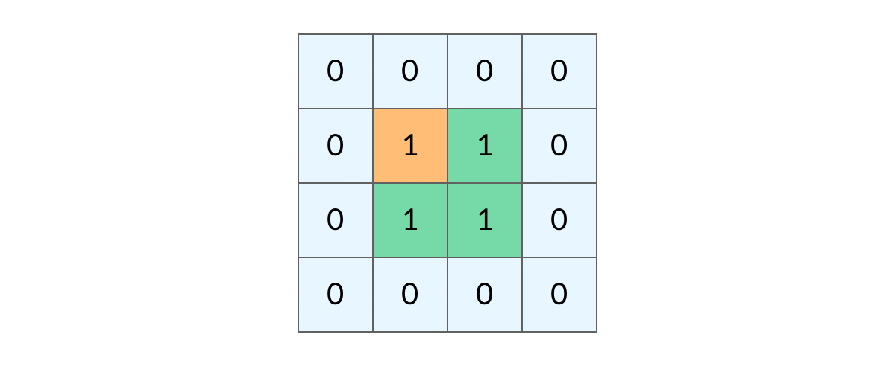
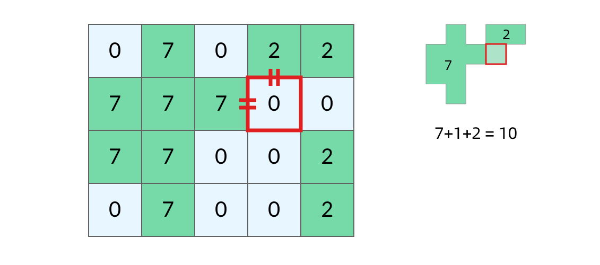

# 题目整理

下面是深度优先遍历的经典题目整理， 在整理之前， 首先回顾一下DFS的过程， DFS， 从起点出发， 从规定的方向选择其中一个不断向前走， 直到无法继续为止， 然后尝试另外一种方向， 直到最后走到终点。递归代码如下：

```python
visited = set()
def dfs(node, visited):
	if node in visited:
		return
	
    process(node)
	visited.add(node)
	
	for next_node in node.children():
		if next_node not in visited:
			dfs(next_node, visited)
```

非递归程序如下：非递归程序的话需要手动维护一个栈

```python
def dfs(self, tree):
	if tree.root is None:
		return []
	
	visited, stack = [], [tree.root]
	
	while stack:
		node = stack.pop()
		
		process(node)
		visited.add(node)
		nodes = generate_related_nodes(node)
		stack.push(nodes)
```

具体题目如下：

## 2. [括号生成](https://leetcode-cn.com/problems/generate-parentheses/#/description)（中等）

这个题目递归的时候整理过，关键是判断好左括号和右括号可以生成的条件， 对于当前层， 如果左括号的数量少于n， 那么左括号就可以添加， 而对于右括号来说， 不仅要少于n， 还要少于当前左括号的数目， 才可以添加， 这时候才算合法。 所以这个题目用递归的整体框架逻辑如下：

1. 参数： left_num表示当前左括号的数量， right_num表示当前右括号的数量， s记录中间结果
2. 结束条件： left_num和right_num都达到了最高限度n， 注意这个条件， 后来写的时候把and写成or了
3. 当前和下一层的逻辑：那就是生成括号了
   1. 满足左括号生成的条件， 生成左括号
   2. 满足右括号生成的条件， 生成右括号

代码如下：

```python
class Solution:
    def generateParenthesis(self, n: int) -> List[str]:

        res = []

        def generate(left_num, right_num, n, res, s=""):

            if left_num == n and right_num == n:
                res.append(s)
                return
            
            # 当前逻辑
            if left_num < n:
                generate(left_num+1, right_num, n, res, s+"(")
            
            if right_num < left_num:
                generate(left_num, right_num+1, n, res, s+")")
        
        generate(0, 0, n, res)
        return res
```

## 3. [岛屿数量](https://leetcode-cn.com/problems/number-of-islands/)（中等）

这个题目需要好好整理一下，岛屿问题是一系列的题目， 涉及到了网格类的DFS算法，类似的题目如下：

* [岛屿周长（简单）](https://leetcode-cn.com/problems/island-perimeter/)
* [岛屿的最大面积（中等）](https://leetcode-cn.com/problems/max-area-of-island/)
* [最大人工岛（困难）](https://leetcode-cn.com/problems/making-a-large-island/)

这类题目都可以使用通用的DFS框架进行解决。 所以后面借着这个机会统一的整理一下。 具体的参考后面的岛屿问题。 这里先针对这个题目进行解决。主要参考了[该题解](https://leetcode-cn.com/problems/number-of-islands/solution/dfs-bfs-bing-cha-ji-python-dai-ma-java-dai-ma-by-l/)

这类题目可以使用一个经典的算法来解决，那就是 ==Flood fill==，以下的定义来自维基百科：

> Flood fill 算法是**从一个区域中提取若干个连通的点与其他相邻区域区分开（或分别染成不同颜色）的经典算法**。因为其思路类似洪水从一个区域扩散到所有能到达的区域而得名。在 GNU Go和扫雷中，Flood Fill算法被用来计算需要被清除的区域。

Flood，作为动词是「淹没；充满」 的意思，作为名词是「洪水」的意思。下面我们简单解释一下这个算法：*从一个区域中提取若干个连通的点与其他相邻区域区分开*。

从一个点扩散开，找到与其连通的点，其实就是从一个点开始，进行一次「深度优先遍历」 或者「广度优先遍历」，发现一片连着的区域。看一下深度和广度优先的效果：

<center class = "half"> 
     </center>

对于这道题来说，就是从一个是「陆地」 的格子开始进行一次「深度优先遍历」 或者「广度优先遍历」，把与之相连的所有的格子都标记上，视为发现了一个「岛屿」。

说明：这里做「标记」 的意思是，通过「深度优先遍历」 或者「广度优先遍历」 操作，发现了一个新的格子，与起始点的那个格子是连通的，我们视为「标记」 过，也可以说「被访问过」。

那么每一次进行「深度优先遍历」 或者「广度优先遍历」 的条件就是：

* 这个格子是陆地1
* 这个格子不能是之前发现「岛屿」 的过程中执行了「深度优先遍历」 或者「广度优先遍历」 操作，而被标记的格子。

==思路一： DFS网格遍历框架==

这个的具体可以参考下面岛屿问题汇总问题的总结， 这里先给出解题框架， 其实如果理解了DFS的话，这个也挺好理解的， 这里的代码逻辑就是

对于grid的每个格子， 如果该格子是陆地且没有被访问过， 那么我们就在上面进行dfs算法， 通过flood fill之后， 就会锁定出一个岛屿来。

下面的核心问题就是如何在网格上dfs了， 两个关键问题：返回条件和如何找相邻
1. 返回条件： 如果不在区域里面(越界了)， 返回
2. 如果没有越界， 如果被访问过了或者不是陆地， 返回
3. 标记为访问， 然后去它的相邻节点，也就是上下左右

 最初的版本代码如下：

```python
class Solution:

    # 判断是否越界
    def InArea(self, grid, r, c):
        return r >= 0 and r < len(grid) and c >=0 and c < len(grid[0])

    # 网格内的DFS算法
    def dfs(self, visited, grid, r, c):

        # 结束条件
        if not self.InArea(grid, r, c):
            return
        
        # 如果是海洋 后者是已经被访问过的陆地， 那么直接返回
        if grid[r][c] == "0" or visited[r][c]:
            return 

        # 访问当前陆地
        visited[r][c] = True

        # 访问相邻陆地
        self.dfs(visited, grid, r-1, c)       # 上
        self.dfs(visited, grid, r+1, c)       # 下
        self.dfs(visited, grid, r, c-1)       # 左
        self.dfs(visited, grid, r, c+1)       # 右
        

    def numIslands(self, grid: List[List[str]]) -> int:

        # 记录网格的行列
        rows = len(grid)

        if rows == 0:
            return 0
        
        cols = len(grid[0])

        # 结果
        count = 0

        # 声明访问标记
        visited = [[False]*cols for _ in range(rows)]
        
        # 遍历每个格子
        for i in range(rows):
            for j in range(cols):
                # 如果没有被访问过且是陆地， 那么就开始洪范， 也就是dfsdfs
                if not visited[i][j] and grid[i][j] == "1":
                    self.dfs(visited, grid, i, j)
                    count += 1
        
        return count
```

这个应该是比较通俗易懂了，当然DFS那块还可以进行优化， 这里可以采用这样的一种写法， 这样就相当于在进行dfs的时候，进行了剪枝操作。这种访问操作可以学习一下， 这是第一次见到。与上面相比， 多了一个DIRECTIONS来记录遍历方向。

```python
class Solution:

    # 判断是否越界
    def InArea(self, grid, r, c):
        return r >= 0 and r < len(grid) and c >=0 and c < len(grid[0])

    # 网格内的DFS算法
    def dfs(self, visited, grid, r, c, DIRECTIONS):

        visited[r][c] = True

        # 上下左右相邻点访问
        for k in range(len(DIRECTIONS)):
            newx = r + DIRECTIONS[k][0]
            newy = c + DIRECTIONS[k][1]

            # 这里进行整体的判断  如果没有越界， 且是陆地， 且没有被访问过
            if self.InArea(grid, newx, newy) and not visited[newx][newy] and grid[newx][newy]=="1":
                self.dfs(visited, grid, newx, newy, DIRECTIONS)

    def numIslands(self, grid: List[List[str]]) -> int:

        # 记录网格的行列
        rows = len(grid)

        if rows == 0:
            return 0
        
        cols = len(grid[0])

        # 结果
        count = 0

        # 声明访问标记
        visited = [[False]*cols for _ in range(rows)]

        # 定义一个directions来控制后面dfs的遍历方向， 这样方便进行剪枝操作
        DIRECTIONS = [(-1, 0), (0, -1), (1, 0), (0, 1)]
        
        # 遍历每个格子
        for i in range(rows):
            for j in range(cols):
                # 如果没有被访问过且是陆地， 那么就开始洪范， 也就是dfs
                if not visited[i][j] and grid[i][j] == "1":
                    self.dfs(visited, grid, i, j, DIRECTIONS)
                    count += 1
        
        return count
```

==思路二： BFS网格遍历框架==

这里只需要基于上面这个修改遍历方式即可

```python
# 网格内的bFS算法
def bfs(self, visited, grid, r, c, DIRECTIONS):

    queue = deque()
    queue.append(r * len(grid[0]) + c)     # 这里队列里面存放的是元素一维展开之后的位置

    visited[r][c] = True

    while queue:
        curr = queue.popleft()
        newr = curr // len(grid[0]) # 这里要注意是整数
        newc = curr % len(grid[0])

        # 上下左右相邻点访问
        for k in range(len(DIRECTIONS)):
            newx = newr + DIRECTIONS[k][0]
            newy = newc + DIRECTIONS[k][1]

            # 这里进行整体的判断  如果没有越界， 且是陆地， 且没有被访问过
            if self.InArea(grid, newx, newy) and not visited[newx][newy] and grid[newx][newy]=="1":
                queue.append(newx * len(grid[0]) + newy)
                visited[newx][newy] = True
```

 ==思路三 并查集==

关于连通性的问题， 并查集也是常用的思路， 这里先占个坑， 等学完了并查集之后再来补充这块。

## 4. 岛屿问题解题汇总

这个参考的这个[题解](https://leetcode-cn.com/problems/number-of-islands/solution/dao-yu-lei-wen-ti-de-tong-yong-jie-fa-dfs-bian-li-/)

我们所熟悉的DFS问题通常是在树或者图结构上进行的， 而岛屿问题的解题思路， 采用的DFS是从网络结构中进行的。

网格问题的基本概念：

> 网格问题是由 $m×n$个小方格组成一个网格，每个小方格与其上下左右四个方格认为是相邻的，要在这样的网格上进行某种搜索。

岛屿问题是一类典型的网格问题。每个格子中的数字可能是 0 或者 1。我们把数字为 0 的格子看成海洋格子，数字为 1 的格子看成陆地格子，这样相邻的陆地格子就连接成一个岛屿。


在这样一个设定下，就出现了各种岛屿问题的变种，包括岛屿的数量、面积、周长等。不过这些问题，基本都可以用 DFS 遍历来解决。

DFS的基本结构：

网格结构要比二叉树结构稍微复杂一些，它其实是一种简化版的图结构。要写好网格上的 DFS 遍历，我们首先要理解二叉树上的 DFS 遍历方法，再类比写出网格结构上的 DFS 遍历。我们写的二叉树 DFS 遍历一般是这样的：

```python
def traverse(root):
	
	if root == NULL:
		return
    # 访问相邻节点： 左子节点和右子节点
	traverse(root.left)
	traverse(root.right)
```

可以看到， 二叉树的DFS有两个要素： **访问相邻节点**和**判断base case**

* 第一个要素是**访问相邻结点**。二叉树的相邻结点非常简单，只有左子结点和右子结点两个。二叉树本身就是一个递归定义的结构：一棵二叉树，它的左子树和右子树也是一棵二叉树。那么我们的 DFS 遍历只需要递归调用左子树和右子树即可。
* 第二个要素是 判断base case。一般来说，二叉树遍历的 base case 是 `root == null`。这样一个条件判断其实有两个含义：一方面，这表示 root 指向的子树为空，不需要再往下遍历了。另一方面，在 `root == null` 的时候及时返回，可以让后面的 `root.left` 和 `root.right` 操作不会出现空指针异常。


对于网格上的DFS， 我们可以参考二叉树的， 写出网格DFS的两个要素：

首先，网格结构中的格子有多少相邻结点？答案是上下左右四个。对于格子 `(r, c)` 来说（r 和 c 分别代表行坐标和列坐标），四个相邻的格子分别是 `(r-1, c)、(r+1, c)、(r, c-1)、(r, c+1)`。换句话说，网格结构是「四叉」的。


其次，网格 DFS 中的 base case 是什么？从二叉树的 base case 对应过来，应该是网格中不需要继续遍历、`grid[r][c]`会出现数组下标越界异常的格子，也就是那些超出网格范围的格子。


这一点稍微有些反直觉，坐标竟然可以临时超出网格的范围？这种方法称为「先污染后治理」—— 甭管当前是在哪个格子，先往四个方向走一步再说，如果发现走出了网格范围再赶紧返回。这跟二叉树的遍历方法是一样的，先递归调用，发现 `root == null` 再返回。

这样， 就得到了网格DFS遍历的框架代码：

```python
# 判断是否越界
def InArea(self, grid, r, c):
    return r >= 0 and r < len(grid) and c >=0 and c < len(grid[0])

# 网格内的DFS算法
def dfs(self, visited, grid, r, c):

    # 结束条件
    if not self.InArea(grid, r, c):
        return

    # 访问相邻陆地
    self.dfs(visited, grid, r-1, c)       # 上
    self.dfs(visited, grid, r+1, c)       # 下
    self.dfs(visited, grid, r, c-1)       # 左
    self.dfs(visited, grid, r, c+1)       # 右
```

如何避免重复遍历？

网格结构的 DFS 与二叉树的 DFS 最大的不同之处在于，遍历中可能遇到遍历过的结点。这是因为，网格结构本质上是一个「图」，我们可以把每个格子看成图中的结点，每个结点有向上下左右的四条边。在图中遍历时，自然可能遇到重复遍历结点。

这时候，DFS 可能会不停地「兜圈子」，永远停不下来，如下图所示：


如何避免这样的重复遍历呢？答案是标记已经遍历过的格子。以岛屿问题为例，我们需要在所有值为 1 的陆地格子上做 DFS 遍历。每走过一个陆地格子，就把格子的值改为 2，这样当我们遇到 2 的时候，就知道这是遍历过的格子了。也就是说，每个格子可能取三个值：

* 0 —— 海洋格子
* 1 —— 陆地格子（未遍历过）
* 2 —— 陆地格子（已遍历过）

当然， 我们这里不想直接改里面的数， 所以采用了一个visited来标记是否已经被访问过。 **这里一定要慎重改人家原来的数组**。

```python
# 网格内的DFS算法
def dfs(self, visited, grid, r, c):

    # 结束条件
    if not self.InArea(grid, r, c):
        return

    # 如果是海洋 后者是已经被访问过的陆地， 那么直接返回
    if grid[r][c] == "0" or visited[r][c]:
        return 

    # 访问当前陆地
    visited[r][c] = True

    # 访问相邻陆地
    self.dfs(visited, grid, r-1, c)       # 上
    self.dfs(visited, grid, r+1, c)       # 下
    self.dfs(visited, grid, r, c-1)       # 左
    self.dfs(visited, grid, r, c+1)       # 右
```

下面是该框架下的效果：



这样就得到了岛屿问题， 乃至各种网格问题的通用DFS的遍历方法。 而BFS的遍历方法， 其实稍微改一下也能得到。 具体的参考问题3里面的修改后的BFS和DFS。

下面就基于上面的总结， 练习几个题目吧！ 

## 5. [岛屿的周长（简单）](https://leetcode-cn.com/problems/island-perimeter/)

这个题目的最优解法不是DFS， 但是这个题目可以很好地理解上面的模板。 这里的模板采用了一种修改原数组元素的方式， 这个算是再给一种思路吧。 具体面试的时候一定要问清楚能不能改人家的元素。先回顾DFS的模板：

```python
# 判断是否越界
def InArea(self, grid, r, c):
    return r >=0 and r < len(grid) and c >= 0 and c < len(grid[0])

# 网格内的DFS算法
def dfs(self, grid, r, c):

    # 结束条件
    if not self.InArea(grid, r, c):
        return

    # 如果是海洋 后者是已经被访问过的陆地， 那么直接返回
    if grid[r][c] != 1:
        return 

    # 访问当前陆地, 这里直接修改
    grid[r][c] = 2

    # 访问相邻陆地
    self.dfs(grid, r-1, c)       # 上
    self.dfs(grid, r+1, c)       # 下
    self.dfs(grid, r, c-1)       # 左
    self.dfs(grid, r, c+1)       # 右
```

可以看到，dfs 函数直接返回有这几种情况：

* `!inArea(grid, r, c)`，即坐标 (r, c) 超出了网格的范围，也就是所说的「先污染后治理」的情况
* `grid[r][c] != 1`，即当前格子不是岛屿格子，这又分为两种情况：
  * `grid[r][c] == 0`，当前格子是海洋格子
  * `grid[r][c] == 2`，当前格子是已遍历的陆地格子   

那么这些和我们岛屿的周长有什么关系呢？实际上，==岛屿的周长是计算岛屿全部的「边缘」，而这些边缘就是我们在 DFS 遍历中，dfs函数返回的位置==。观察题目示例，我们可以将岛屿的周长中的边分为两类，如下图所示。黄色的边是与网格边界相邻的周长，而蓝色的边是与海洋格子相邻的周长。


* 当我们的 dfs 函数因为「坐标 `(r, c)` 超出网格范围」返回的时候，实际上就经过了一条黄色的边；

* 而当函数因为「当前格子是海洋格子」返回的时候，实际上就经过了一条蓝色的边。

  

这样，我们就把岛屿的周长跟 DFS 遍历联系起来了， 具体代码如下：

```python
class Solution:

    def __init__(self):
        self.res = 0

    # 判断是否越界
    def InArea(self, grid, r, c):
        return r >=0 and r < len(grid) and c >= 0 and c < len(grid[0])

    # dfs
    def dfs(self, grid, r, c):

        # 如果碰到了网格的边缘，此时到了岛屿的边界， 周长加1
        if not self.InArea(grid, r, c):
            self.res += 1
            return

        # 如果碰到了海水， 此时到了岛屿的边界， 周长加1
        if grid[r][c] == 0:
            self.res += 1
            return
        
        if grid[r][c] == 2:
            return

        grid[r][c] = 2   # 用这个标记是否被访问过

        # 遍历上下左右
        self.dfs(grid, r-1, c)
        self.dfs(grid, r+1, c)
        self.dfs(grid, r, c-1)
        self.dfs(grid, r, c+1)       

    def islandPerimeter(self, grid: List[List[int]]) -> int:

        # 记录grid的行列值
        rows = len(grid)
        
        if rows == 0:
            return self.res
        
        cols = len(grid[0])
        
        # 进行遍历， 由于这里只有一个岛屿， 可以不用visited数组进行标记
        for i in range(rows):
            for j in range(cols):
                if grid[i][j] == 1: 
                    self.dfs(grid, i, j)
        
        return self.res
```

当然这个题目还有更简洁的解法， 用不着DFS， 这个思路参考的后面的题解第三个。 

一块土地原则上会带来 4 个周长，但岛上的土地存在接壤，每一条接壤，会减掉 2 个边长。

所以，$总周长 = 4 \times 土地个数 - 2  \times 接壤边的条数$。

遍历矩阵，遍历到土地，就 land++，如果它的右/下边也是土地，则 border++，遍历结束后代入公式。代码如下：

```python
class Solution:
    def islandPerimeter(self, grid: List[List[int]]) -> int:

        # 记录row和cols
        rows = len(grid)

        if rows == 0:
            return 0
        cols = len(grid[0])

        land, border = 0, 0

        # 遍历一遍
        for i in range(rows):
            for j in range(cols):

                # 如果遇到了陆地 land++
                if grid[i][j] == 1:
                    land += 1
                
                    # 如果遇到了边界 border++
                    if i < rows - 1 and grid[i+1][j] == 1:
                        border += 1
                    if j < cols - 1 and grid[i][j+1] == 1:
                        border += 1
        
        return 4 * land - 2 * border
```

再来一种思路的扩展， 因为岛屿是封闭的， 所以每一条上边必定对应一条下边， 每一条左边必定对应一条右边。 因此只需要关注上边和左边即可。而上面和左边的条件是：

1. 遍历到的块本身得是陆地
2. 在上面的条件下， 它上面是grid的边界或者是水， 或者它左边是grid的边界或者是水

```python
class Solution:
    def islandPerimeter(self, grid: List[List[int]]) -> int:

        # 记录row和cols
        rows = len(grid)

        if rows == 0:
            return 0
        cols = len(grid[0])

        circum = 0

        # 遍历一遍
        for i in range(rows):
            for j in range(cols):

                # 如果遇到了陆地 land++
                if grid[i][j] == 1:
                    
                    # 上面的判断： 边界或者他上面是水
                    if i == 0 or grid[i-1][j] == 0:
                        circum += 2
                    # 左边判断： 边界或者左边是水
                    if j == 0 or  grid[i][j-1] == 0:
                        circum += 2
        
        return circum
```

这个目前是最快的方式了。

## 6. [岛屿的最大面积（中等）](https://leetcode-cn.com/problems/max-area-of-island/)

这个题目也是直接可以用DFS的模板， DFS可以用来找到一块岛屿，只不过我们在寻找岛屿的过程中， 需要计算一下岛屿的面积。具体的代码如下： 主要是dfs里面变了一下，调用dfs的时候改变了一下， 因为这个题目中不一定是一块岛屿了。 我们需要找到所有的岛屿， 看看哪个岛屿的面积最大就返回哪个。

```python
class Solution:
    
    def InArea(self, grid, r, c):
        return r >= 0 and r < len(grid) and c >= 0 and c < len(grid[0])

    def dfs(self, grid, r, c, visited):

        # 到了边界了
        if not self.InArea(grid, r, c):
            return 0
        
        # 不是陆地或者是已经被访问过
        if grid[r][c] == 0 or visited[r][c]:
            return 0
        
        visited[r][c] = True

        return 1 + self.dfs(grid, r-1, c, visited) + self.dfs(grid, r+1, c, visited) + self.dfs(grid, r, c-1, visited) + self.dfs(grid, r, c+1, visited)

    def maxAreaOfIsland(self, grid: List[List[int]]) -> int:
        # 记录行列
        rows = len(grid)
        if rows == 0:
            return 0
        
        cols = len(grid[0])

        # 声明visited数组， 标记是否被访问
        visited = [[False] * cols for _ in range(rows)]

        max_area = 0
        # 开始遍历
        for i in range(rows):
            for j in range(cols):

                if grid[i][j] == 1 and not visited[i][j]:
                    area = self.dfs(grid, i, j, visited)
                    if area > max_area:
                        max_area = area
        
        return max_area
```

这个题目也可以使用BFS算法的框架了， 具体代码如下：

```python
from collections import deque

class Solution:

    # 判断是否越界
    def InArea(self, grid, r, c):
        return r >= 0 and r < len(grid) and c >= 0 and c < len(grid[0])

    def bfs(self, grid, r, c, visited, DIRECTIONS):

        queue = deque()
        queue.append(r * len(grid[0]) + c)

        visited[r][c] = True

        area = 0

        while queue:
            curr = queue.popleft()
            newr = curr // len(grid[0])
            newc = curr % len(grid[0])

            # 上下左右访问
            for k in range(len(DIRECTIONS)):
                newx = newr + DIRECTIONS[k][0]
                newy = newc + DIRECTIONS[k][1]

                # 这里进行整体的判断， 如果没有越界， 且是陆地， 且没有被访问过
                if self.InArea(grid, newx, newy) and not visited[newx][newy] and grid[newx][newy] == 1:
                    queue.append(newx * len(grid[0]) + newy)
                    visited[newx][newy] = True
                    area += 1
        
        return area + 1
            
    def maxAreaOfIsland(self, grid: List[List[int]]) -> int:

        # 记录网格的行列
        rows = len(grid)

        if rows == 0:
            return 0
        
        cols = len(grid[0])

        # 声明访问标记
        visited = [[False]*cols for _ in range(rows)]

        #定义一个directions来控制后面dfs的遍历方向
        DIRECTIONS = [(0, 1), (1, 0), (0, -1), (-1, 0)]

        max_area = 0

        # 遍历
        for i in range(rows):
            for j in range(cols):
                if grid[i][j] == 1 and not visited[i][j]:
                    area = self.bfs(grid, i, j, visited, DIRECTIONS)
                    if area > max_area:
                        max_area = area
        
        return max_area
```

时间复杂度$O(r*c)$, r是给定网格中的行数， c是列数。 访问每个网格最多一次。 空间复杂度$O(r*c)$, 递归的深度最大可能是整个网络的大小， 因此最大可能使用$O(r*c)$的栈空间。

## 7. [最大人工岛（困难）](https://leetcode-cn.com/problems/making-a-large-island/)

这个题目算是上面岛屿最大面积的又一次升级， 现在有了填海造陆的能力， 可以把海洋的一个格子变成陆地， 进而让两块岛屿连在一块， 那么填海造陆之后， 最大能构造出多大的岛屿呢？

大致的思路就是先计算出所有岛屿的面积， 然后再相应岛屿格子上进行标记。 然后搜索哪个海洋格子相邻的两个岛屿面积最大。例如下图中红色方框内的海洋格子，上边、左边都与岛屿相邻，我们可以计算出它变成陆地之后可以连接成的岛屿面积为 `7+1+2=10`。



然而，这种做法可能遇到一个问题。如下图中红色方框内的海洋格子，它的上边、左边都与岛屿相邻，这时候连接成的岛屿面积难道是 `7+1+7 ？`显然不是。这两个 7 来自同一个岛屿，所以填海造陆之后得到的岛屿面积应该只有 `7+1=8`。


可以看到，要让算法正确，我们得能区分一个海洋格子相邻的两个 7 是不是来自同一个岛屿。那么，==我们不能在方格中标记岛屿的面积，而应该标记岛屿的索引（下标），另外用一个数组记录每个岛屿的面积==，如下图所示。这样我们就可以发现红色方框内的海洋格子，它的「两个」相邻的岛屿实际上是同一个。


所以， 这道题目的思路应该是这样：

1. 对格子中的每个块进行遍历， 用dfs算法找到所有的岛屿， 并在dfs的同时， 对每个格子用岛屿的索引下标进行标记， 且还需要计算每个岛屿的面积， 建立索引 --> 面积的映射， 这个用上面的dfs框架就可以搞定
2. 对格子中的每个块再进行遍历一遍， 对于每个块，尝试填充， 然后计算可以获得的最大面积， 返回最大的那个。 这里面涉及到了计算获得的最大面积， 这个的思路也很简单， 如果当前块是陆地， 那么只需要返回相应面积即可， 否则， 就需要看他的上下左右， 是否是陆地， 如果是的话， 把陆地的面积加入到set集合里面， 最后算出填上它之后的大陆总面积。

这个题的总体代码如下：

```python
def largestIsland(self, grid: List[List[int]]) -> int:

    # 获取行列
    rows = len(grid)

    if rows == 0:
        return 0

    cols = len(grid[0])

    # 下面要找出每一块岛屿， 且进行标记
    value = 2
    islandAreas = {}   # 岛屿编号 -> 岛屿面积的map
    for i in range(rows):
        for j in range(cols):
            if grid[i][j] == 1:
                area = self.area(grid, i, j, value)  # 计算每块岛屿的面积
                # 存入字典
                islandAreas[value] = area
                value += 1


    # 下面尝试填海操作
    res = 0
    for i in range(rows):
        for j in range(cols):
            fillsea_area = self.newArea(grid, i, j, islandAreas)
            if fillsea_area > res:
                res = fillsea_area

    return res
```

dfs计算每个岛屿的面积， 并且对每块岛屿用编号进行标记。

```python
def InArea(self, grid, r, c):
        return r >= 0 and r < len(grid) and c >= 0 and c < len(grid[0])
    
# 通过dfs计算每个岛屿的面积, 并对每块岛屿进行编号编辑
def area(self, grid, r, c, value):

    if not self.InArea(grid, r, c):
        return 0

    if grid[r][c] != 1:
        return 0

    grid[r][c] = value # 这里进行编号

    # 计算面积
    return 1 + self.area(grid, r-1, c, value) + self.area(grid, r+1, c, value) + self.area(grid, r, c-1, value) + self.area(grid, r, c+1, value)

```

填海操作：

```python
# 把(r,c)填海， 计算岛屿的最大面积
def newArea(self, grid, r, c, islandAreas):

    # 如果当前是陆地， 那就直接返回其面积
    if grid[r][c] != 0:
        return islandAreas.get(grid[r][c])      # 有可能字典里面没有键， 所以这里用get

    # 遍历海洋了， 看看其上下左右相邻的地方， 把编号记录下来
    land_neighbor = set()

    # 上面是陆地
    if self.InArea(grid, r-1, c) and grid[r-1][c] > 0:
        land_neighbor.add(grid[r-1][c])

    # 下面是陆地
    if self.InArea(grid, r+1, c) and grid[r+1][c] > 0:
        land_neighbor.add(grid[r+1][c])

    # 左边是陆地
    if self.InArea(grid, r, c-1) and grid[r][c-1] > 0:
        land_neighbor.add(grid[r][c-1])

    # 右边是陆地
    if self.InArea(grid, r, c+1) and grid[r][c+1] > 0:
        land_neighbor.add(grid[r][c+1])

    return sum([islandAreas[i] for i in land_neighbor]) + 1
```

## 8. [扫雷游戏](https://leetcode-cn.com/problems/minesweeper/)（中等）

