# 知识点梳理

DFS和BFS是算法面试题中比较高频的考点， 在整个面试知识点中所占比重比较大， 应用最多的地方就是对图进行搜索遍历（树也是图的一种）。

关于搜索， 我们要知道两点： 

1. 搜索的时候没有所谓的智能的情况在里面考虑， 简单的暴力搜索， 很多时候做的事情就是把结果全部遍历一次， 然后找到我们想要的结果。
2. 每个节点都要访问一次且只被访问一次（根据遍历的顺序不同， 可以分为DFS和BFS算法， 也就是深度优先和广度优先）

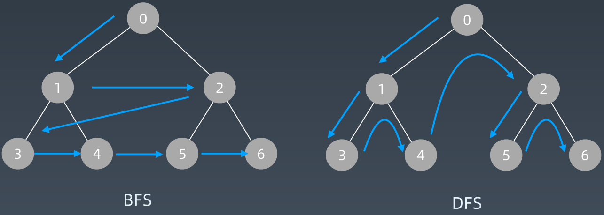

## 1. 深度优先搜索（DFS）

DFS， 从起点出发， 从规定的方向选择其中一个不断向前走， 直到无法继续为止， 然后尝试另外一种方向， 直到最后走到终点。

==DFS解决的是连通性的问题==， 即，给定两个点， 一个是起始点， 一个是终止点， 判断是不是有一条路径能从起点连接到终点。起点和终点，也可以指的是某种起始状态和最终的状态。==问题的要求并不在乎路径是长还是短，只在乎有还是没有==。有时候题目也会要求把找到的路径完整的打印出来。

### DFS遍历

例如， 假如我们有下面一个图， 里面有A, B, C, D, E, F, G, H的8个顶点， 点与点之间的联系如下， 我们对这个图进行深度优先：

我们需要依赖一个**栈**。特点是先进后出。 首先， 第一步， 选择一个起始点， 例如A， 把A压入栈， 标记为访问过(红色标记)， 并输出到结果中。

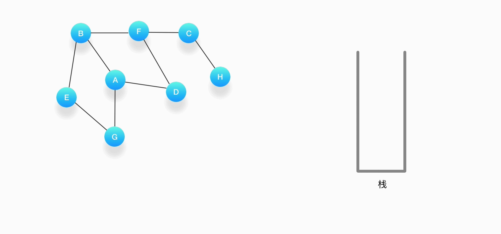

第二步， 寻找与A相连但是还没有被访问过的顶点， A 与B, D, G相连， 而且都没有访问过， 按照字母顺序处理， 将B压入栈， 标记它为访问过， 输出到结果中。

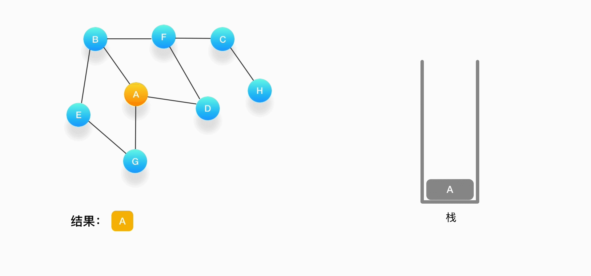

第三步，现在我们在顶点 B 上，重复上面的操作，由于 B 与 A、E、F 相连，如果按照字母顺序处理的话，A 应该是要被访问的，但是 A 已经被访问了，所以我们访问顶点 E，将 E 压入栈，标记它为访问过，并输出到结果中。

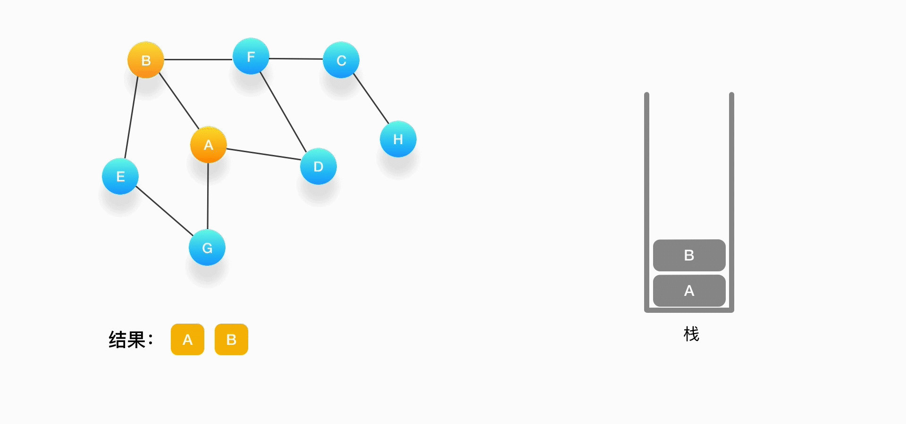

第四步，从 E 开始，E 与 B、G 相连，但是B刚刚被访问过了，所以下一个被访问的将是G，把G压入栈，标记它为访问过，并输出到结果中。

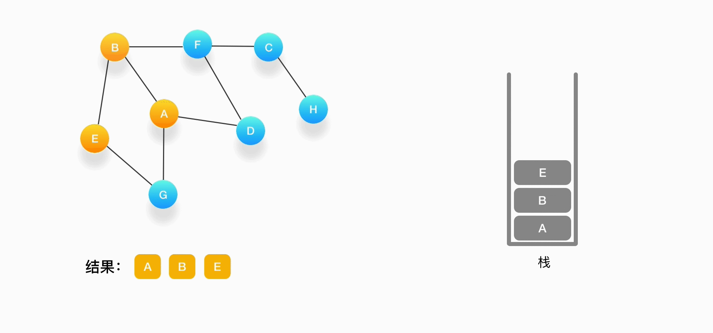

第五步，现在我们在顶点 G 的位置，由于与 G 相连的顶点都被访问过了，类似于我们走到了一个死胡同，必须尝试其他的路口了。所以我们这里要做的就是简单地将 G 从栈里弹出，表示我们从 G 这里已经无法继续走下去了，看看能不能从前一个路口找到出路。

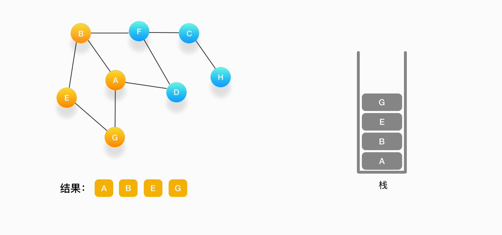

可以看到，**每次我们在考虑下一个要被访问的点是什么的时候，如果发现周围的顶点都被访问了，就把当前的顶点弹出。**

第六步，现在栈的顶部记录的是顶点 E，我们来看看与 E 相连的顶点中有没有还没被访问到的，发现它们都被访问了，所以把 E 也弹出去。

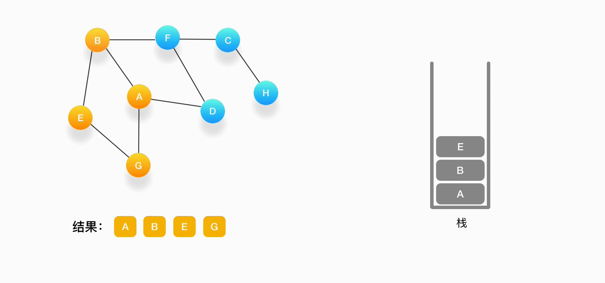

第七步，当前栈的顶点是 B，看看它周围有没有还没被访问的顶点，有，是顶点 F，于是把 F 压入栈，标记它为访问过，并输出到结果中。

第八步，当前顶点是 F，与 F 相连并且还未被访问到的点是 C 和 D，按照字母顺序来，下一个被访问的点是 C，将 C 压入栈，标记为访问过，输出到结果中。

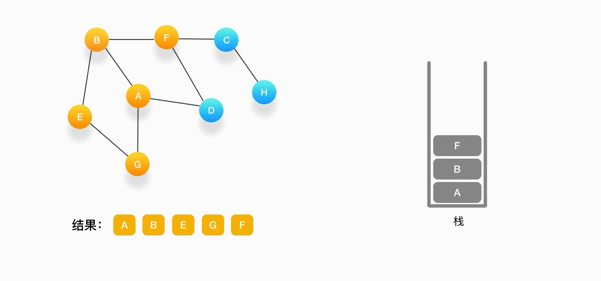

第九步，当前顶点为 C，与 C 相连并尚未被访问到的顶点是 H，将 H 压入栈，标记为访问过，输出到结果中。

第十步，当前顶点是 H，由于和它相连的点都被访问过了，将它弹出栈。

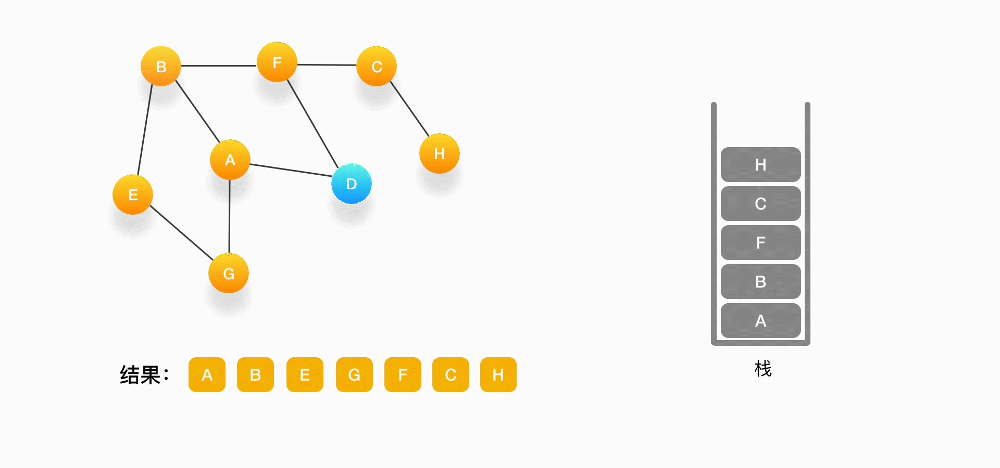

第十一步，当前顶点是 C，与 C 相连的点都被访问过了，将 C 弹出栈。

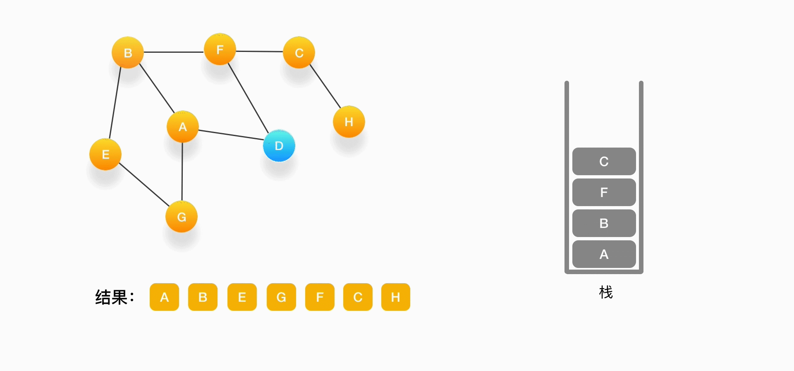

第十二步，当前顶点是 F，与 F 相连的并且尚未访问的点是 D，将 D 压入栈，输出到结果中，并标记为访问过。

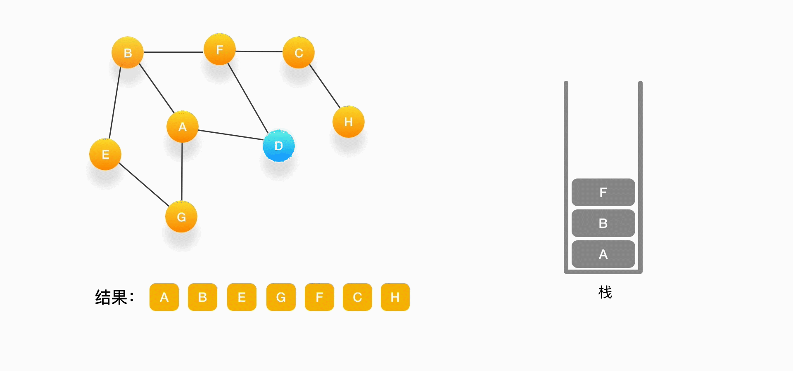

第十三步，当前顶点是 D，与它相连的点都被访问过了，将它弹出栈。以此类推，顶点 F，B，A 的邻居都被访问过了，将它们依次弹出栈就好了。最后，当栈里已经没有顶点需要处理了，我们的整个遍历结束。

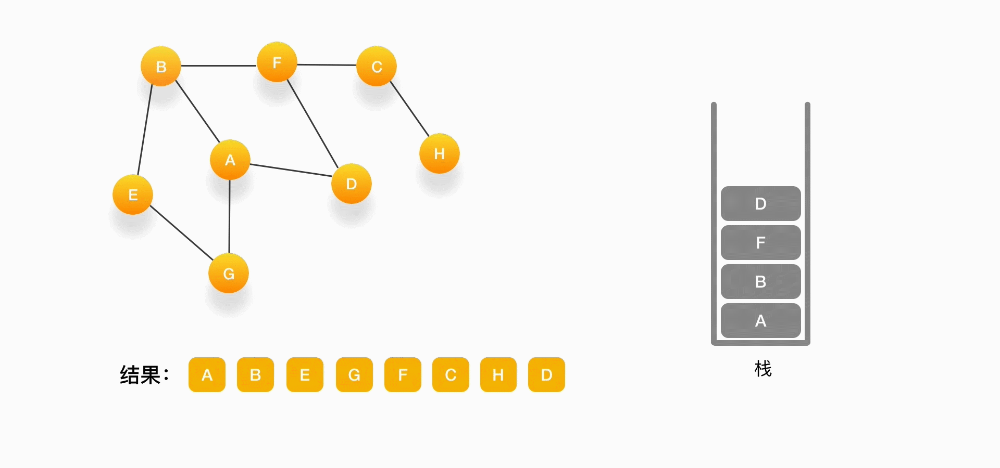

根据上面这个过程， 总结出了DFS的递归遍历和非递归遍历的两个代码模板。 

递归解法：

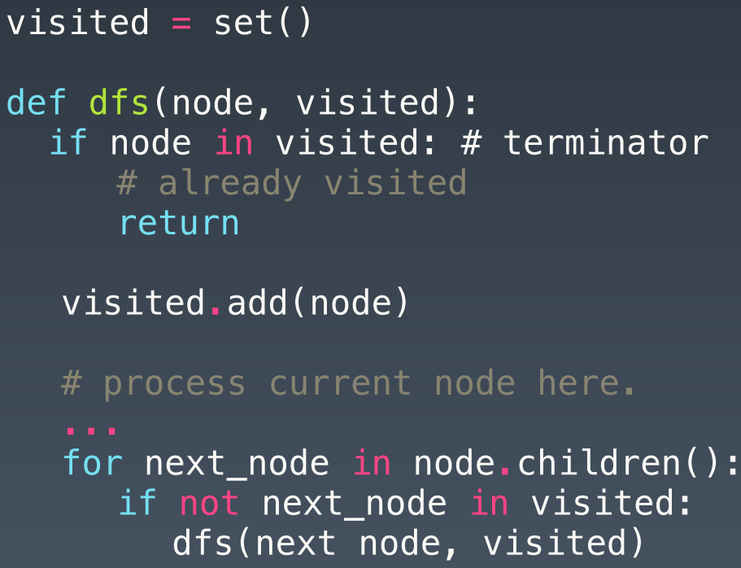

非递归解法： 自己手动维护一个栈

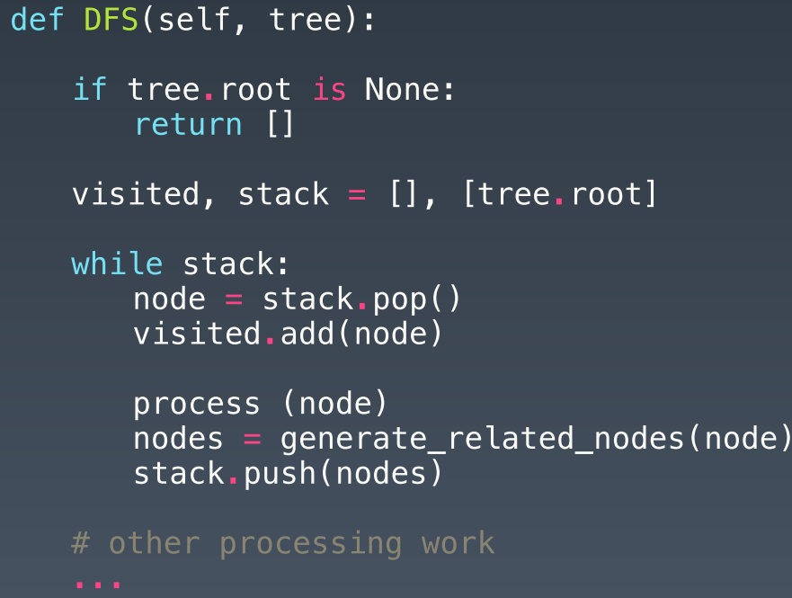

### 算法分析

DFS 是图论里的算法，分析利用 DFS 解题的复杂度时，应当借用图论的思想。图有两种表示方式：邻接表、邻接矩阵。假设图里有 V 个顶点，E 条边。

时间复杂度：

* 邻接表：访问所有顶点的时间为 $O(V)$，而查找所有顶点的邻居一共需要 O(E) 的时间，所以总的时间复杂度是 $O(V + E)$。
* 邻接矩阵：查找每个顶点的邻居需要 $O(V)$ 的时间，所以查找整个矩阵的时候需要 $O(V^2)$ 的时间。

空间复杂度：

DFS 需要堆栈来辅助，在最坏情况下，得把所有顶点都压入堆栈里，所以它的空间复杂度是 $O(V)$.

Leetcode上有个走迷宫的题目， 就是典型的DFS解法， 后面可以做一做。

## 2. 广度优先搜索(BFS)

广度优先搜索，一般==用来解决最短路径的问题==。和深度优先搜索不同，广度优先的搜索是从起始点出发，一层一层地进行，每层当中的点距离起始点的步数都是相同的，当找到了目的地之后就可以立即结束。

广度优先的搜索可以同时从起始点和终点开始进行，称之为**双端 BFS**。这种**算法往往可以大大地提高搜索的效率**。

举例：在社交应用程序中，两个人之间需要经过多少个朋友的介绍才能互相认识对方。

解法：

1. 只从一个方向进行 BFS，有时候这个人认识的朋友特别多，那么会导致搜索起来非常慢；
2. 如果另外一方认识的人比较少，从这一方进行搜索，就能极大地减少搜索的次数；
3. 每次在决定从哪一边进行搜索的时候，要判断一下哪边认识的人比较少，然后从那边进行搜索。

### 广度优先遍历

例题：假设我们有这么一个图，里面有A、B、C、D、E、F、G、H 8 个顶点，点和点之间的联系如下图所示，对这个图进行广度优先的遍历。

依赖**队列**， 先进先出。 一层一层地把与某个点相连的点放入队列中，处理节点的时候正好按照它们进入队列的顺序进行。

第一步，选择一个起始顶点，让我们从顶点 A 开始。把 A 压入队列，标记它为访问过（用红色标记）。

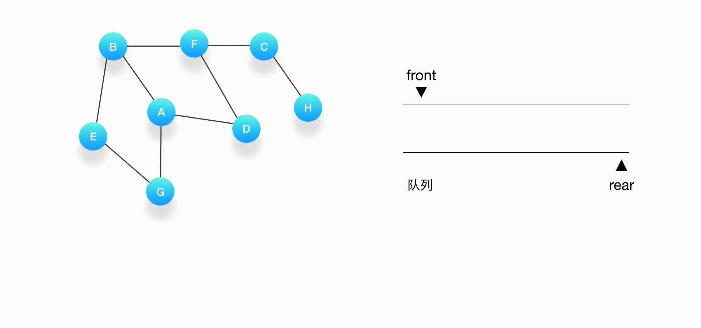

第二步，从队列的头取出顶点 A，打印输出到结果中，同时将与它相连的尚未被访问过的点按照字母大小顺序压入队列，同时把它们都标记为访问过，防止它们被重复地添加到队列中。

第三步，从队列的头取出顶点 B，打印输出它，同时将与它相连的尚未被访问过的点（也就是 E 和 F）压入队列，同时把它们都标记为访问过。

第四步，继续从队列的头取出顶点 D，打印输出它，此时我们发现，与 D 相连的顶点 A 和 F 都被标记访问过了，所以就不要把它们压入队列里。

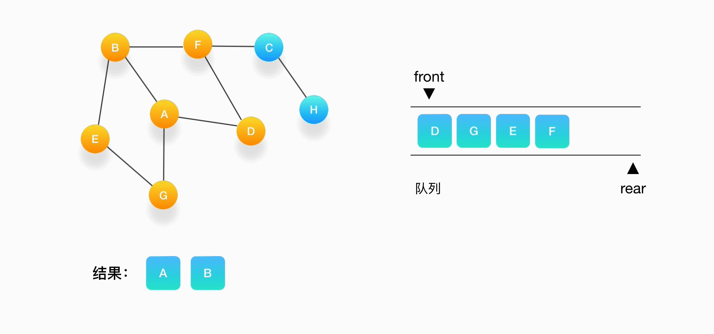

第五步，接下来，队列的头是顶点 G，打印输出它，同样的，G 周围的点都被标记访问过了。我们不做任何处理。

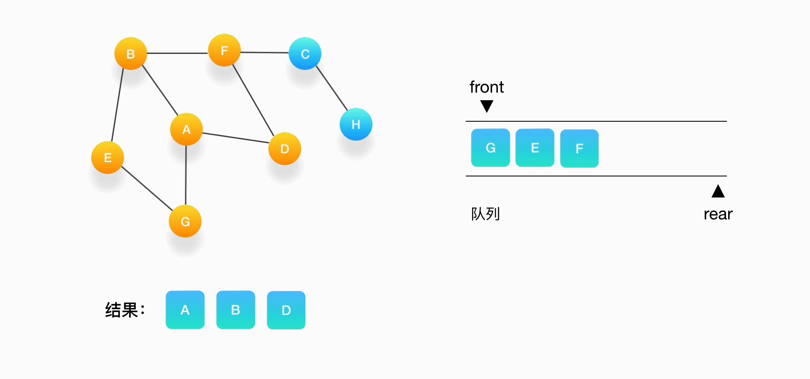

第六步，队列的头是 E，打印输出它，它周围的点也都被标记为访问过了，我们不做任何处理。

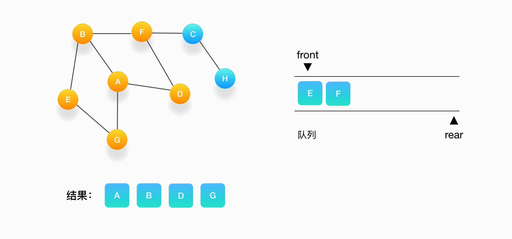

第七步，接下来轮到顶点 F，打印输出它，将 C 压入队列，并标记 C 为访问过。

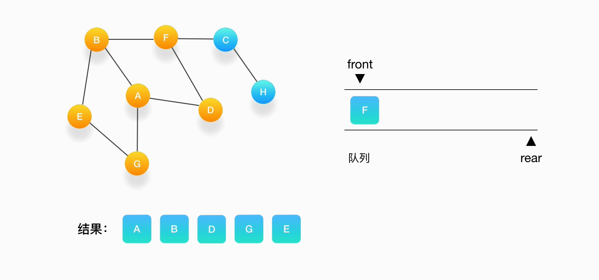

第八步，将 C 从队列中移出，打印输出它，与它相连的 H 还没被访问到，将 H 压入队列，将它标记为访问过。

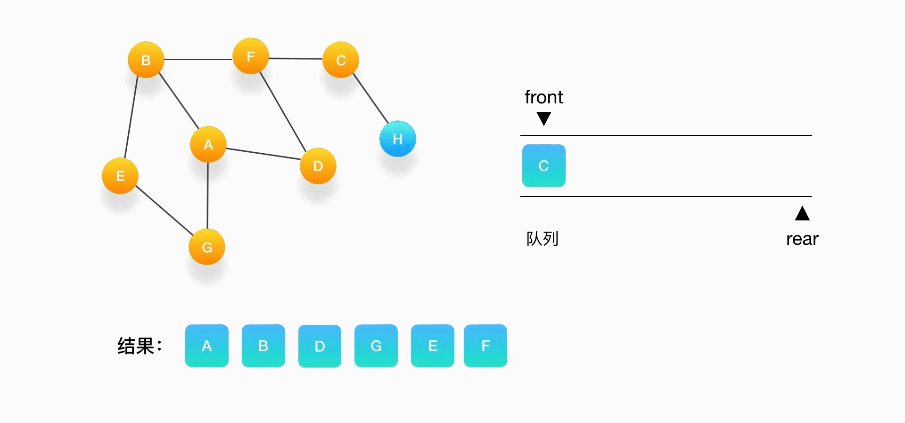

第九步，队列里只剩下 H 了，将它移出，打印输出它，发现它的邻居都被访问过了，不做任何事情。

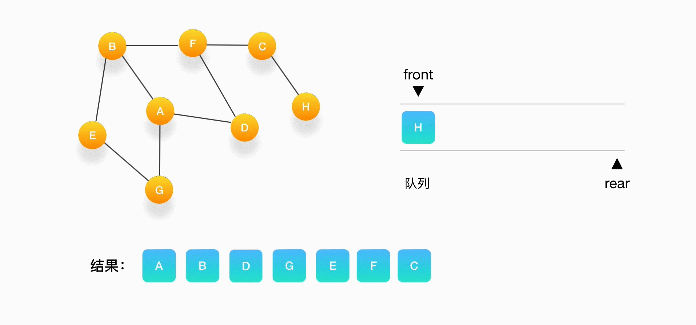

第十步，队列为空，表示所有的点都被处理完毕了，程序结束。

关于BFS， 我们需要手动实现， 下面依然给出一个模板：

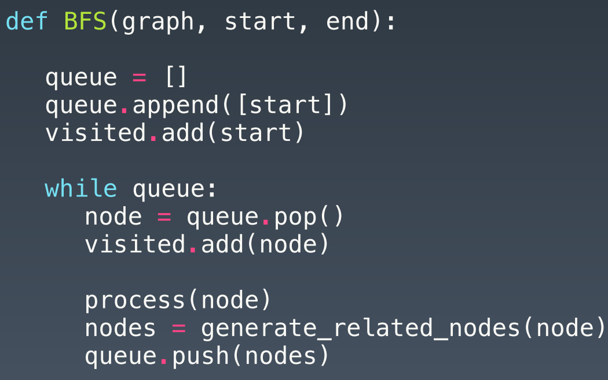

### 算法分析

同样借助图论的分析方法， 假设有V个顶点，E条边。
时间复杂度：

* 邻接表：每个顶点都需要被访问一次，时间复杂度是 $O(V)$；相连的顶点（也就是每条边）也都要被访问一次，加起来就是 $O(E)$。因此整体时间复杂度就是 $O(V+E)$。
* 邻接矩阵：$V$ 个顶点，每次都要检查每个顶点与其他顶点是否有联系，因此时间复杂度是 $O(V^2)$。

空间复杂度：

需要借助一个队列，所有顶点都要进入队列一次，从队列弹出一次。在最坏的情况下，空间复杂度是 $O(V)$

# 刷过的题目总结

## BFS

* 二叉树的层序遍历(中等)
* 每个树行中找最大值(中等)
* 最小基因变化(中等)
* 单词接龙(中等)
* 单词接龙II(困难)

## DFS

* 括号生成(中等)
* 岛屿数量(中等)
* 岛屿周长(简单)
* 岛屿的最大面积(中等)
* 最大人工岛(困难)

## 待做

* 扫雷游戏
* 走迷宫

# 结论

DFS和BFS经常在算法面试题里面出现， 在整个算法面试知识点中所占的比重也非常大。DFS里面主要包括树， 图， 网格化的DFS遍历，BFS中主要还是那个算法框架一定要记好。 DFS中有个岛屿问题的， 这个需要用到网格化的DFS框架， 具体的可以看相应整理。

