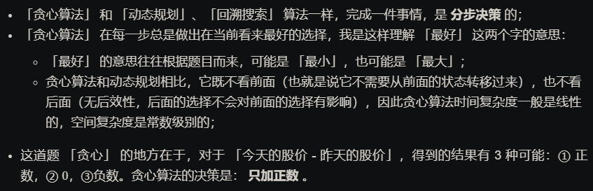

# 题目整理

## [1. 零钱兑换(中等)](https://leetcode-cn.com/problems/coin-change/)

这个题很重要的， 在很多面试题里面都出现过， 好像比较标准的解法是动态规划(DP)， 由于目前还没接触到动态规划， 这里先进行一波贪心， 到了动态规划那里再统一整理一下这个题目。 

贪心也能解这个题目， 但是贪心的问题是不一定每次都能到最优解， 就比如这个题目， 很容易忽略掉一些情况， 所以参考了后面的一个[题解](https://leetcode-cn.com/problems/coin-change/solution/322-by-ikaruga/)， 得到了贪心的解决思路。

贪心的两大策略：

* 想要总硬币总数最少， 那么就需要优先使用最大的硬币开始换， 所以coins需要先进行排序
* 从最大硬币开始， 进行兑换的时候， 可以直接考虑用上全部的最大硬币， 如果发现都用上之后， 后面的硬币凑不到最终的amount了， 这时候， 考虑减少当前最大硬币的数量

这个题比较坑的一个地方就是最先找到的不一定是最优解， 比如`coins=[1, 7, 10], amount=14`这种情况， 如果使用上面的贪心策略， 会找到`10+1+1+1`， 这个显然会比`7+7`结果差。所以这个题目还是需要把所有情况都看一遍。

我第一遍想贪心的时候， 忽略的了两个情况， 第一个就是上面这种贪心不一定可以得到最优解， 第二个情况是没考虑全部用上当前的硬币之后， 有可能找不到解了， 这时候需要减少当前硬币的数量。

那贪心在这里干啥用呢？  贪心可以在这里快速帮助我们找到一个局部的最优情况， 这时候虽然是把所有情况都遍历一遍， 但是为我们提供了一个很好的剪枝策略， 只有先好于这个局部最优的时候，我们才进行某一次情况的遍历。下面来个图解， 来自上面的题解：


下面的代码逻辑是这样：

1. 给定coins, amount, 当前硬币的索引, 累积的数量统计情况之后， 进行递归
2. 递归结束条件： amount=0， 这时候说明找到了一种兑换方案， 但千万要注意，此时不一定是最优的，我们需要保留最优
3. 越界情况： 如果发现了索引越界了，说明已经遍历完了所有情况， 返回
4. 小剪枝： 这个起的作用不是很大， 但确实可以加速一点点， 就是发现当前的amount<coins的最后一个的时候，说明最小的硬币都比amount大，这时候没必要再往下进行了，直接没法兑换
5. 下面就是兑换过程：
   1. 首先，从能兑换的最大数量开始， 到当前硬币不能兑换为止
      1. 大剪枝： 如果发现当前累积数量+能兑换的当前硬币数量大于当前的最优值时， 这时候就没必要再减少当前硬币数量看后面的结果了，因为此时已经不是最优， 如果再减少当前大硬币数量， 那就需要更多小值硬币的数量，更不可能是最优。
      2. 进行当前硬币兑换， 然后往下走

代码如下：

```python
class Solution:

    def __init__(self):
        self.count = 1000    # 初始化一个比较大的值

    def coinChange(self, coins: List[int], amount: int) -> int:

        if amount == 0:
            return 0
        
        # 数组从大到小排序
        coins.sort(reverse=True)

        # 当前索引和当前计数
        cur_index, cur_cou = 0, 0

        def change(coins, amount, cur_index, cur_cou):

            # 递归结束： 当amount=0， 此时已经找到了一种组合进行兑换, 但注意这种组合并不一定是最优
            if amount == 0:
                self.count = min(self.count, cur_cou)
                return
            
            # 越界情况 到最后了
            if cur_index == len(coins):
                return
            
            # 剪枝一下： 如果发现当前的amount < coins的最后一个了， 这时候没法兑换了
            if coins[-1] > amount:
                return 
            
            # 根据贪心，从最大面值的最大数量开始换， 如果按照最大数量换， 得不到结果， 再进行缩小
            for k in range(amount // coins[cur_index], -1, -1):

                # 如果发现cur_cou + k > 目前的最优结果数量了， 直接停掉，因为这个兑换法不可能是最优解了, 进一步剪枝
                if cur_cou + k < self.count:
                    # 进行兑换
                	change(coins, amount-coins[cur_index]*k, cur_index+1, cur_cou+k)
                else:
                    break
                
        change(coins, amount, cur_index, cur_cou)

        return -1 if self.count == 1000 else self.count
```

这里面需要一个全局的那种变量。 一定要注意，不要在这个coinchange函数里面声明一个全局的变量， 然后放到递归函数里面去， 这样每一层都会变得，除非声明成global。所以这里我用了一个成员变量。

动态规划那里还会整理这个题目。

## [2. 柠檬水找零(简单)](https://leetcode-cn.com/problems/lemonade-change/description/)

这个题我的思路比较简单， 拿一个字典来记录当前面值10和5的钱币个数， 因为只有这两个能够来找钱用。 遍历一下bills， 对于当前的数， -5之后，看看能不能找到当前字典中能够进行兑换的， 如果有进行相应的兑换，且同时修改字典里面的纸币个数即可。

如果说用了一下贪心， 那么贪心的地方就是兑换的时候， 先从最大面值10进行兑换， 当面值10不够了，再拿5的来兑换。所以下面是第一款代码：

```python
class Solution:

    def coinschange(self, coins_cou, money):

        # 如果money==0， 不需要找0， 返回True
        if money == 0: 
            return True

        # 看看能成功兑换不
        for key in sorted(coins_cou.keys(), reverse=True):

            # 如果当前的硬币值大于找的零钱或者是当前的硬币个数为0
            if key > money or coins_cou[key] == 0:
                continue
            
            # 拿最大的换了
            coins_cou[key] -= money // key
            
            if coins_cou[key] < 0:
                return False
            
            money %= key 
            if money == 0:
                return True

        return False
        
    def lemonadeChange(self, bills: List[int]) -> bool:

        # 如果第一个不是5， 直接返回FALSE
        if len(bills) == 0 or bills[0] > 5:
            return False
        # 定义一个字典， 记录每类钱的个数， 然后从头开始遍历bills
        coins_cou = {10: 0, 5: 1}
        for i  in range(1, len(bills)):

            # 对于当前的每个值， 如果不能成功找零， 返回False
            if not self.coinschange(coins_cou, bills[i]-5):
                return False
            if bills[i] in coins_cou:
                coins_cou[bills[i]] += 1
          
            #print(bills[i], self.coins_cou[bills[i]], self.coins_cou)
        return True
```

当然这个题目， 其实还有更简单的方法， 这个题一开始陷入了从整体上找答案的困境，导致陷入， 各种情况交叉，想起来比较复杂， 其实没有那么复杂， 参考的这个[题解](https://leetcode-cn.com/problems/lemonade-change/solution/860-ning-meng-shui-zhao-ling-du-gan-jue-zpbdp/)

这个题目只需要维护3种金额的钞票： 5元， 10元， 20元，有三种情况：

1. 账单是5， 直接收下
2. 账单是10， 那么就消耗一个5， 增加一个10
3. 账单是15， 那么优先消耗一个10， 一个5， 如果没有10， 那么就消耗3个5

此时大家就发现 情况一，情况二，都是固定策略，都不用我们来做分析了，而唯一不确定的其实在情况三。

而情况三逻辑也不复杂甚至感觉纯模拟就可以了，其实情况三这里是有贪心的。

账单是20的情况，为什么要优先消耗一个10和一个5呢？因为美元10只能给账单20找零，而美元5可以给账单10和账单20找零，美元5更万能！所以局部最优：遇到账单20，优先消耗美元10，完成本次找零。全局最优：完成全部账单的找零。

局部最优可以推出全局最优，并找不出反例，那么就试试贪心算法！

```python
class Solution:
    def lemonadeChange(self, bills: List[int]) -> bool:
        five, ten = 0, 0
        for i in bills:
            if i == 5: 
                five += 1
            elif i == 10:
                five -= 1
                ten += 1
            elif ten > 0:
                ten -= 1
                five -= 1
            else:
                five -= 3
            if five < 0:
                return False
        
        return True
```

咋眼一看好像很复杂，分析清楚之后，会发现逻辑其实非常固定。这道题目可以告诉大家，遇到感觉没有思路的题目，可以静下心来把能遇到的情况分析一下，只要分析到具体情况了，一下子就豁然开朗了。

如果一直陷入想从整体上寻找找零方案，就会把自己陷进去，各种情况一交叉，只会越想越复杂了。

## 3. [买卖股票的最佳时机I（简单）](https://leetcode-cn.com/problems/best-time-to-buy-and-sell-stock/)

* 思路一： 暴力破解

  这个题一上来想到的就是暴力破解， 也就是两层for循环， 第一层是遍历当前天， 第二层去寻找后面的天，如果发现有收益，则计算收益， 看看和当前最大收益哪个比较大， 更新最大收益。 但是这个会超时	

  ```python
  class Solution:
      def maxProfit(self, prices: List[int]) -> int:
  
          if len(prices) < 2: 
              return 0
          
          max_profit = 0
  
          for i in range(len(prices)-1):
              for j in range(i+1, len(prices)):
                  if prices[j] > prices[i]:
                      max_profit = max(max_profit, prices[j]-prices[i])
          
          return max_profit
  ```

  所以在上面这个题目中， 又进行了简化，第二层的for循环去掉，然后换成对于当前天的股票价格， 去找他后面股票价值最大的天数，然后只需要用这个减去当前天的就是对于当前天来说买入收益的最大值。 然后更新最大值。

  ```python
  class Solution:
      def maxProfit(self, prices: List[int]) -> int:
  
          if len(prices) < 2: 
              return 0
          
          max_profit = 0
  
          for i in range(len(prices)-1):
              max_val = max(prices[i+1:])
              max_profit = max(max_profit, max_val-prices[i])
          
          return max_profit
  ```

  这个可以A掉，但是时间很慢，因为这个的时间复杂度也是$O(n^2)$级别，只不过把相减的过程换成了比较。

* 思路二： 动态规划

  现在还没具体弄明白动态规划的原理，但是这个题可以这么想， 我们要获取的一次交易中股票买卖的最大价格，其实这个就是计算一下我每天卖出股票的一个最大收益，最后取最大的那个即可。 这个和上面暴力有些差别， 上面那个是算假设我当天买下股票， 我啥时候卖的时候会收益最大，记录最大收益。 这时候肯定是两层for循环才行。 而如果换个角度， 假设我当天卖这个股票， 我啥时候买的时候收益最大，由于我的从前面遍历过来的， 遍历到当前天的时候，只需要记录下他前面那些天的买入最小值，两者相减就是当天卖出股票的最大收益。对于每一天，更新最大收益即可。

  

   即：

  ​                                   $$前i天的最大利润 = max(前i-1天的最大利润， 第i天的利润-前i-1天中的最小买入价格)$$

  这样，就把时间复杂度降到了$O(n)$。看具体代码：

  ```python
  class Solution:
      def maxProfit(self, prices: List[int]) -> int:
  
          if len(prices) < 2: 
              return 0
          
          max_profit, min_val = 0, prices[0]
  
          for i in range(1, len(prices)):
              # 更新最大利润
              max_profit = max(max_profit, prices[i]-min_val)
              # 更新最小值
              min_val = min(min_val, prices[i])
          
          return max_profit
  ```

## [3. 买卖股票的最佳时机II(简单)](https://leetcode-cn.com/problems/best-time-to-buy-and-sell-stock-ii/)

这道题在上面的基础上， 不限制交易次数了。这道题目用上面的暴力和动态规划都可以求解，当然这个题目还多了一种贪心的解法，由于这个专题就是贪心，所以重点会看一下贪心是如何做的，当然暴力和动态规划的思路也在这里简单的整理一下，这个是参考后面的[weiwei大神的题解](https://leetcode-cn.com/problems/best-time-to-buy-and-sell-stock-ii/solution/tan-xin-suan-fa-by-liweiwei1419-2/), 我自己开始的时候，没做出来， 懵逼了。看了人家的题解，受益良多。

* 思路一： 暴力搜索

  由于这个题目不限制交易次数， 也就是对于每一天来讲， 有下面几种选择：

  1. 如果当前已经买入了， 也就是持股了， 那么就只能在当天卖出或者是不操作
  2. 如果当前没有买入， 那么要么在当天买入，要么不操作

  看大神的树形图解：

  

  所以，对于这个题目， 我们可以用回溯算法来暴力搜索， 代码逻辑如下：

  1. 从第1天开始， 如果当前没有股票(cash)， 那么我们尝试买入或者不操作，然后去下面一天，如果发现当前有股票了，我们尝试卖出或者不操作，然后去下面一天
  2. 递归终止条件： 当前天已经是最后了

  代码如下：

  ```python
  class Solution:
      def __init__(self):
          self.max_profit = 0
      def maxProfit(self, prices: List[int]) -> int:
  
          if len(prices) < 2:
              return 0
          
          profit = 0      # 当前收益为0
          index = 0
          status = 0       # 起始状态为0， 也就是没有股票
  
          def dfs(prices, index, len_prices, status, profit):
  
              # 递归结束
              if index == len_prices:
                  self.max_profit = max(self.max_profit, profit)
                  return
              
              # 对于当前的天， 不做任何操作，然后进入下一天
              dfs(prices, index+1, len(prices), status, profit)
  
              # 对于当前的天， 如果已经买入了， 那么考虑卖出， 如果没有持股， 那么考虑买入, 注意下面状态的转换
              if status == 0:
                  dfs(prices, index+1, len(prices), 1, profit-prices[index])
              else:
                  dfs(prices, index+1, len(prices), 0, profit+prices[index])
          
          dfs(prices, index, len(prices), status, profit)
  
          return self.max_profit
  ```

  当然， 这个思路会超时， 毕竟做了太多无用的搜索，这里整理的目的是这种回溯的思路。这种搜索的思路说明在这里可行。

* 思路二： 动态规划

  这是一个通用解法， 但是目前没有太明白原理， 先做整理，后期消化吧。DP动态规划， 第$i$天只有两种状态， 不持有或者持有股票， 当天不持有股票的状态可能来自于昨天卖出或者是昨天也不持有， 同理， 当天持有股票的状态可能来自昨天买入或者昨天也持有， 解的是最后一天不持有股票的问题。动态规划要设置一个二维矩阵表示状态， 四个步骤：

  1. 定义状态

     状态 `dp[i][j]`定义如下：

     `dp[i][j]` 表示到下标为 `i` 的这一天，持股状态为 `j` 时，我们手上拥有的最大现金数。

     注意：限定持股状态为 `j` 是为了方便推导状态转移方程，这样的做法满足**无后效性**。

     其中：

         第一维 i 表示下标为 i 的那一天（ 具有前缀性质，即考虑了之前天数的交易 ）；
         第二维 j 表示下标为 i 的那一天是持有股票，还是持有现金。这里 0 表示持有现金（cash），1 表示持有股票（stock）。


  2. 思考状态转移方程

     状态从持有现金（cash）开始，到最后一天我们关心的状态依然是持有现金（cash），每一天状态可以转移，也可以不动。状态转移用下图表示：

     

     由于不限制交易次数，除了最后一天，每一天的状态可能不变化，也可能转移；

  3. 确定初始值

     起始的时候：

         如果什么都不做，dp[0][0] = 0；
         如果持有股票，当前拥有的现金数是当天股价的相反数，即 dp[0][1] = -prices[i]；

  4. 确定输出值

     终止的时候，上面也分析了，输出 `dp[len - 1][0]`，因为一定有 `dp[len - 1][0] > dp[len - 1][1]`

  代码如下：

  ```python
  class Solution:
      def maxProfit(self, prices: List[int]) -> int:
  
          if len(prices) < 2:
              return 0
          
          n = len(prices)
  
          dp = [[0]*2 for _ in range(n)]
  
          # dp[i][0] 表示第i天不持有股票， dp[i][1]表示第i天持有股票
          dp[0][0], dp[0][1] = 0, -prices[0]
          for i in range(1, n):
              dp[i][0] = max(dp[i-1][0], dp[i-1][1] + prices[i])
              dp[i][1] = max(dp[i-1][1], dp[i-1][0] - prices[i])
          
          return dp[n-1][0]
  ```

  优化版本， 不用二维数组记录状态，而是两个变量， 这样空间复杂度会低

  ```python
  class Solution:
      def maxProfit(self, prices: List[int]) -> int:
  
          if len(prices) < 2:
              return 0      
          n = len(prices)
          # cash表示第i天不持有股票， hold表示第i天持有股票
          cash, hold = 0, -prices[0]
          preCash, preHold = cash, hold
          for i in range(1, n):
              cash = max(preCash, preHold + prices[i])
              hold = max(preHold, preCash - prices[i])
  
              preCash = cash
              preHold = hold
          
          return cash
  ```

 由于每一天都会有两种状态， 那么动规的思路就是从第一天开始，就去尝试；每一种可能的状态， 从这里面选择出最优的来。因为还是上面的那个公式， 第$i$天获得的最大利润是前$i-1$天的最大利润（持有现金）与前$i-1$天持有股票时的最大利润+第$i$天卖出股票时（持有现金）得到的利润的最大值。而第$i$天持有股票时的最大利润是前$i-1$天持有股票的状态与前$i-1$天获得最大利润与第$i$天持有股票时的最大值。 比如我第一天可以不买股票， 也可以买入股票， 如果买入了股票，那么我第二天可以卖出，也可以不卖。 如果没买，那么第二天可以买入，可以不买。那么看看第二天的利益怎么算？

* 利益一开始为0， 即第一天不买股票， cash=0， 买了股票， hold=-price[0]
* 如果第一天买入了股票，hold=-price[0],那么第二天可以卖出， 也可以不卖， 卖出的利益是$hold+price[1]$（持有现金）， 不卖的状态hold（持有股票）
* 如果第一天没买股票， cash=0， 那么第二天可以买，可以不买， 买的状态是$cash-price[1]$（持有股票）， 不买的利益是cash（持有现金）
* 算第二天的最大收益： 第一天买了， 然后第二天卖出去的收益(持有现金）和之前没买（持有现金）的最大值，也就是max(第二天卖出的收益，第一天没买)，也就是`max(precash, prehold+price[1])`。 如果希望卖出去的收益更大， 需要prehold更大， 也就是之前买的合适。
* 那么第二天买的最合适就是要看看第二天买（持有股票）和之前持有股票的一个最大值，也就是`max(preHold, preCash-prices[1]),` 这样就用最便宜的价格进行了买入。 然后上面那个是用最贵的价格进行了卖出。 
* 对于每一天都是这样，所以最后一天就能得到最大的收益。

总结起来，每一天的收益最大化：要更新每一天的状态

面临两个选择： 保持之前的状态，或者是如果有股票就卖，如果没有股票就买

* 有股票就卖和保持之前的状态的最大化利益：之前持有现金的状态， 和今天的持有现金状态（有股票就卖）的最大值
* 没有股票就买的最大化： 之前持有股票的状态和今天的持有股票的状态（无股票就买）的最大值

时间复杂度$O(N)$, 空间复杂度$O(1)$

* 思路三： 贪心算法（针对这道题可以）

  **贪心算法的直觉**：由于不限制交易次数，只要今天股价比昨天高，就交易。

  下面对这个算法进行几点说明：

  1. 该算法仅可以用于计算，但 计算的过程并不是真正交易的过程，但可以用贪心算法计算题目要求的最大利润。下面说明等价性：以 `[1, 2, 3, 4]` 为例，这 4 天的股价依次上升，按照贪心算法，得到的最大利润是：

     ```
     res =  (prices[3] - prices[2]) + (prices[2] - prices[1]) + (prices[1] - prices[0])
         =  prices[3] - prices[0]
     ```

     注意看这个等式， 按照贪心算法， 在下标为1,2,3的这三天， 操作应该是买进昨天的，然后卖出今天的， 虽然这种操作不允许，但是它等价于： 在下标为0的那天买入， 下标为3的那天卖出。

  为什么贪心？

  贪心算法 在每一步总是做出在当前看来最好的选择。

  

  这个代码就简洁很多了。

  ```python
  class Solution:
      def maxProfit(self, prices: List[int]) -> int:
  
          if len(prices) < 2:
              return 0
       
          res = 0
          for i in range(1, len(prices)):
              res += max(prices[i]-prices[i-1], 0)      # 只加正数
          
          return res
  ```

  时间复杂度$O(N)$, 空间复杂度$O(1)$

## [4. 分发饼干(简单)](https://leetcode-cn.com/problems/assign-cookies/description/)

这个题目的思路不是太复杂，如果想让满足的孩子尽量多， 那么尽可能的物尽其用， 让大的饼干服务于胃口大的孩子， 小饼干服务于胃口小的孩子， **这里的局部最优解就是大饼干喂给胃口大的， 充分利用饼干尺寸，全局最优就是喂饱尽可能多的小孩**。

所以逻辑如下：

1. 两个数组排序从大到小排序

2. 然后i,j各自指向遍历， 如果发现当前饼干满足当前孩子了， 那么cou计数， 同时i,j后移，否则孩子往后移动。

代码如下：

```python
class Solution:
    def findContentChildren(self, g: List[int], s: List[int]) -> int:
        
        # 没有饼干或者孩子
        if len(s) == 0 or len(g) == 0:   
            return 0

        cou = 0
        i, j = 0, 0

        # 两数组从大到小排序
        s.sort(reverse=True)
        g.sort(reverse=True)

        while i != len(g) and j != len(s):

            if s[j] >= g[i]:
                i += 1
                j += 1
                cou += 1
            else:
                i += 1
        
        return cou
```

从小到大排序也行， 那样的话，如果发现当前饼干不能满足当前孩子， 控制饼干的指针后移。 时间复杂度$O(N)$

## [5. 模拟行走机器人(简单)](https://leetcode-cn.com/problems/walking-robot-simulation/description/)

这个题卡了挺长的一段时间， 机器人的方向没理清楚， 且正式走的时候，也没想清楚过程， 看了后面的题解，发现也不是太难，关键是对于题目的理解和解题上出现了问题。

对于题目的理解， 这个题，一定要注意题目中的： 从原点到机器人所有经过的路径点的最大欧式距离的平方，这里可不是机器人终点到原点哟！所以在机器人走的过程中，途径的每一个点，都要算一下与原点的最大欧式距离的平方，然后保存最大值。

另一个关键是机器人怎么走？ 

* 方向

  这个很重要， 也就是当前机器人是沿着哪个方向走， 这里可以把四个方向都设定出来，分别是[0,1], [1,0], [0,-1], [-1,0]分别代表着上，右，下，左。然后把这个放在数组中[[0,1], [1,0], [0,-1], [-1,0]], 初始方向朝上，也就是index=0

* 左转和右转又如何去改变上面的方向？

  右转， 是遇到了-1， 此时index加1就是接下来的朝向， 不要越界

  左转， 是遇到了-2， 此时index加3就是接下来的朝向，不要越界

* 模拟走

  搞定了方向之后，就可以根据给定的步长一步步的走了， 如果在走的过程中遇到了障碍点，那么停住，等待下一个命令，否则计算离远点的欧式距离，更新最大值

看下代码：

```python
class Solution:
    def robotSim(self, commands: List[int], obstacles: List[List[int]]) -> int:

        #控制方向  # curdire[0] -> 上， curdire[1] -> 右, curdire[2] -> 下， curdire[3] -> 左   
        # 左转 当前index + 3,   右转方向 当前index+1
        directions = [[0, 1], [1, 0], [0, -1], [-1, 0]]

        # 当前方向和位置
        curdire = 0
        curx, cury = 0, 0
        
        # 当前最优结果
        res = 0

        # 这里要把障碍点转成集合，否则会超时， 集合搜索要比列表快
        obstacle_set = {(obstacles[i][0], obstacles[i][1]) for i in range(len(obstacles))}

        for i in range(len(commands)):
            if commands[i] == -1:  # 右转
                curdire = (curdire + 1) % 4
            elif commands[i] == -2: # 左转
                curdire = (curdire + 3) % 4
            else:      # 向前走x步
                for j in range(commands[i]):
                    nx, ny = curx+directions[curdire][0], cury + directions[curdire][1]

                    # 如果当前坐标点不是障碍点， 计算并与目前最大的欧氏距离平方作比较，保存最大的
                    if (nx,ny) not in obstacle_set:
                        curx = nx
                        cury = ny
                        res = max(res, curx*curx + cury*cury)
                    else:
                        break
        return res
```

## [6. 跳跃游戏(中等)](https://leetcode-cn.com/problems/jump-game/)

这个题开始的时候陷入了一个局，就是一直在考虑如何跳才能跳到了终点，终点关注了跳的过程上，所以对于当前位置，采用递归的方式模仿应该跳多少步，最后才能跳到终点上。 这样导致了写出的代码超时：

```python
class Solution:
    def __init__(self):
        self.iscan = False

    def canJump(self, nums: List[int]) -> bool:

        if len(nums) == 1:
            return True  
        start = 0
        def Jump(nums, start, end):
            if self.iscan:
                return
            # 跳过去了
            if start == end or nums[start] >= end:
                self.iscan = True
                return

            for i in range(nums[start], 0, -1):

                if start + i >= end:
                    self.iscan = True
                    return
                if self.iscan:
                    break
                Jump(nums, start+i, end)
        
        Jump(nums, start, len(nums)-1)
        return self.iscan
```

看了[题解](https://leetcode-cn.com/problems/jump-game/solution/55-tiao-yue-you-xi-tan-xin-jing-dian-ti-mu-xiang-j/)后，发现这个题目想偏了， 这个题其实在某个位置跳几步无所谓，关键是在这个位置的**可跳范围**。也就是基于当前这个位置，我能跳到后面的什么位置上去。 **如果从当前能道达最远的某个位置，那么一定能到这其中的任何一个位置**。所以这个问题，基于贪心的思想，在每个位置，就是尽可能的在每一步能到它能覆盖的最远位置。

**那么，这个可达问题，就转变成了跳跃的覆盖范围究竟能不能覆盖到终点了**。

所以这里的思想逻辑就是：

1. 首先声明一个当前的最大距离0
2. 然后开始遍历数组， 如果发现当前这个位置可达，且当前位置的步数加上当前位置大于最大距离，那么就更新最大距离
3. 如果发现最大距离覆盖了终点， 返回True
4. 遍历结束后，如果没有返回True，说明不可达，返回False

看下图：


贪心算法局部最优解： 每次取最大跳跃步数（取最大覆盖范围）

整体最优解： 最后得到整体最大覆盖范围，看能否到终点

局部最优 -> 全局最优

代码：

```python
class Solution:
    def canJump(self, nums: List[int]) -> bool:

        # 如果只有一个元素，那就是可达
        if len(nums) == 1:
            return True
        
        # 下面开始遍历， 对于当前的每个元素， 需要更新最大举例
        max_dis = 0
        for i, dis in enumerate(nums):

            # 如果能够到当前最远距离
            if max_dis >= i:
                max_dis = max(i+dis, max_dis)
            
            if max_dis >= len(nums)-1:
                return True
        
        return False
```

还有种简介写法，但是貌似慢一些，就是在循环中判断的时候，如果发现当前的最远覆盖距离到不了当前位置，直接返回False。否则，更新最远覆盖距离

```python
class Solution:
    def canJump(self, nums: List[int]) -> bool:

        # 如果只有一个元素，那就是可达
        if len(nums) == 1:
            return True
        
        # 下面开始遍历， 对于当前的每个元素， 需要更新最大举例
        max_dis = 0
        for i, dis in enumerate(nums):

            # 如果最大距离覆盖不到当前， 直接返回FALSE了
            if i > max_dis: return False

            # 更新覆盖距离
            max_dis = max(i+dis, max_dis)
           
        return True
```

时间复杂度$O(n)$， 空间复杂度$O(1)$

## [7. 跳跃游戏II(困难)](https://leetcode-cn.com/problems/jump-game-ii/)

这个是总是能够到大数组的最后一个位置， 要求最小的跳跃数了。 上面那个是判断能不能跳过去。两个还是有区别的。这个依然是贪心的经典题目， 采用贪心的思想，与上面那个不一样的地方就是， 这个贪心的时候，不是关注的最大覆盖范围， 而是最少跳跃次数。也就是这个在遍历的时候，要记录一下每个位置上所能够到达的最远距离。 遍历的时候，如果发现到了这样的一个距离，就说明需要跳一下子了。 比如给出的例子,[2, 3, 1, 1, 4， 2， 1]， 参考的这个[题解](https://leetcode-cn.com/problems/jump-game-ii/solution/xiang-xi-tong-su-de-si-lu-fen-xi-duo-jie-fa-by-10/)。 

首先，开始的位置是2， 那么可跳的范围是橙色的部分。 然后因为3可以跳的更远，所以下一次可以跳到3的位置。


如果当前位置是3了， 能跳的范围依然是橙色， 然后因为4跳的更远， 下一次跳到4.


如果发现此时最大范围已经越过了数组的最后一个元素， 那么就可以返回最少的跳跃的次数3了，这个路径就是2->3->4->1

那么写代码的时候， 其实不用这么麻烦， 只要用一个end来锁定在当前位置上能够跳的最远距离即可。比如上面的首位置2， 可以跳的最远距离就是2， 那么此时end==2， 这时候，当遍历到2这个索引的时候，说明已经到了之前元素的最远范围，就需要跳到下一个节点3， 然后更新3可以到达的最远距离即可。

所以，这个题目的代码逻辑：

1. 遍历数组位置， 先更新当前位置能够跳到的更远距离
2. 如果当前位置到了之前元素的最远距离， 更新新的最远距离， 然后步数加1即可
3. 如果发现，最远距离到了终点， 返回step即可

代码如下：

```python
class Solution:

    def jump(self, nums: List[int]) -> int:

        if len(nums) == 1:
            return 0
        
        min_cou = 0    # 记录最小次数
        max_dis = 0      # 记录最大范围
        end = 0    # 记录当前位置跳到的最远位置的边界

        for i in range(len(nums)-1):
            max_dis = max(max_dis, i+nums[i])       # 记录在当前位置可以跳到的最远位置

            if i == end:   # 跳到了当前最远位置
                # 更新边界
                end = max_dis
                min_cou += 1
            
            if end == len(nums) - 1:
                break
            
        return min_cou
```

## [8. 会议室II(中等) -- 这个目前没解锁]

## [9. 摆动序列(中等)](https://leetcode-cn.com/problems/wiggle-subsequence/)

这个题目也可以采用贪心的思路， 首先还是先找局部极值点， 局部极值点的判断就是要么同时大于相邻两个数，要么同时小于相邻两个数。 整体最优， 整个序列有最多的局部极值点，局部最优推出全局最优，且找不到反例， 试试贪心


找极值点这里有个比较好的技巧就是从现在看过去， **当前这个$i$位置，其实是判断的$i-1$这个点是不是一个极值点**，这一点要注意。下面的代码我连极值点也顺便记录了下来：初识的`res=1`是默认了最右边那个点是峰值， 第一个点是不是峰值需要借助第二个点， 第二个点需要借助第三个点，依次类推，倒数第二个点需要借助倒数第一个点，而最后一个点默认是峰值。 上面图里面有个小错误，就是最后极值点8后面不应该有绿色的那个点了，这时候退出循环了。

```python
class Solution:
    def wiggleMaxLength(self, nums: List[int]) -> int:
        
        if len(nums) < 2:
            return len(nums)
        
        prediff, curdiff, res = 0, 0, 1
        arr = [nums[0]]
        
        for i in range(1, len(nums)):
            
            # 计算当前的差值
            curdiff = nums[i] - nums[i-1]
            
            # 如果发现当前的点是峰值(极大或者极小)， 那么就统计个数，顺便更新前一步的差值
            if (curdiff > 0 and prediff <=0) or (curdiff < 0 and prediff >= 0):
                res += 1
                arr.append(nums[i])
                prediff = curdiff
        print(arr)
        return res
```

## 10. [ 最大子序和](https://leetcode-cn.com/problems/maximum-subarray/)

这里贪心思路关键是明白在哪里贪心了，这关系到找计算的起点，如果 -2 1 在一起，计算起点的时候，一定是从1开始计算，因为负数只会拉低总和，这就是贪心贪的地方！ 所以局部最优，就是当前“连续和”为负数的时候立刻放弃， 从下一个元素重新计算“连续和”， 因为负数加上下一个元素，“连续和”只会越来越小。 全局最优： 最大的连续和。 在局部最优的时候，只要记录最大的连续和，就能推出全局最优， 试试贪心。

```python
class Solution:
    def maxSubArray(self, nums: List[int]) -> int:
        
        summ = 0
        max_sum = float("-inf")
        for i in range(len(nums)):
            
            summ += nums[i]
            
            if summ > max_sum:
                max_sum = summ
            
            if summ < 0:         # 是负数了，重新开始计算
                summ = 0
        
        return max_sum
```

## [11. K 次取反后最大化的数组和](https://leetcode-cn.com/problems/maximize-sum-of-array-after-k-negations/)

第一款代码类似于暴力的解法， 每次取最小值，然后取反。

```python
import numpy as np

class Solution:
    def largestSumAfterKNegations(self, A: List[int], K: int) -> int:
        
        for i in range(K): 
            # 对于每一次, 找最小的值，取负号
            min_loc = np.argmin(A)
            A[min_loc] *= -1
        
        return sum(A)
```

这个题目的贪心思路：

贪心一： 找绝大值大的负数，然后取反变为整数， 贪心二： 如果都是正数了， 找数值最小的正数反转。

```python
class Solution:
    def largestSumAfterKNegations(self, A: List[int], K: int) -> int:
        
        # 按照绝对值将数组排序 从大到小
        A.sort(key=lambda x: abs(x), reverse=True)
        
        # 从头开始， 遇见负数就取反
        for i in range(len(A)):
            if A[i] < 0 and K > 0:
                A[i] *= -1
                K -= 1
        
        while K > 0:
            A[-1] *= -1
            K -= 1

        return sum(A)
```

## [12. 加油站](https://leetcode-cn.com/problems/gas-station/)

第一款代码， 类似于暴力的解法了，直接遍历每个位置作为初始位置， 对于每个初始位置， 尝试去走走看， 如果能够走回初始点，就返回，否则，停掉找下一个。 那么如何判断能不能走回初始点呢？  这里我用steps控制步子， 每一步都记录所剩的油， 如果发现油不够到下一站了，也就是当前的油不够当前的消耗， 就停掉。 具体代码如下：

```python
class Solution:
    def canCompleteCircuit(self, gas: List[int], cost: List[int]) -> int:
        # 尝试从头开始
        for start_loc in range(len(gas)):
            
            # 如果开始的油不够消费， continue
            if gas[start_loc] < cost[start_loc]:
                continue
            
            # 从当前位置尝试走
            cur_loc = start_loc
            cur_gas = gas[cur_loc]
            steps = 0
            while steps < len(gas):

                # 走一步
                cost_gas = cost[cur_loc]
                cur_loc = (cur_loc+1) % len(gas)
                # 去掉消费，顺便加上油
                cur_gas = cur_gas - cost_gas + gas[cur_loc]
                
                # 如果发现油不够走到下一站，停掉，也就是从当前位置无法走完
                if cur_gas < cost[cur_loc]:
                    break

                steps += 1
            
            # 这里说明走完了, 即从该站出发能够走完
            if steps == len(gas):
                return start_loc
                
        return -1
```

这个的时间复杂度是O(n^2)， 两层循环。 这里再采用一种贪心的思路， 这个思路其实有点难理解的，看了几个题解之后， 还是感觉我自己创的这个有点好理解哈哈， 当然，不一定普适。要理解贪心的思路，首先要理解两点：

1. 当前加油站能到下一个加油站的前提： **当前的油箱里的油还有剩余**， 因为要知道这个题目里面给定的两个数组， 其实这个索引对应不是当前对当前， 比如第$i$个加油站的时候， gas[i]表示在当前加油站能加多少油， 而cos[i]表示在当前加油站到下一加油站所耗费的油。所以从当前能到下一个加油站的前提就是当前的rest[i]要大于等于0才行。
2. 全局的角度来看， 如果想从一个加油站开始， 经过途中不停的加油，放油过程， 再回到该加油站， 比如**要保证这个途中的总油量剩余始终大于或者等于0**， 否则一定会在中间某个站停掉。 原因就是因为上面那个1，因为小于0了之后，也就是油箱里的油没了，根本到不了下一站。

所以这样，我们就可以采用贪心的思路，遍历所有的加油站，找到那个累积总油量达到最小的加油站， 让这个加油站的累积总油量大于或者等于0， 这时候就保证了这个途中的所有总油量剩余大于等于0， 这就说明**只要从它下面的那个加油站出发，就一定能走一圈回到下面的那个加油站**， 这句话要理解，因为在当前加油站总累计油量最小，但是还大于或者等于0， 说明能够到下一个加油站。**下一个加油站的位置即我们所求**。 这里面的贪心策略， 全局最优，其实就是找那个累积总油量达到最小的加油站，因为找到这个就找到了答案。 而局部最优就是每走个加油站，计算下累积总油量， 如果发现比之前的小，就更新下（找当前的最小)， 这样由局部最优可以找到全局最优，就可以试试贪心了。为了说明上面的这个思路，这里还画了两个图加以理解上面的过程，参考了后面一个题解。


代码如下：

```python
class Solution:
    def canCompleteCircuit(self, gas: List[int], cost: List[int]) -> int:
        
        cur_rest_acc = 0       # 当前剩余油量累计
        min_rest_acc = float("inf")   # 记录剩余油量的最小值
        min_rest_index = -1     # 记录剩余油量达到最小的那个位置
        
        # 下面开始从0点出发，记录各个加油站的累计剩余油量
        for i in range(len(gas)):
            
            cur_rest_acc += gas[i] - cost[i]
            
            # 如果当前加油站的累计最小小于等于全局了， 更新它
            if cur_rest_acc <= min_rest_acc:
                min_rest_acc = cur_rest_acc
                min_rest_index = i
        
        # 上面完了之后，就相当于找到了上面图里面的最低点以及对应的index，接下来两个判断
        # 如果剩余油量累计小于0， 说明了跑一圈，总消耗大于总补给，从任何一个点就不可能跑下来，返回-1
        if cur_rest_acc < 0:
            return -1
        
        # 这里说明了一定能找到某个可以跑一圈的加油站了， 返回最低点的后面一个位置。
        # 这里以防最后一个点是最低点，如果这个大于等于0，那么第一个加油站为起始点
        return (min_rest_index+1) % len(gas)
```

##  [13.分发糖果](https://leetcode-cn.com/problems/candy/)

这个题切记一定不要一下子就考虑两边， 直接考虑两边这个题目根本无从下手， 所以需要先考虑右边孩子比左边孩子评分更高的情况，如果高了， 就给右边的孩子提升糖果个数。  这时候局部最优是右边的孩子评分高，就增加糖果个数，全局最优是评分高的右孩子会比左孩子的糖果个数多。

然后再考虑左边孩子比右边孩子评分更高的情况， 从后往前遍历， 如果发现左边孩子的评分高， 左边孩子的糖果数增加， 这样局部最优就是左边孩子评分高就增加糖果数，全局最优是保证评分高的左孩子会比右孩子的糖果数多。  

通过上面这两次，就可以保证评分更高的孩子比两侧的邻位孩子都能获得更多的糖果了。

具体过程就是先初始化一个糖果分发数组， 默认每个孩子都分1个糖果。 然后从左往右遍历，如果发现后面的孩子的评分比前一个孩子的高， 后一个孩子的糖果数要是前一个孩子的糖果数加1。 这样遍历完毕之后才能保证评分高的右孩子的糖果都比左边孩子多。 

然后从右往左遍历， 如果发现前一个孩子的分数比后一个孩子的分数多， 这时候， 前一个孩子的糖果数**要是原先的糖果数和后一个孩子糖果数加1的最大值**， 这个算是个小坑， 因为这时候如果本身前面孩子的糖果数就多，就不用管了， 如果糖果数少的话才更新。 所以max操作可以实现这个目的。 最终candyassign数组就是分配的每个孩子的糖果数量了。

具体代码如下：一次是前向遍历，一次是反向遍历

```python
class Solution:
    def candy(self, ratings: List[int]) -> int:
        
        # 初始的时候，每个孩子都会获得一个糖果
        candyassign = [1 for i in range(len(ratings))]
        candysadd = 0
        
        # 前向遍历， 如果发现后面的评分比前面的大，后面的孩子的糖果加1
        for i in range(1, len(ratings)):
            
            if ratings[i] > ratings[i-1]:
                candyassign[i] = candyassign[i-1] + 1
        
        # 后向遍历，如果发现前面的评分比后面的大， 前面孩子的糖果加1
        for i in range(len(ratings)-2, -1, -1):
            
            if ratings[i] > ratings[i+1]:
                candyassign[i] = max(candyassign[i], candyassign[i+1] + 1)
        return sum(candyassign)
```

## [14. 根据身高重建队列](https://leetcode-cn.com/problems/queue-reconstruction-by-height/)

这个具体的看博客上面的记录吧