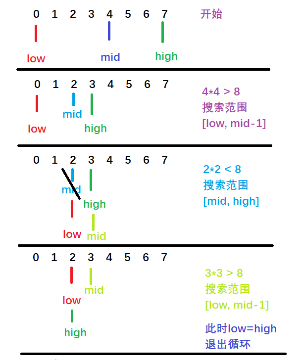

# 题目整理

二分查找这里的题目，主要分为下面几大类型， [这个题解](https://leetcode-cn.com/problems/search-in-rotated-sorted-array-ii/solution/yi-wen-dai-ni-gao-ding-er-fen-sou-suo-ji-ki52/)中已经帮我们总结好了， 把里面思维导图摘了过来：


## [0. 直接是二分查找](https://leetcode-cn.com/problems/binary-search/)

这是一个直接写二分查找的题目， 通过这个题目， 想看一下二分查找的全貌，其实二分查找，不是我们想象的那么简单， 对于二分查找，这是一种减而治之的思想，也就是把一个大问题划分成小问题， 然后只在其中一个里面寻找答案。 二分查找有两种思路的：

1. 在循环体中查找元素
2. 在循环体中排除目标元素一定不在的区间

之前，见到过的大部分都是第一种思路，也就是假设元素在循环体中，根据条件我们每次都搜索元素所在的那部分， 比如下面的两种写法， 当然这两种写法根据开闭区间的考虑，又可以不同：

这里给出两种写法，一定要体会区别：

```python
class Solution:
    def search(self, nums: List[int], target: int) -> int:
        if len(nums) == 0:
            return -1     
        if target < nums[0] or target > nums[-1]:
            return -1
        
        # 事先假定target在一个闭区间中[begin, end]
        begin, end = 0, len(nums)-1 

        while begin <= end:   # [begin, end]

            mid = begin + (end-begin) // 2  # 这里用右移运算会快很多  mid = low + ((high - low) >> 1)
            if nums[mid] == target:
                return mid
            elif nums[mid] > target:   # [begin, mid-1]
                end = mid - 1
            else:              # [mid+1, end]
                begin = mid + 1
        
        return -1
```

另外一种写法：

```python
class Solution:
    def search(self, nums: List[int], target: int) -> int:

        if len(nums) == 0:
            return -1
        
        if target < nums[0] or target > nums[-1]:
            return -1
        
        # 事先假定target在开区间中[begin, end)
        begin, end = 0, len(nums)

        while begin < end:  # 这个地方不能等于了，因为如果等于的话，那将是一个不合法的区间[begin, end)

            mid = begin + (end-begin) // 2  # 这里用右移运算会快很多  mid = low + ((high - low) >> 1)

            if nums[mid] == target:
                return mid
            elif nums[mid] > target:      # [begin, mid)
                end = mid 
            else:                # [mid+1, end)
                begin = mid + 1 
        
        return -1
```

一般第一种会比较简单。第一种写法的递归写法：

```python
class Solution:
    def search(self, nums: List[int], target: int) -> int:

        if len(nums) == 0:
            return -1
        
        if target < nums[0] or target > nums[-1]:
            return -1
        
        # 事先假定target在开区间中[begin, end)
        begin, end = 0, len(nums)

        # 递归写法
        def find(nums, target, begin, end):

            if begin > end:
                return -1

            mid = begin + (end-begin) // 2

            if nums[mid] == target:
                return mid
            elif nums[mid] > target:
                return find(nums, target, begin, mid-1)
            else:
                return find(nums, target, mid+1, end)
        
        return find(nums, target, begin, end)
```

关于二分查找， 其实还可以使用另外一种思路，就是排除法， 每一次都排除目前元素一定不在的那部分， 最后剩下的那个就是查找的元素， 这个思路感觉也挺好的，虽然可能不太好理解，但是对于一些复杂的问题， 排除法可能是更好的解决办法，比如问你想干什么？ 你可能一下子回答不出来，此时如果你知道你不想干什么，排除掉，最后就是你想干的事情。下面是针对该题两种排除法的思路， 关于具体的原理，可以[看这里](https://leetcode-cn.com/leetbook/read/learning-algorithms-with-leetcode/xs41qg/)


第一种：

```python
class Solution:
    def search(self, nums: List[int], target: int) -> int:

        if len(nums) == 0:
            return -1
        
        if target < nums[0] or target > nums[-1]:
            return -1
        
        # 事先假定target在开区间中[begin, end]
        begin, end = 0, len(nums)-1

        # 这里用排除法  当begin==end，退出循环，此时只剩下这一个元素
        while begin < end:

            mid = begin + (end - begin) // 2   # 下取整

            if nums[mid] < target:  # 说明一定在右边了，空间范围[mid+1, end]
                begin = mid + 1
            else:    # 说明在左边， 这时候空间范围[begin, mid]
                end = mid
        
        # 退出循环后， 发现begin就是最终的位置
        if nums[begin] == target:
            return begin
        else:
            return -1

```

这种思路，就是我们只需要进行排除目前元素一定不在的空间，最后剩下一个就有可能是我们要找的元素。想一下最后的情况，倒数第二步应该是这样的：

begin, end

此时end指向的就是我们找的元素， 此时Begin仍然小于end, 再次循环， mid=begin的位置， 此时发现nums[mid] < target， begin = mid+1, 也就是begin和end指向了同一个，此时begin==end， 退出， 得到了我们要找的数。

但下面这种写法就要注意了：

```python
# 这里用排除法  当begin==end，退出循环，此时只剩下这一个元素
while begin < end:

    mid = begin + (end - begin) // 2   # 下取整 

    if nums[mid] > target:  # 说明一定在左边了，空间范围[begin, mid-1]
        end = mid - 1
    else:    # 说明在右边， 这时候空间范围[mid, end]
        begin = mid

# 退出循环后， 发现begin就是最终的位置
if nums[begin] == target:
    return begin
else:
    return -1
```

这个和上面的区别就是先判断的num[mid] > target， 此时改变end, 否则改变begin， 这个看起来好像没有错，但是提交会发现死循环了。我们可以拿[-1, 0, 3, 5, 9, 12]， target 9来看一下为啥：

1. 初识的时候begin=0, end=5， 指向首尾
2. 此时begin < end， 成立
   1. mid = 2, nums[mid] = 3
   2. 满足nums[mid] <= 9, 在右边， 此时更新begin=mid=2
3. 此时begin < end, 成立
   1. mid = (2+5) / 2 = 3， 下取整， nums[mid] = 5
   2. 满足nums[mid] <= 9, 在右边， 此时更新begin=mid=3
4. 此时begin<end， 成立
   1. mid = (3+5) / 2 =4, nums[mid] = 9
   2. 满足nums[mid] <=9,  更新begin=mid=4
5. 此时begin<end, 成立
   1. ==mid = (4+5) / 2 = 4==, nums[mid] = 9
   2. 满足nums[mid] <=9,  更新begin=mid=4
6. 这时候，就会发现陷入死循环了

这里就是mid下取整带来的问题了， 如果下面这个写法， 也就是当nums[mid] <= target的时候，会有个begin=mid, 这时候由于mid是下取整，就可能陷入begin=mid的一种死循环。 所以如果是下面这种写法，需要改成上取整的方式才行。

```python
# 这里用排除法  当begin==end，退出循环，此时只剩下这一个元素
while begin < end:

    mid = begin + (end - begin + 1) // 2   # 下取整  这里用右移运算会快很多  mid = low + ((high - low) >> 1)

    if nums[mid] > target:  # 说明一定在左边了，空间范围[begin, mid-1]
        end = mid - 1
    else:    # 说明在右边， 这时候空间范围[mid, end]
        begin = mid

# 退出循环后， 发现begin就是最终的位置
if nums[begin] == target:
    return begin
else:
    return -1
```

最后总结下这种思路的编码要点：

1. 循环终止条件写成：while (left < right) ，表示退出循环的时候只剩下一个元素；
2. 在循环体内考虑如何缩减待搜索区间，也可以认为是在待搜索区间里排除一定不存在目标元素的区间；
3. 根据中间数被分到左边和右边区间，来调整取中间数的行为；
4. 如何缩小待搜索区间，一个有效的办法是：从 nums[mid] 满足什么条件的时候一定不是目标元素去考虑，进而考虑 mid 的左边元素和右边元素哪一边可能存在目标元素。一个结论是：当看到 left = mid 的时候，取中间数需要上取整，这一点是为了避免死循环；
5. 退出循环的时候，根据题意看是否需要单独判断最后剩下的那个数是不是目标元素。

边界设置的两种写法：

* `right = mid` 和 `left = mid + 1` 和 `int mid = left + (right - left) / 2`; 一定是配对出现的；
* `right = mid - 1` 和 `left = mid` 和 `int mid = left + (right - left + 1) / 2`; 一定是配对出现的。

这种二分查找的思路，对于查找边界问题，会使得思考的过程变得简单。

二分查找的思路 1，有的时候要考虑返回是 left 还是 right，在循环体内有 3 个分支，如何分类讨论，有些时候并不那么容易。

思路 2 的分支只有 2 个，其中一个思考对了，另外一个就可以直接得到。其实思路 2 更符合二分这个语义，我们就是将区间一分为二地去看待，一部分一定不存在目标元素，我们把它排除掉了，我们在另外一个可能存在目标元素的区间里继续查找。

* 如果这个二分查找的问题比较简单，在输入数组里不同元素的个数只有 1 个，使用思路 1 ，在循环体内查找这个元素；
* 如果这个二分查找的问题比较复杂，要你找一个可能在数组里不存在，或者是找边界这样的问题，使用思路 2 ，在循环体内排除一定不存在目标元素的区间会更简单一些。

## [1. 在排序数组中查找元素的第一个和最后一个位置(中等)](https://leetcode-cn.com/problems/find-first-and-last-position-of-element-in-sorted-array/)

这里首先给出一个非常简单的思考思路， 那就是用两个指针i, j从数组的两头进行遍历， i找target的首位置， j找target的最后位置， 这个的时间复杂度是$O(n)$的。 所以不符合题目的要求， 只是暴力的一种解题思路。代码的逻辑如下：

1. 判断异常，如果数组为空，那么就直接返回[-1,-1]
2. 定义两个变量分别记录第一个和最后一个位置，初始化-1
3. 然后定义两个指针i,j指向数组的两端， i开始从左往右， 如果找到第一个target， 停， 记录位置，同样的j从右往左， 如果找到第一个target，停，记录最后位置即可

代码如下：

```python
class Solution:
    def searchRange(self, nums: List[int], target: int) -> List[int]:

        min_loc, max_loc = -1, -1

        if len(nums) == 0:
            return [min_loc, max_loc]
        
        # 定义两个指针i, j从两端进行遍历
        i, j = 0, len(nums)-1
        
        while i <= j and nums[i] != target:
            i += 1
        if i <= j:
            min_loc = i
        
        while i <= j and nums[j] != target:
            j -= 1
        if i <= j:
            max_loc = j
            
        
        return [min_loc, max_loc]
```

题目中明确要求要使用$O(logn)$的复杂度， 所以上面的不符合要求， 需要用折半查找的思路去寻找左右边界。 

通过这次学习，确实又对二分查找开阔了一些眼界， 二分查找虽然看起来比较简单，但其实搜索起来有些细节还是容易搞错的。所以这一块感觉还是应该好好的学习一下，具体内容[可以看这里](https://leetcode-cn.com/leetbook/read/learning-algorithms-with-leetcode/xsz9zc/), 这里主要是说一下如何使用二分查找去找边界。

对于这个题来说， 情况主要是下面三种：

1. target在给定数组的两边， 也就是target小于数组最小值或者大于数组最大值， 这时候返回[-1,-1]
2. target在给定数组范围内， 但是没有这个值， 这时候依然是返回[-1,-1]
3. target在给定数组范围内，且有这个值，那么我们就要用二分查找去看左右边界了

二分查找左右边界， 还是先延续之前二分查找的思路，这里还是采用target在闭区间范围内的二分查找思路， 那么找左边界的话：

1. 首先start和end指向数组的两端(0, len(nums-1))， 那么整个数组的元素在[start, end]范围内
2. 当start<=end的时候， 开始二分查找
   1. 找到start和end的中点
   2. 如果发现中点的值小于target， 那么说明中点以及中点左边的都不可能是左边界了， 这时候搜索范围[mid+1, end]
   3. 如果发现中点的值大于或者等于target， 两种情况：
      1. 如果是等于target，那么中点的值有可能是左边界，如果不是左边界， 左边界还在左边，搜索范围[start,mid-1],如果是左边界的话，此时应该是结束的时候， 搜索范围如果是[start, mid-1]应该是找不到， 最后start和end都会停留在左边界的前一个位置，这时候还会再次循环， start=mid+1， 此时start正好是左边界，而此时正好start>end，循环也退出。
      2. 如果是大于target， 说明左边界还在左边，搜索范围[start, mid-1]
   4. 这样退出循环， 如果第上面的第三种情况，也就是在这个区间内能找到target， 那么start最后会指向它。
3. 退出循环的时候， 看一下start是否合法，如果合法说明找到了左边界

代码如下：

```python
def findLeftBorder(self, nums, target, begin, end):
    # 找左侧边界
    while begin <= end:
        # 中间值
        mid = begin + (end-begin) // 2  # 这里用右移运算会快很多  mid = low + ((high - low) >> 1)

        if nums[mid] < target:     # 这时候搜索的范围是[mid+1, end]
            begin = mid + 1
        else:   # 这时候两种情况， nums[mid]==target, 那么有可能是最左侧有可能不是，不是最左侧，[start, mid-1],是最左侧,startstart指向他， 或者nums[mid] > target，这时候搜索区间[start, mid-1]
            end = mid - 1


    if begin < len(nums) and nums[begin] == target:
        return begin
    else:
        return -1
```

右边界的分析方法和左边界一样， 依然是先[begin, end]区间里面找

1. 找中点
2. 如果发现中点比target大， 这时候说明右边界在中点左边, 搜索范围[start, mid-1]
3. 如果发现中点比target小， 搜索范围[mid+1, end]
4. 如果发现中点和target相等， 有可能是右边界，此时应该返回，即start > end了， 所以此时的搜索范围是[mid+1, end]，但是没有搜到， 最后start和end都停在右边界的右边一个位置， 然后mid也是这个位置， end=mid-1正好是右边界，此时返回。 不是右边界的话，还在右边，也是[mid+1, end]

所以代码是这样：

```python
def findRightBorder(self, nums, target, begin, end):
    # 找右侧边界
    while begin <= end:

        # 中间值
        mid = begin + (end-begin) // 2  # 这里用右移运算会快很多  mid = low + ((high - low) >> 1)

        if nums[mid] > target:  # 这时候搜索边界[start, mid-1]
            end = mid -1
        else:     # nums[mid]==target, 可能是最右侧也可能不是，不是的话，搜索空间是[mid+1,end], 是的话end指向, 小于target，搜索区间[mid+1,end]
            begin = mid + 1

    if end < len(nums) and nums[end] == target:
        return end
    else:
        return -1

```

这样就大功告成了：

```python
def searchRange(self, nums: List[int], target: int) -> List[int]:
    if len(nums) == 0:
        return [-1, -1]

    # 第一种情况， target在给定数组的两侧
    if target < nums[0] or target > nums[-1]:
        return [-1, -1]

    # 折半查找
    begin, end = 0, len(nums)-1
    left_border = self.findLeftBorder(nums, target, begin, end)
    right_border = self.findRightBorder(nums, target, begin, end)

    return [left_border, right_border]
```


对于这个问题， 这里又学习到了一种思考方式， 且思考起来可能比上面的还要直接， 并且这种思考方式还适用于下面的一些题目。来自苏勇老师的讲解。就拿题目里面的[5, 7, 8, 8, 10]来说， 找8的下边界和上边界。 

成为8的上边界的条件：

* 该数是8
* 该数的左边第一个数不是8
* 8的左边有数， 那么该数必须小于8
* 8的左边没有数， 8是数组的第一个数

这个代码感觉写起来更加直观些

```python
# 左边界
def findleftorder(self, nums, target, left, right):

    if right < left:
        return -1

    mid = left + (right - left) // 2  # 这里用右移运算会快很多  mid = low + ((high - low) >> 1)

    # 该数是targett， 并且该数位于0位置或者他前面的数小于他
    if nums[mid] == target and (mid == 0 or nums[mid-1] < target):
        return mid
    elif nums[mid] >= target:    # 搜索范围[left, mid-1]   等于8的话，范围也是这个，要不然上面就返回了
        return self.findleftorder(nums, target, left, mid-1)
    else:
        return self.findleftorder(nums, target, mid+1, right)
```

成为8的下边界的条件

* 该数必须是8
* 该数的右边一个数必须不是8
* 8的右边有数，必须大于8
* 8的右边没数， 8是最右边的数

```python
# 右边界
def findrightorder(self, nums, target, left, right):

    if right < left:
        return -1

    mid = left + (right - left) // 2  # 这里用右移运算会快很多  mid = low + ((high - low) >> 1)

    # 该数是target, 并且该数位于最后或者他后面的数大于他
    if nums[mid] == target and (mid == len(nums)-1 or nums[mid+1] > target):
        return mid
    elif nums[mid] <= target: # 搜索范围[mid+1, right], 等于的话同样也是，要不然上面就返回了
        return self.findrightorder(nums, target, mid+1, right)
    else:
        return self.findrightorder(nums, target, left, mid-1)
```

## 2. 找模糊边界

二分搜索可以用来查找一些模糊的边界。模糊的边界指，**边界的值并不等于目标的值，而是大于或者小于目标的值**。

例题：从数组 {-2, 0, 1, 4, 7, 9, 10} 中找到第一个大于 6 的数。

这个题也可以用上面的最后一种想法， 如果是找这种模糊边界， 第一个大于6， 那么要符合两个条件：

1. 这个数要大于6
2. 该数有可能是数组里的第一个数， 或者它之前的一个数比6小

代码如下：

```python
def firstGreaterThan(nums, target, low, high):
	if low > high:
		return -1
	
	mid = low + (high - low) // 2  # 这里用右移运算会快很多  mid = low + ((high - low) >> 1)
	
	# 判断mid指向的数是否为第一个比target大的数时， 必须满足上面两个条件
	if nums[mid] > target and (mid == 0 or nums[mid-1] <= target):
		return mid
	
	if (target < nums[mid]):   # 搜索区间 [low, mid-1]
		return firstGreaterThan(nums, target, low, mid-1)
	else:
		return firstGreaterThan(nums, target, low+1, mid)
```

注意一下， 下面的这两个判断写法是有讲究的， 如果碰到当前的数等于target， 那么由于我们是找第一个比target大的数，理应在右半边搜索， 所以`target == nums[mid]`的时候，我们的搜索范围也是[low+1, mid], 但如果是找最后一个比target小的数， 这时候，如果`target==nums[mid]`的时候，我们的搜索范围就变成了[low, mid-1], 思路还是上面的思路。


## 3. 旋转数组搜索

关于旋转数组中进行搜索的题目，下面整理四个， 这几个的特点：

* 3.1和3.2： 搜索特定某个值
* 3.3和3.4： 搜索最小值
* 3.2和3.4: II系列包含重复元素

### [3.1 搜索旋转排序数组(中等)](https://leetcode-cn.com/problems/search-in-rotated-sorted-array/)

这个题首先暴力了一下，竟然能AC：

```python
def search(self, nums: List[int], target: int) -> int:    
    try:
        res = nums.index(target)
    except ValueError:
        res = -1
    return res
```

当然到时候不能写这样的代码， 这里写了是熟悉一下，python在列表中查找元素的函数是`list_name.index(target)`, 如果找不到报`ValueError`.第二个就是熟悉一下python的捕获异常语句。 下面正式开始此题。

暴力的话这个题肯定能解，这个方法不管他有序还是无序， 但是时间复杂度$O(n)$, 所以这里还是用二分查找的方式， 看看应该怎么考虑。这道题目输入不是有序的。

首先， 旋转数组里面，如果我们用mid将其分成左右两部分的时候，**一定有一部分是有序的**。如拿[4, 5, 6, 7, 0, 1]来看， 中间值是6, 这时候左边[4, 5, 6]是有序的


根据这个特点， 我们做二分搜索的时候， 当前mid会把数组分成[l, mid]和[mid+1, r]两部分， 这时候我们需要判断出哪部分是有序的， 并根据有序的部分确定搜索的上下界，因为根据有序的部分能够判断出target在不在这部分， 思路是这样：

1. 若`target == nums[mid]`， 直接返回

2. 若`nums[left] <= nums[mid]`, 说明在左侧区间`[left, mid]`是连续递增的，此时

   1. 若`nums[left] <= target <= nums[mid]`， 说明target在左侧的有序区间， 那我们的搜索范围`[left, mid-1]`， 这地方没有mid位置了，因为上面事先判断了一下target不会等于`nums[mid]`
   2. 否则， target在右边的无序区间，搜索范围`[mid+1, right]`

   这里说一下为啥这个地方要带上`nums[left]==nums[mid]`的情况， 是因为我们取中位数的时候是下取整， 但只有一个元素的时候, 此时left=mid, 我们也认为是有序的

3. 否则， 说明在右侧区间`[mid, right]`是连续递增的， 此时

   1. 若`nums[mid+1] <= target <= nums[right]`, 说明target在右侧的有序区间， 搜索范围`[mid+1, right]`
   2. 否则， target在左边的无序区间，搜索范围`[left, mid-1]`

根据这个思路，可以写出循环和递归两种不同的代码如下：

```python
def search(self, nums: List[int], target: int) -> int:

    low, high = 0, len(nums) - 1

    while low <= high:

        mid = low + (high - low) // 2  # 这里用右移运算会快很多  mid = low + ((high - low) >> 1)

        if nums[mid] == target:
            return mid

        if nums[low] <= nums[mid]:    # 说明左侧是有序的
            if nums[low] <= target and target < nums[mid]:  # target在左侧的有序区间， 搜索范围[low, mid-1]
                high = mid - 1
            else:   # target在右边的无序区间, 搜索范围[mid+1, high]
                low = mid + 1
        else:   # 说明右侧是有序的 [mid,high]
            if nums[mid] < target and target <= nums[high]:  # target在右侧有序区间，搜索范围[mid+1, high]
                low = mid + 1
            else:
                high = mid - 1

    return -1
```

递归解法：

```python
def binarysearch(self, nums, target, low, high):

    if low > high:
        return -1

    mid = low + (high - low) // 2   # 这里用右移运算会快很多  mid = low + ((high - low) >> 1)

    if nums[mid] == target:
        return mid

    if nums[low] <= nums[mid]:   # 左侧有序
        if nums[low] <= target and target < nums[mid]:
            # 左边找  [low, mid-1]
            return self.binarysearch(nums, target, low, mid-1)
        # 否则，右边找[mid+1, high]
        return self.binarysearch(nums, target, mid+1, high)
    else:  # 右侧有序
        if nums[mid] < target and target <= nums[high]:
            # 右边找 [mid+1, high]
            return self.binarysearch(nums, target, mid+1, high)
        # 否则，左边找 [low, mid-1]
        return self.binarysearch(nums, target, low, mid-1)
```

时间复杂度$O(logn)$, 空间复杂度$O(1)$

### 3.2 [搜索旋转排序数组II(中等)](https://leetcode-cn.com/problems/search-in-rotated-sorted-array-ii/)

这个题目和上面的思路基本上一样， 在上面I的基础上加上了可以包含重复元素的选项，这时候，我们nums[low] == nums[mid]的时候，就没法判断target是在左区间还是右区间了。比如下面这个：


假设我们的target是3， 一开始会发现nums[left] == nums[mid]， 这时候，按照上面代码的逻辑， 会觉得左边是有序的序列，但是很显然[1,3,1]不是有序的， 此时会走left=mid+1， 即到了下面那种情况， 这时候跳过了target了。所以对于这种情况， 我们需要将**重复的元素去掉**， 即当我们发现nums[left] == nums[mid]的时候， 让left++, 然后跳出本次循环， 就变成和上面一样的了。 这时候，其实退化成了顺序查找。代码的话只需要在上面的基础上稍微改一下， 非递归代码如下：

```python
class Solution:
    def search(self, nums: List[int], target: int) -> bool:

        low, high = 0, len(nums) - 1

        while low <= high:
            
            mid = low + ((high - low) >> 1)
            
            if nums[mid] == target:
                return True
            # 加了这一句单独判断
            if nums[mid] == nums[low]:
                low += 1
                continue
            
            if nums[low] < nums[mid]:
                if nums[low] <= target and target < nums[mid]:
                    high = mid - 1
                else:
                    low = mid + 1
            else:
                if nums[mid] < target and target <= nums[high]:
                    low = mid + 1
                else:
                    high = mid - 1
        
        return False
```

### 3.3[寻找旋转数组中的最小值(中等)](https://leetcode-cn.com/problems/find-minimum-in-rotated-sorted-array/)

这个寻找最小值的方式，最好的方式其实是走一个例子，然后去找规律， 如果单纯靠想，比较难想到这个规律， [这个题解](https://leetcode-cn.com/problems/find-minimum-in-rotated-sorted-array/solution/er-fen-cha-zhao-wei-shi-yao-zuo-you-bu-dui-cheng-z/)写的非常好。 这里基于人家的思想， 稍微总结一下这个题目吧。 这个题一上来，如果没有思路， 可以画个这样的图试试能不能缩小搜索空间。把[1,2,3,4,5,6,7]从每个点进行了一次翻转如下：


这里就可以发现规律了， 只需要比较nums[mid]和nums[high]之间的关系，就可以确定搜索空间了， 上图右边的不是下标哈，应该是对应的数。有点小错。

另外注意几个细节：

1. 这里循环的结束条件， 要用while low < high, 不能等于了，因为假设只有一个元素，这时候low=high， 应该退出去，直接返回low即可，如果加上等于， 这里就没法套住最小值了。也就是假定了最小值的区间[low, high)
2. mid采用的下取整， 所以会更靠近low， 那么这里面缩小区间范围的时候，就千万不能有low=mid的这种举动， 这样会导致死循环
3. 当nums[mid] < nums[high]的时候， 这时候往左缩小空间，此时让high=mid， 而不是high=mid-1, 否则会溜掉上面的第五种情况
4. 最后返回的时候，left指向的就是最小值

代码如下：

```python
class Solution:
    def findMin(self, nums: List[int]) -> int:

        low, high = 0, len(nums) - 1

        while low < high:
            mid = low + ((high - low) >> 1)
            if nums[mid] > nums[high]:   # 右边
                low = mid + 1
            else:
                high = mid
        
        return nums[low]
```

### 3.4 [寻找旋转数组中的最小值II(困难)](https://leetcode-cn.com/problems/find-minimum-in-rotated-sorted-array-ii/)

这个题在上面题的基础上又允许了元素可以重复。这时候， 对于nums[mid] 严格大于或者小于nums[right]时， 最小值所在区间的判断没有影响， 但是如果nums[mid]==nums[right]的时候，就很难判断最小值究竟是在左边还是右边了， 比如[1,0,1,1,1]和[1,1,1,0,1]的时候。这时候采取的措施就是right=right-1来去除重复。

1. 此操作不会使数组越界：因为迭代条件保证了 `right > left >= 0`；
2. 此操作不会使最小值丢失：假设 `nums[right]`是最小值，有两种情况：
   1. 若 `nums[right]` 是唯一最小值：那就不可能满足判断条件 `nums[mid] == nums[right]`，因为 `mid < right`（`left != right` 且 `mid = (left + right) // 2` 向下取整）；
   2. 若 `nums[right]`不是唯一最小值，由于 `mid < right` 而 `nums[mid] == nums[right]`，即还有最小值存在于`[left,right−1]`区间，因此不会丢失最小值。

所以， 这个题的代码只需要在上面的基础上修改一下循环里面，把`nums[mid]==nums[right]`的单独拿出来进行讨论。

```python
class Solution:
    def findMin(self, nums: List[int]) -> int:

        low, high = 0, len(nums) - 1

        while low < high:    # [low,high)

            mid = low + ((high - low) >> 1)

            if nums[mid] > nums[high]:   # 最小值在右边
                low = mid + 1
            elif nums[mid] < nums[high]: # 最小值在左边
                high = mid               # [low, mid)
            else:   # nums[mid] == nums[high]的情况单拿出来，这时候， right-=1
                high -= 1
                continue
        
        return nums[low]
```

遇到重复的情况， 要用减等于的策略避免重复。

根据这个题目，其实可以延伸到找最大值， 降序的情况下找最大最小值等。 最好是理解这种搜索的思想。如果是找最大值的话， 换成下面这个代码， 上取整， 偏右搜索， 规律就是对比nums[mid] 和nums[low]了。也是画图看看：

* `nums[mid] > nums[low],` 最大值在右边，`[mid, right]`
* `nums[mid] < nums[low]`, 最大值在左边， `[low, mid-1]`

这里采用上取整的方式,找到最大值之后， 最小值其实是在最大值的右边一个， 所以代码可以写成这样的逻辑：

1. 先找最大值
2. 找到最大值的位置， 然后返回最大值右边的数

```python
class Solution:
    def findMin(self, nums: List[int]) -> int:

        low, high = 0, len(nums) - 1

        while low < high:

            mid = low + ((high - low + 1) >> 1)

            if nums[mid] < nums[low]:   #  最大值在左边
                high = mid - 1
            else:
                low = mid
        
        return nums[(high+1) % len(nums)]
```

## [4. x的平方根(简单)](https://leetcode-cn.com/problems/sqrtx/)

这个题可以使用二分查找， low和high分别指向0，x-1, 然后找mid， 如果发现mid*mid > x， 搜索空间在左边，[low, mid-1]， 否则， 搜索空间在右边[mid, high]， 这里面有两个细节：

1. 这里mid取的时候采用了上取整， 这个是通过例子模拟了一下得到的
2. 循环结束条件是<， 而没有取到等号，因为这个感觉还是一个找边界的题目， 而两者相等的时候，需要退出了

走一下题目中的那个例子：



所以这个题目二分法的代码如下：

```python
class Solution:
    def mySqrt(self, x: int) -> int:

        if x <= 1:
            return x
        
        # 一个数的平方根最多不会超过它的一半
        low, high = 0, x // 2 + 1
        while low < high:
            mid = low + ((high - low + 1) >> 1)   # 这地方要上取整

            if mid * mid == x:
                return mid
            if mid * mid > x:
                high = mid - 1
            else:
                low = mid
        return low
```

时间复杂度$O(n)$， 空间复杂度$O(1)$, 所以具体问题算的的时候，尤其是考虑边界情况的时候，最好手画模拟一下。

下面介绍该题的第二种方法， 牛顿迭代法， 通过这次的学习顺便重温了一下优化中的牛顿法和拟牛顿法，收获很大。 关于牛顿迭代法，牛顿法和拟牛顿法的原理，我整理了一篇[博客]()， 这里简单的说一下牛顿迭代法的思路， 参考[wei哥题解](https://leetcode-cn.com/problems/sqrtx/solution/er-fen-cha-zhao-niu-dun-fa-python-dai-ma-by-liweiw/)

核心思想：在迭代过程中，**以直线代替曲线**，用一阶泰勒展式（即在当前点的切线）代替原曲线，求直线与 xxx 轴的交点，重复这个过程直到收敛。

应用牛顿法解平方根问题， $f(x)=x^2-a$, 根据牛顿法， 可得到最后的迭代公式：


有了迭代公式，就是初始化$x_0$， 然后开始迭代，当误差非常小的时候， 结束，就可以得到平方根。代码如下：

```python
class Solution:
    def mySqrt(self, x: int) -> int:

        if x <= 1:
            return x
        
        # 牛顿迭代法
        x_0 = 1     # 比较随意，但是要是正数， 初始化x_0
        while True:
            x_new = x_0
            x_0 = (x_0 + x / x_0) / 2
            if abs(x_0 - x_new) < 1e-6:          # 如果这两个数相差很小了
                return int(x_0)
```

这个速度会很快。

## [5.  有效的完全平方数(简单)](https://leetcode-cn.com/problems/valid-perfect-square/)

这个题目和上面那个差不多， 二分查找他的平方根， 如果有那就是完全平方数，如果没有， 返回False，代码和上面二分查找基本一样：

```python
class Solution:
    def isPerfectSquare(self, num: int) -> bool:

        if num <= 1:
            return True

        low, high = 0, num // 2  + 1

        # 这里采用等于方式查找, 上取整
        while low <= high:
            mid = low + ((high - low + 1) >> 1)

            if mid * mid == num:
                return True
            
            if mid * mid > num:
                high = mid - 1
            else:
                low = mid + 1
        
        return False
```

牛顿迭代法也可以解决这个问题：

```python
class Solution:
    def isPerfectSquare(self, num: int) -> bool:

        if num <= 1:
            return True

        # 牛顿迭代法 + 贪心
        x = num // 2

        while x * x > num:
            x = (x + num // x) // 2
        return x * x == num
```

关于完全平方数还有这样的一个结论：


所以根据这个思路，可以使用一个while循环，不断减去一个从1开始不断增大的奇数，若最终减成了0，说明是完全平方数，否则，不是， 代码如下：

```python
class Solution:
    def isPerfectSquare(self, num: int) -> bool:

        if num <= 1:
            return True
        x = 1
        while num > 0:
            num -= x
            x += 2
        
        return num == 0
```

这个思路感觉挺奇妙的。

## [6. 搜索二维矩阵(中等)](https://leetcode-cn.com/problems/search-a-2d-matrix/)

这个题可以使用两次二分查找来实现， 根据题目中给出的规律， 每一行递增排列， 且每行的第一个数要大于上一行最后一个数的思想， 如果想高效的找二维矩阵中的数， 可以**用一次二分锁定目标可能存在的行， 然后用一次二分在该行中查找**。

对于二分锁定目标可能存在的行，我们要对最后一列的数进行二分搜索，然后找的是第一个大于target的数，也就是右边界，而对于在该行中的二分搜索， 就是普通的二分查找即可。

所以第一次二分搜索我们要找边界， 这时候的二分采用了开区间的写法[low, high), 而第二次用的是闭区间的写法[low, high]， 现在有个直觉就是如果找边界的话，一般循环结束条件不包括等于， 而如果找具体值，循环条件会包含等于。  所以第一版代码如下：

```python
class Solution:
    def searchMatrix(self, matrix: List[List[int]], target: int) -> bool:

        r, l = len(matrix), len(matrix[0])

        if r == 0 or l == 0:
            return False
        
        # 行二分查找
        low, high = 0, r - 1
        while low < high:

            mid = low + ((high - low) >> 1)

            if matrix[mid][l-1] == target:
                return True
            
            if matrix[mid][l-1] > target:
                high = mid
            else:
                low = mid + 1
        
        # 这样low记录的是目标可能存在的行, 判断一下第一个数是否小于target
        if matrix[low][0] > target:
            return False
        # 列搜索
        left, right = 0, l - 1
        while left <= right:

            mid = left + ((right - left) >> 1)

            if matrix[low][mid] == target:
                return True
            elif matrix[low][mid] > target:
                right = mid - 1
            else:
                left = mid + 1 
        return False
```

当然这个题锁定行的时候，也可以用第一行，这时候要上取整了，代码如下：

```python
# 行二分查找
low, high = 0, r - 1
while low < high:

    mid = low + ((high - low + 1) >> 1)

    if matrix[mid][0] == target:
        return True

    if matrix[mid][0] > target:
        high = mid - 1
    else:
        low = mid

# 这样low记录的是目标可能存在的行, 判断一下第一个数是否小于target
if matrix[low][l-1] < target:
    return False
```

这个题的另一种思路就是把这个二维数组直接看成一个有序的一维数组来做， 这就涉及到了坐标转换的问题， 比如当前求得mid之后对应的是一维数组的下标， 那么转成行列才能去对应，也简单：

* `row = mid / col_num`
* `col = mid % col_num`

所以这个代码用用一次二分即可搞定：

```python
class Solution:
    def searchMatrix(self, matrix: List[List[int]], target: int) -> bool:

        r, l = len(matrix), len(matrix[0])

        if r == 0 or l == 0:
            return False
        
        low, high = 0, r * l - 1
        while low <= high:

            mid = low + ((high - low) >> 1)

            row, col = mid // l, mid % l
            if matrix[row][col] == target:
                return True
            
            if matrix[row][col] > target:
                high = mid - 1
            else:
                low = mid + 1
        
        return False
```

## 7. [搜索插入位置(简单)](https://leetcode-cn.com/problems/search-insert-position/)

这里由于是搜索下边界，所以采用了开区间的搜索， 如下：

```python
class Solution:
    def searchInsert(self, nums: List[int], target: int) -> int:

        if len(nums) == 0:
            return 0

        if target > nums[-1]:
            return len(nums)
        low, high = 0, len(nums) - 1

        # 搜索下边界的问题， 这里用开区间
        while low < high:

            mid = low + ((high - low) >> 1)

            if nums[mid] == target:
                return mid
            
            if nums[mid] > target:   # 搜索范围[low, mid)
                high = mid
            else:
                low = mid + 1
        
        return low
```

这个题目其实有两种二分的写法，具体的总结可以[看这个](https://mp.weixin.qq.com/s/fCf5QbPDtE6SSlZ1yh_q8Q)，分析的非常透彻。这里只写一下写法：

只要看到面试题里给出的数组是有序数组，都可以想一想是否可以使用二分法

1. 第一种写法： 闭区间

   定义 target 是在一个在左闭右闭的区间里，==「也就是[left, right] （这个很重要）」==

   ```Java
   class Solution {
   public:
       int searchInsert(vector<int>& nums, int target) {
           int n = nums.size();
           int left = 0;
           int right = n - 1; // 定义target在左闭右闭的区间里，[left, right] 
           while (left <= right) { // 当left==right，区间[left, right]依然有效
               int middle = left + ((right - left) / 2);// 防止溢出 等同于(left + right)/2
               if (nums[middle] > target) {
                   right = middle - 1; // target 在左区间，所以[left, middle - 1]
               } else if (nums[middle] < target) {
                   left = middle + 1; // target 在右区间，所以[middle + 1, right]
               } else { // nums[middle] == target
                   return middle;
               }
           }
           // 分别处理如下四种情况
           // 目标值在数组所有元素之前  [0, -1]
           // 目标值等于数组中某一个元素  return middle;
           // 目标值插入数组中的位置 [left, right]，return  right + 1
           // 目标值在数组所有元素之后的情况 [left, right]， return right + 1
           return right + 1;
       }
   };
   ```

   ==思考为什么要写while(left <= right)， 为什么要写right = middle - 1==

2. 第二种写法： 开区间

   如果说定义 target 是在一个在左闭右开的区间里，==也就是[left, right)== 。

   不变量是[left, right)的区间，如下代码可以看出是如何在循环中坚持不变量的。

   ```java
   class Solution {
   public:
       int searchInsert(vector<int>& nums, int target) {
           int n = nums.size();
           int left = 0;
           int right = n; // 定义target在左闭右开的区间里，[left, right)  target
           while (left < right) { // 因为left == right的时候，在[left, right)是无效的空间
               int middle = left + ((right - left) >> 1);
               if (nums[middle] > target) {
                   right = middle; // target 在左区间，在[left, middle)中
               } else if (nums[middle] < target) {
                   left = middle + 1; // target 在右区间，在 [middle+1, right)中
               } else { // nums[middle] == target
                   return middle; // 数组中找到目标值的情况，直接返回下标
               }
           }
           // 分别处理如下四种情况
           // 目标值在数组所有元素之前 [0,0)
           // 目标值等于数组中某一个元素 return middle
           // 目标值插入数组中的位置 [left, right) ，return right 即可
           // 目标值在数组所有元素之后的情况 [left, right)，return right 即可
           return right;
       }
   };
   ```

   ==思考为什么要写while (left < right)， 为什么要写right = middle==

所以， ==**二分查找的循环中，坚持循环不变量的原则**==

## 8. 不定长边界

这个不是LeetCode上的题目， 作为一个拓展， 上面的二分搜索都给定了一个具体的范围或者区间， 如果没有给定明确区间的问题能不能二分搜索？

比如，有一段不知道具体长度的日志文件，里面记录了每次登录的时间戳，已知日志是按顺序从头到尾记录的，没有记录日志的地方为空，要求当前日志的长度。

可以把这个问题看成是不知道长度的数组，数组从头开始记录都是时间戳，到了某个位置就成为了空：{2019-01-14, 2019-01-17, … , 2019-08-04, …. , null, null, null ...}。

解题思路一就是暴力破解：顺序遍历该数组，一直遍历下去，当发现第一个 null 的时候，就知道了日志的总数量。很显然，这是很低效的办法。

思路2是二分搜索的思想， 反着搜索：

1. 开始设置low=0, high=1
2. 只要logs[high] 不为null, high *= 2
3. 当logs[high]为null的时候，可以区间[0, high]普通的二分搜索

代码如下：

```python
# 先通过getUpperBound函数不断试探在什么位置出现空的日志
def getUpperBound(logs, high):
	if logs[high] == None:
		return high
	return getUpperBound(logs, high*2)

# 再运用二分搜索的方法寻找日志的长度
def binarySearch(logs, low, high):
    if low > high:
        return -1
    mid = low + ((high - low) >> 1)
    
    # 当前日志为空而前一个不为空的时候，就是日志的结尾
    if logs[mid] == None and logs[mid-1] != None:
        return mid
    if logs[mid] == None:       # 当前位置日志为空， 搜索空间[low, mid-1]
        return binarySearch(logs, low, mid-1)
    else:       # 当前日志不为空， 右边找 搜索空间[low+1, high]
        return binarySearch(logs, low+1, mid)
```

